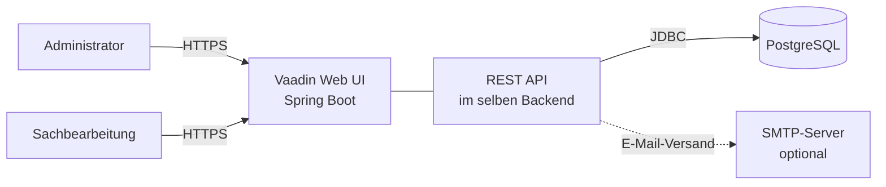
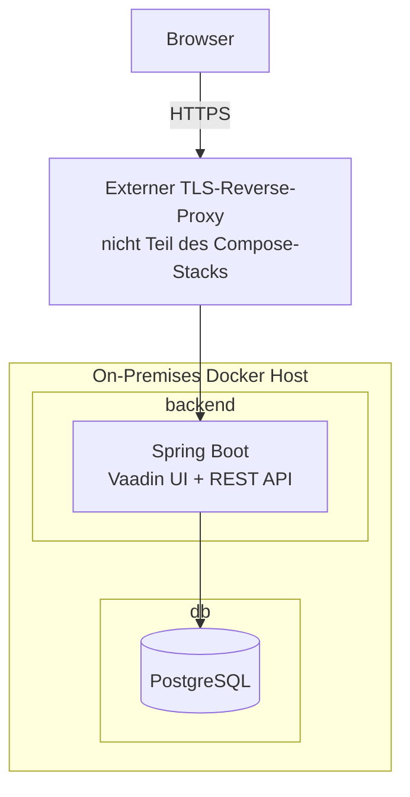

# Finale Architektur

## 1. Dokumentstatus und Evidenz

Dieses Dokument beschreibt den **Stand des abgegebenen Prototyps**, nicht den ursprünglich
geplanten Vaadin-/Windows-Dienst-Entwurf. Die Implementierung liegt als `Code.zip` im
Repository. Eine entpackte Arbeitskopie ist nicht Bestandteil des Versionsstands; alle
Reproduktions- und Bewertungsprozesse müssen deshalb vom Archiv ausgehen.

| Evidenzstatus | Bedeutung |
|---------------|-----------|
| **Implementiert** | durch Quellcode oder Konfiguration in `Code.zip` belegt |
| **Konfiguriert** | Konfigurationsartefakt vorhanden, betriebliche Wirksamkeit noch zu testen |
| **Zielwert** | gewünschte Eigenschaft, noch nicht durch Messprotokoll nachgewiesen |

Die ursprünglichen ADRs bleiben als Entscheidungshistorie erhalten. Überholte Entscheidungen
werden durch neue ADRs ersetzt:

| Thema | Ursprüngliche Entscheidung | Aktueller Stand |
|-------|-----------------------------|-----------------|
| Frontend | ADR-003: Vaadin | Vaadin 25.2.3 im Prototyp |
| Authentifizierung | ADR-004: serverseitige Session | UI-Session plus zustandslose API gemäß ADR-012 |
| Deployment | ADR-006: native Windows-Dienste | [ADR-011](adrs/011-container-deployment.md): Docker Compose On-Premises |
| Backup | ADR-005: pgBackRest | Konfiguration vorhanden; Restore und Automatisierung nachzuweisen |

## 2. Systemkontext

Das System ersetzt den direkten Datenbankzugriff des bisherigen Swing-Fat-Clients durch einen
zentralen Web-Zugang:

Der Browser besitzt keine Datenbankzugangsdaten. Alle fachlichen Zugriffe laufen über das
Backend. Das reduziert die zentrale Schwachstelle des Altsystems, garantiert aber allein weder
Fehlerfreiheit noch DSGVO-Konformität.

## 3. Technologie- und Deployment-Sicht

| Schicht | Implementierter Stand | Nachweis |
|---------|------------------------|---------|
| Frontend | Vaadin 25.2.3, serverseitig gerendert | `Code.zip`, `pom.xml`; ADR-003 |
| Eintrittspunkt | Spring Boot liefert UI und API aus; TLS über externen Reverse Proxy | `Code.zip`, Compose-Konfiguration |
| Backend | Spring Boot / Java, REST-Controller | `Code.zip`, `pom.xml`, `*Controller.java` |
| Persistenz | Spring Data JPA / PostgreSQL | `Code.zip`, Repositories und Migrationen |
| Authentifizierung | UI: Session; API: HTTP Basic/STATELESS; BCrypt und RBAC | `SecurityConfig.java`; ADR-004/014 |
| Audit | Hibernate Envers und Datenbankmigrationen | Audit-Service, Entities und Migrationen |
| Deployment | Docker Compose On-Premises | `docker-compose*.yml`; ADR-011 |
| Backup | pgBackRest-Zielkonfiguration | `ops/pgbackrest.conf`; betrieblicher Nachweis offen |

## 4. Innere Architektur

Das Backend folgt einer Schichtenstruktur:

1. **Web-Schicht:** REST-Controller, Validierung der HTTP-Eingaben und Statuscodes.
2. **Service-Schicht:** Geschäftslogik, Transaktionsgrenzen und Orchestrierung.
3. **Repository-Schicht:** Datenzugriff über Spring Data JPA.
4. **Domänenmodell:** JPA-Entities und Beziehungen.
5. **Querschnitt:** Security, Audit, Row-Level Security, Konfiguration und Migrationen.

Vaadin-Views laufen serverseitig im Backend und können die Service-Schicht direkt aufrufen. Eine
zusätzliche REST-API bildet einen zweiten Eintrittspunkt und muss sicherheitstechnisch getrennt
von der browserseitigen UI bewertet werden.

## 5. Authentifizierung und Autorisierung

Der Prototyp nutzt Spring Security mit BCrypt-gehashten Passwörtern und den Rollen `ADMIN` und
`SACHBEARBEITUNG`. Zwei geordnete Filterketten trennen die Eintrittspunkte:

- Vaadin-UI: Formularlogin über `LoginView`, serverseitige Session und Vaadin-CSRF-Schutz,
- REST-API/Actuator: HTTP Basic, zustandslos und CSRF deaktiviert.

Eine browserseitige Speicherung von Basic-Credentials im `sessionStorage` ist im Codearchiv
nicht vorhanden und wird daher nicht behauptet.

**Vor Produktivbetrieb erforderlich:**

- eindeutige Dokumentation und Negativtests der getrennten UI- und API-Filterketten,
- für die UI serverseitige Session-Cookies mit `HttpOnly`, `Secure` und geeignetem `SameSite`,
- Content Security Policy und XSS-Tests,
- Rate Limiting oder Account Lockout,
- Passwort-Policy,
- dokumentierte TLS-Zertifikatsverwaltung.

## 6. Datenbank, Konsistenz und Audit

PostgreSQL erzwingt referentielle Integrität und wird über versionierte Migrationen aufgebaut.
Die Anwendung verwendet Spring Data JPA. Parametrisierte Abfragen reduzieren
Injection-Risiken; eine absolute „SQL-Injection-Freiheit“ darf daraus nicht abgeleitet werden,
da native oder dynamisch erzeugte Abfragen weiterhin geprüft werden müssen.

Row-Level Security dient als zusätzliche Schutzschicht. Die Wirksamkeit hängt davon ab, dass
der Benutzer- und Rollenkontext pro Verbindung korrekt gesetzt wird und die Anwendungsrolle
RLS nicht umgehen kann.

Die Auditierung ist nicht für jede Entität identisch. Dokumentation und Abnahmetests müssen
explizit ausweisen, welche Tabellen über Envers oder Datenbankmechanismen historisiert werden.
Eine pauschale Aussage „jede Änderung wird auditiert“ ist unzulässig.

## 7. Dokumentgenerierung

Dokumente werden serverseitig aus Vorlagen erzeugt. Der Prototyp enthält dafür Java-Services
und Office-Bibliotheken. Vor Produktivfreigabe sind Stichproben gegen die jeweils gültigen
amtlichen Formulare sowie Tests für Sonderzeichen, lange Anschriften und unterschiedliche
Spendenarten erforderlich.

## 8. Backup und Wiederherstellung

ADR-005 beschreibt pgBackRest, WAL-Archivierung und die 3-2-1-Regel als Zielbild. Eine
pgBackRest-Konfiguration ist im Codearchiv vorhanden. Daraus folgt noch kein nachgewiesen
funktionierendes Backup.

Für die Abnahme fehlen insbesondere:

- nachgewiesene zeitgesteuerte Ausführung,
- Trennung von Daten- und Backup-Volume,
- verschlüsselte Offsite-Kopie,
- dokumentierte Schlüsselverwahrung,
- erfolgreiches Restore-Protokoll,
- gemessene RPO-/RTO-Werte.

pgBackRest unterstützt keine native Windows-Installation. Im containerisierten Linux-Modell ist
der Einsatz grundsätzlich plausibel; die frühere Kombination „native Windows-Dienste +
pgBackRest“ war dagegen technisch nicht konsistent.

## 9. Qualitätsziele und Nachweise

| ID | Ziel | Status |
|----|------|--------|
| QS-1 | Wiederverfügbarkeit nach Prozessfehler < 60 s | **Zielwert**, Chaos-/Neustarttest fehlt |
| QS-2 | RPO ≤ 24 h, RTO ≤ 4 h | **Zielwert**, Restore-Messung fehlt |
| QS-3 | ≥ 99 % Verfügbarkeit in Kernzeiten | **Zielwert**, Monitoringzeitraum fehlt |
| QS-4 | kein direkter DB-Zugriff des Browsers | **Architektonisch umgesetzt** |
| QS-5 | rollenbasierte Backend-Autorisierung | **Implementiert**, Negativtests erforderlich |
| QS-6 | korrekte Restbetragsberechnung | **Durch automatisierte Tests nachzuweisen** |
| QS-7 | Bedienbarkeit für nicht-technische Nutzer | **Usability-Test offen** |
| QS-8 | nachvollziehbare Änderungen | **Teilweise implementiert**, Abdeckung ausweisen |

## 10. Risiken und technische Schulden

| ID | Risiko | Priorität | Maßnahme |
|----|--------|-----------|----------|
| R-1 | unklarer bzw. doppelter Authentifizierungsweg für UI und API | hoch | Filterketten dokumentieren und testen |
| R-2 | Backup vorhanden, Restore nicht belegt | hoch | automatisierter Restore-Test |
| R-3 | Single Host als Ausfallpunkt | hoch | Ersatzhardware und Wiederanlaufplan |
| R-4 | unvollständige Auditabdeckung | mittel | Entitätsmatrix und Tests |
| R-5 | REST-API und direkte Vaadin-Service-Nutzung entwickeln sich auseinander | mittel | klare Schnittstellengrenzen und Tests |
| R-6 | Löschung kollidiert mit Audit und Backups | hoch | abgestimmtes Lösch-/Retention-Konzept |
| R-7 | Container- und Dependency-Patches fehlen | mittel | Patch- und Rollback-Prozess |

## 11. Offene Abnahmekriterien

Die Architektur ist erst produktionsreif, wenn mindestens folgende Nachweise vorliegen:

1. vollständiger reproduzierbarer Build aus `Code.zip`,
2. erfolgreicher Start über dokumentierte Compose-Befehle,
3. fehlerfreier Testlauf; der archivierte Surefire-Stand enthält 33 Fehler bei 142 Tests,
4. Rollen- und Sicherheits-Negativtests,
5. Backup- und Restore-Protokoll mit gemessenem RPO/RTO,
6. Migrationstest mit Summen- und Datensatzabgleich,
7. fachliche Abnahme der erzeugten Dokumente,
8. dokumentierte Betriebs-, Update- und Löschprozesse.
