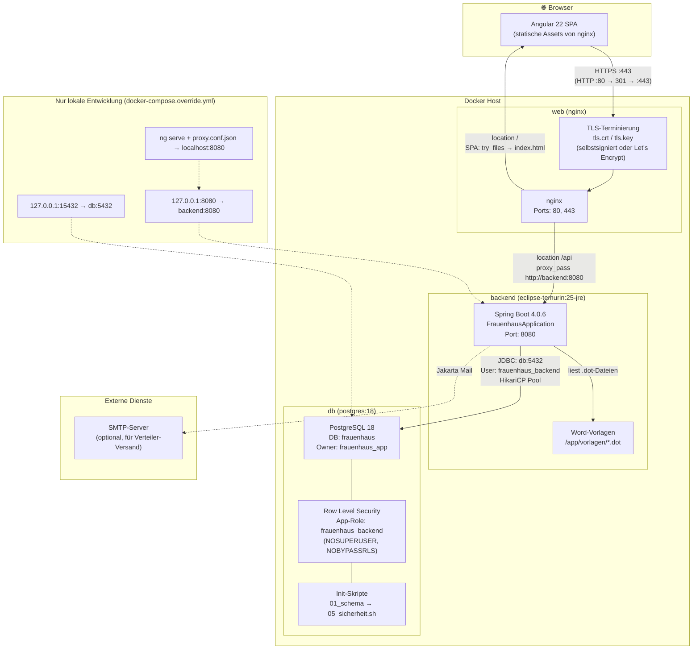
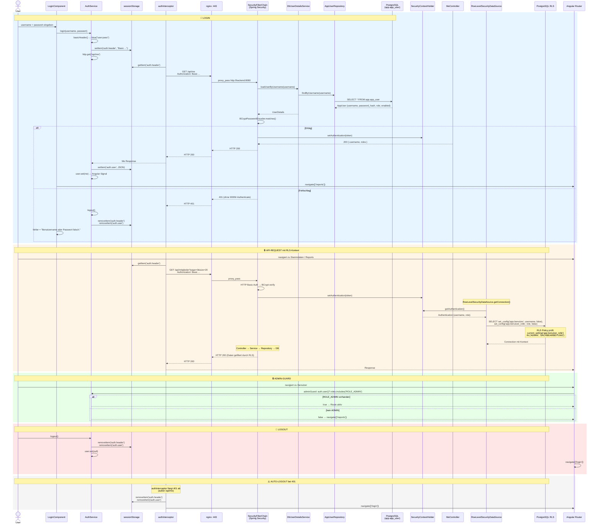

# Architekturdiagramme

Diese Diagramme dokumentieren die **tatsächlich implementierte** Architektur der
Frauenhaus-Verwaltung. Sie basieren auf einer Analyse des Quellcodes und ergänzen
die in [02-finale-architektur.md](02-finale-architektur.md) beschriebene Zielarchitektur.

> **Hinweis:** Die ADRs planten Vaadin als Frontend-Framework (ADR-003). Die
> tatsächliche Implementierung verwendet **Angular 22** als separates SPA-Frontend
> mit nginx als Reverse Proxy.

---

## 1. Systemarchitektur (Deployment)

### Deployment-Details

| Aspekt | Implementierung | Quelle |
|--------|----------------|--------|
| HTTPS-Enforcement | Port 80 → `301 https://$host$request_uri` | `nginx.conf` |
| TLS-Protokolle | TLSv1.2, TLSv1.3 | `nginx.conf` |
| API-Proxy | `/api` → `http://backend:8080`, DNS `127.0.0.11` | `nginx.conf` |
| SPA-Fallback | `try_files $uri $uri/ /index.html` | `nginx.conf` |
| Upload-Limit | 12 MB (nginx), 10 MB (backend) | `nginx.conf`, `application.yml` |
| Backend-Port | Kein Host-Mapping in Produktion | `docker-compose.yml` |
| Dev-DB-Port | `127.0.0.1:15432` (vermeidet Konflikt mit lokalem Postgres) | `docker-compose.override.yml` |
| Dev-Backend-Port | `127.0.0.1:8080` + `SPRING_PROFILES_ACTIVE: dev` | `docker-compose.override.yml` |
| DB-App-Role | `frauenhaus_backend` (NOSUPERUSER, NOBYPASSRLS) | `05_sicherheit.sh` |

---

## 2. Anwendungsschichten (Code-Architektur)

```mermaid
graph TD
    subgraph Frontend["Angular 22 Frontend"]
        APP["AppComponent<br/>Kopfzeile + Router-Outlet"]
        ROUTES["app.routes.ts"]
        AUTH_GUARD["authGuard<br/>CanActivateFn"]
        ADMIN_GUARD["adminGuard<br/>CanActivateFn"]
        AUTH_INTERCEPTOR["authInterceptor<br/>HttpInterceptorFn"]
        AUTH_SVC["AuthService<br/>login() / logout() / user Signal"]
        API_SVC["ApiService<br/>CRUD + Reports + Downloads"]
        LOGIN["LoginComponent"]
        REPORTS["ReportsComponent"]
        STICHWORTE["StichworteComponent"]
        BENUTZER["BenutzerComponent<br/>(nur ADMIN)"]
        STAMMDATEN["StammdatenComponent<br/>Tabs: Mitglieder, Spenden,<br/>Bußgelder, Verwaltung"]
        DOK_PANEL["DokumentePanelComponent"]
        VERLAUF_PANEL["VerlaufPanelComponent"]
    end

    subgraph Nginx["nginx Reverse Proxy"]
        NGX["/api → backend:8080<br/>/ → index.html"]
    end

    subgraph Backend["Spring Boot 4.0.6 Backend"]
        subgraph SecurityLayer["Security Layer"]
            SEC_CONFIG["SecurityConfig<br/>SecurityFilterChain<br/>STATELESS, HTTP Basic<br/>CSRF disabled"]
            DB_USER_DETAILS["DbUserDetailsService<br/>loadUserByUsername()"]
            BCrypt["BCryptPasswordEncoder"]
            ADMIN_BOOT["AdminBootstrap<br/>ApplicationRunner"]
        end

        subgraph RLS_Layer["Row Level Security"]
            RLS_CONFIG["RowLevelSecurityConfig<br/>BeanPostProcessor"]
            RLS_DS["RowLevelSecurityDataSource<br/>set_config() pro Connection"]
        end

        subgraph WebLayer["Web Layer (REST Controllers)"]
            ME_CTRL["MeController<br/>GET /api/me"]
            ADMIN_CTRL["AppUserController<br/>/api/admin/users"]
            MITGLIED_CTRL["MitgliedController"]
            SPENDE_CTRL["SpendeController"]
            BUSSGELD_CTRL["BussgeldController"]
            DOK_CTRL["DokumentController"]
            REPORT_CTRL["ReportController"]
            LOOKUP_CTRLS["VereinController, GerichtController,<br/>StichwortController, AnredeController,<br/>SpendentypController, SpendenartController,<br/>BussgeldstatusController"]
        end

        subgraph ServiceLayer["Service Layer"]
            MITGLIED_SVC["MitgliedService"]
            SPENDE_SVC["SpendeService"]
            BUSSGELD_SVC["BussgeldService"]
            DOK_SVC["DokumentService"]
            VERTEILER_SVC["VerteilerService"]
            AUDIT_SVC["AuditService"]
            APPUSER_SVC["AppUserService"]
            WORD_SVC["WordTemplateService<br/>Apache POI"]
            REPORT_SVC["BussgeldReportService"]
            STICHWORTSUCHE_SVC["StichwortsucheService"]
        end

        subgraph RepositoryLayer["Repository Layer (Spring Data JPA)"]
            MITGLIED_REPO["MitgliedRepository"]
            SPENDE_REPO["SpendeRepository"]
            BUSSGELD_REPO["BussgeldRepository"]
            DOK_REPO["DokumentRepository"]
            APPUSER_REPO["AppUserRepository"]
            LOOKUP_REPOS["VereinRepo, GerichtRepo,<br/>StichwortRepo, AnredeRepo,<br/>SpendentypRepo, SpendenartRepo,<br/>BussgeldstatusRepo"]
        end

        subgraph DomainLayer["Domain Entities"]
            MITGLIED_E["Mitglied @Audited"]
            SPENDE_E["Spende @Audited"]
            BUSSGELD_E["Bussgeld @Audited"]
            EINGANG_E["Eingang"]
            DOK_E["Dokument<br/>(polymorph)"]
            VEREIN_E["Verein @Audited"]
            GERICHT_E["Gericht @Audited"]
            STICHWORT_E["Stichwort"]
            APPUSER_E["AppUser<br/>(Schema: app)"]
        end

        subgraph AuditLayer["Hibernate Envers"]
            REVISION["Revision @RevisionEntity"]
            REV_LISTENER["AuditRevisionListener<br/>→ SecurityContextHolder"]
        end
    end

    subgraph PostgreSQL["PostgreSQL 18"]
        SCHEMA_FH["Schema: frauenhaus<br/>mitglied, spende, bussgeld, eingang,<br/>dokument, verein, gericht, stichwort,<br/>stichwort_person, verein_mitglied,<br/>anrede, spendenart, spendentyp, bussgeldstatus"]
        SCHEMA_APP["Schema: app<br/>app_user, revinfo"]
        SCHEMA_AUD["_aud Tabellen<br/>mitglied_aud, spende_aud,<br/>bussgeld_aud, verein_aud, gericht_aud"]
        PgRLS["RLS Policies<br/>app.benutzer / app.benutzer_rolle"]
    end

    APP --> ROUTES
    ROUTES --> AUTH_GUARD
    ROUTES --> ADMIN_GUARD
    APP --> AUTH_SVC
    APP --> AUTH_INTERCEPTOR
    AUTH_SVC --> API_SVC
    AUTH_INTERCEPTOR --> AUTH_SVC
    API_SVC -->|"HTTP Basic Auth Header"| NGX
    NGX -->|"reverse proxy"| SEC_CONFIG

    SEC_CONFIG --> DB_USER_DETAILS
    DB_USER_DETAILS --> APPUSER_REPO
    SEC_CONFIG --> BCrypt
    RLS_CONFIG --> RLS_DS

    ME_CTRL --> SEC_CONFIG
    ADMIN_CTRL --> APPUSER_SVC
    MITGLIED_CTRL --> MITGLIED_SVC
    SPENDE_CTRL --> SPENDE_SVC
    BUSSGELD_CTRL --> BUSSGELD_SVC
    DOK_CTRL --> DOK_SVC
    REPORT_CTRL --> VERTEILER_SVC
    REPORT_CTRL --> REPORT_SVC
    REPORT_CTRL --> STICHWORTSUCHE_SVC

    MITGLIED_SVC --> MITGLIED_REPO
    SPENDE_SVC --> SPENDE_REPO
    BUSSGELD_SVC --> BUSSGELD_REPO
    DOK_SVC --> DOK_REPO
    APPUSER_SVC --> APPUSER_REPO

    MITGLIED_REPO --> MITGLIED_E
    SPENDE_REPO --> SPENDE_E
    BUSSGELD_REPO --> BUSSGELD_E
    DOK_REPO --> DOK_E

    MITGLIED_E -->|"@Audited"| SCHEMA_AUD
    SPENDE_E -->|"@Audited"| SCHEMA_AUD
    BUSSGELD_E -->|"@Audited"| SCHEMA_AUD
    VEREIN_E -->|"@Audited"| SCHEMA_AUD
    GERICHT_E -->|"@Audited"| SCHEMA_AUD

    REV_LISTENER --> REVISION
    REVISION --> SCHEMA_APP
    RLS_DS -->|"SET app.benutzer / app.benutzer_rolle"| PgRLS

    MITGLIED_E --> SCHEMA_FH
    SPENDE_E --> SCHEMA_FH
    BUSSGELD_E --> SCHEMA_FH
    EINGANG_E --> SCHEMA_FH
    DOK_E --> SCHEMA_FH
    APPUSER_E --> SCHEMA_APP

    VERTEILER_SVC -->|"SMTP"| SMTP2["SMTP Server"]

    SPENDE_E -->|"@ManyToOne"| MITGLIED_E
    SPENDE_E -->|"@ManyToOne"| VEREIN_E
    BUSSGELD_E -->|"@ManyToOne"| GERICHT_E
    BUSSGELD_E -->|"@ManyToOne"| VEREIN_E
    BUSSGELD_E -->|"@OneToMany"| EINGANG_E
    MITGLIED_E -->|"@ManyToMany"| STICHWORT_E
    MITGLIED_E -->|"@ManyToMany"| VEREIN_E
    DOK_E -.->|"polymorph"| MITGLIED_E
    DOK_E -.->|"polymorph"| SPENDE_E
    DOK_E -.->|"polymorph"| BUSSGELD_E
```

### Entity-Beziehungen

| Entity | @Audited | Audit-Tabelle | Beziehungen |
|--------|----------|---------------|-------------|
| `Mitglied` | ✅ | `mitglied_aud` | M:N → `Stichwort`, M:N → `Verein` |
| `Spende` | ✅ | `spende_aud` | M:1 → `Mitglied`, M:1 → `Verein`, M:1 → `Spendenart` |
| `Bussgeld` | ✅ | `bussgeld_aud` | M:1 → `Gericht`, M:1 → `Verein`, 1:N → `Eingang` |
| `Eingang` | ❌ | — | M:1 → `Bussgeld` |
| `Verein` | ✅ | `verein_aud` | — |
| `Gericht` | ✅ | `gericht_aud` | — |
| `Dokument` | ❌ | — | Polymorph: `entity_typ` + `entity_id` |
| `AppUser` | ❌ | — | Schema: `app` |

### RLS-geschützte Tabellen

`mitglied`, `spende`, `bussgeld`, `eingang`, `stichwort_person`, `verein_mitglied`,
`dokument`, `mitglied_aud`, `spende_aud`, `bussgeld_aud`, `app.revinfo`

---

## 3. Authentifizierungs-Sequenzdiagramm

### Auth-Flow Details

| Aspekt | Implementierung | Quelle |
|--------|----------------|--------|
| Credential-Speicherung | `sessionStorage` (key: `auth.header`) | `auth.service.ts` |
| Login-Validierung | `GET /api/me` direkt nach Login | `auth.service.ts` |
| Auth-Interceptor | Liest `auth.header` aus sessionStorage, cloned Request | `auth.interceptor.ts` |
| Session-Policy | `STATELESS` — kein JSESSIONID, keine Server-Session | `SecurityConfig.java` |
| 401-Response | Ohne `WWW-Authenticate` Header (verhindert Browser-Dialog) | `SecurityConfig.java` |
| RLS-Kontext | `set_config('app.benutzer', ...)` pro Connection | `RowLevelSecurityDataSource.java` |
| RLS-Policy | `current_setting('app.benutzer_rolle') IN ('ADMIN', 'SACHBEARBEITUNG')` | `05_sicherheit.sh` |
| Admin-Guard | Prüft `ROLE_ADMIN` im Frontend-Routing | `admin.guard.ts` |
| Auto-Logout | Interceptor fängt 401 ab, cleared sessionStorage | `auth.interceptor.ts` |
| Admin-Bootstrap | Erster Start: `APP_ADMIN_PASSWORD` oder zufälliges UUID-Passwort | `AdminBootstrap.java` |

### Sicherheitsmodell

- **Zustandslose HTTP-Basic-Auth** — keine Server-Sessions, kein CSRF-Schutz nötig
- **sessionStorage** — Credentials überleben Page-Refresh, sind aber Tab-scoped
- **RLS als Defense-in-Depth** — selbst mit DB-Credentials sieht man ohne `set_config()` keine Zeilen
- **NOBYPASSRLS** — die App-Role kann RLS-Policies nicht umgehen
