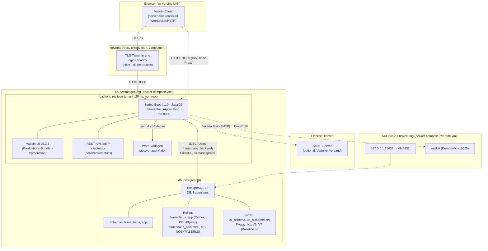
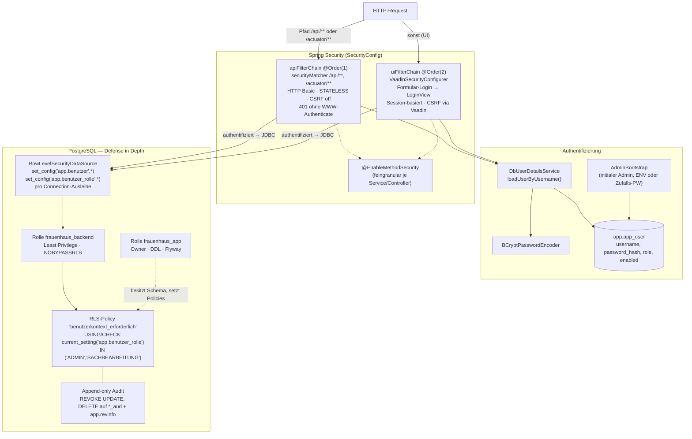
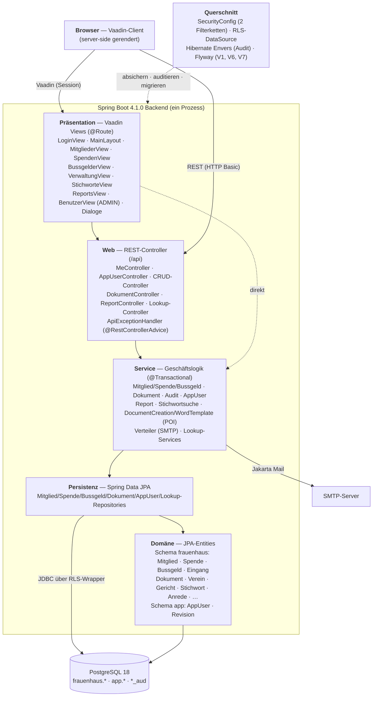
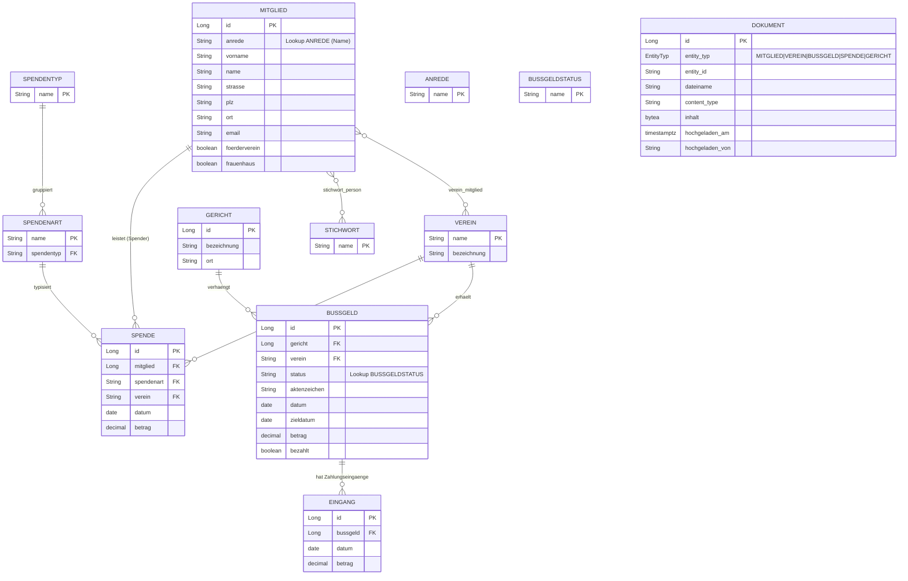
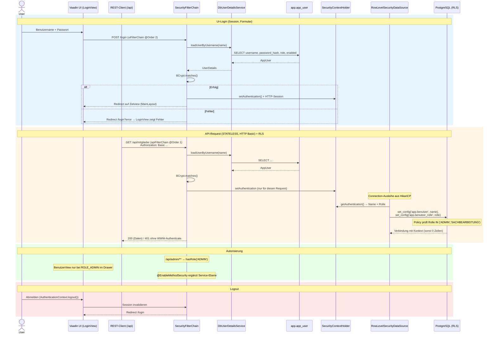
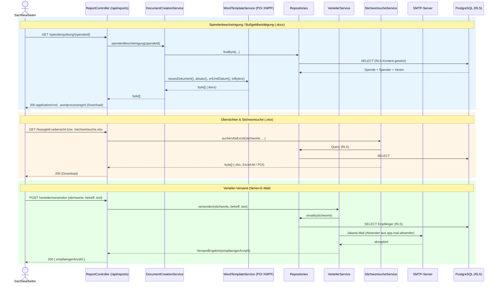

# Architekturdiagramme

Diese Diagramme dokumentieren die **tatsächlich implementierte** Architektur der
Frauenhaus-Verwaltung. Sie basieren auf dem Quellcode und ergänzen die in
[02-finale-architektur.md](02-finale-architektur.md) beschriebene Zielarchitektur
um die konkrete Code- und Laufzeitsicht.

**Technologie-Stand (verifiziert):** Spring Boot **4.1.0** · Java **25** ·
Vaadin **25.2.3** (nur freie `vaadin-core`-Komponenten) · PostgreSQL **18** ·
Hibernate Envers · Apache POI · Flyway · PostgreSQL-JDBC 42.7.13.

---

## 1. Systemarchitektur (Deployment / C4-Container)

### Deployment-Details

| Aspekt | Implementierung | Quelle |
|--------|-----------------|--------|
| Auslieferung | **Ein** Spring-Boot-Prozess liefert Vaadin-UI **und** REST-API aus — kein separater Web-/nginx-Container | `docker-compose.yml`, `pom.xml` |
| Frontend-Build | `-Pproduction` erzeugt optimiertes Vaadin-Bundle (Plugin lädt Node.js selbst) | `Dockerfile` |
| Laufzeit-Image | `eclipse-temurin:25-jre`, non-root User `app`, `EXPOSE 8080` | `Dockerfile` |
| TLS | In Produktion durch **vorgelagerten Reverse-Proxy** terminiert (nicht im Stack) | `docker-compose.yml` |
| Backend-Port | `${WEB_PORT:-8080}:8080` (UI + API gemeinsam) | `docker-compose.yml` |
| DB-Zugang App | `frauenhaus_backend` (NOSUPERUSER, NOCREATEDB, NOINHERIT, **NOBYPASSRLS**) | `V7__…rls.sql` |
| DB-Zugang Flyway | `frauenhaus_app` (Schema-Owner, DDL/GRANT) | `application.yml`, `docker-compose.yml` |
| Schema-Herkunft | `ddl-auto: validate`; Schema aus Flyway (`V1`, `V6`, `V7`) bzw. initdb-Skripten | `application.yml` |
| Upload-Limit | 10 MB (`spring.servlet.multipart` = `DokumentService.MAX_DATEIGROESSE`) | `application.yml` |
| SMTP | optional; ohne `spring.mail.host` kein `JavaMailSender` (nur Verteiler betroffen) | `application.yml` |
| Actuator | `health, info, metrics`; Mail-Health deaktiviert (SMTP optional) | `application.yml` |
| Dev-DB-Port | `127.0.0.1:15432` (vermeidet Konflikt mit lokalem Postgres) | `docker-compose.override.yml` |

---

## 2. Sicherheitsarchitektur (zwei Filterketten + RLS)

Die Anwendung trennt **UI** und **API** in zwei Spring-Security-Filterketten und
setzt die Zugriffskontrolle zusätzlich **in der Datenbank** durch (Defense-in-Depth).

### Sicherheitsmodell

| Ebene | Mechanismus | Quelle |
|-------|-------------|--------|
| API-Kette | `/api/**`, `/actuator/**`: HTTP Basic, `STATELESS`, CSRF aus; `/actuator/health/**` frei, `/api/admin/**` nur `ROLE_ADMIN` | `SecurityConfig.java` |
| UI-Kette | Vaadin `VaadinSecurityConfigurer`, Formular-Login über `LoginView`, Session; `/error` freigegeben | `SecurityConfig.java`, `LoginView.java` |
| 401-Verhalten | API sendet 401 **ohne** `WWW-Authenticate` → kein nativer Browser-Dialog | `SecurityConfig.java` |
| Passwörter | `BCryptPasswordEncoder` (adaptiv, gesalzen) | `SecurityConfig.java` |
| Benutzerquelle | `DbUserDetailsService` → `app.app_user` (Schema `app`) | `DbUserDetailsService.java` |
| Initial-Admin | `AdminBootstrap`: `APP_ADMIN_PASSWORD` oder einmalig geloggtes Zufalls-PW (kein hartes Default) | `AdminBootstrap.java` |
| Methodensicherheit | `@EnableMethodSecurity` (feingranular ergänzbar) | `SecurityConfig.java` |
| DB-Rollen | `frauenhaus_app` (Owner/DDL) vs. `frauenhaus_backend` (Least Privilege, `NOBYPASSRLS`) | `V7__…rls.sql` |
| RLS-Kontext | `RowLevelSecurityDataSource` setzt `app.benutzer` / `app.benutzer_rolle` je Connection (PreparedStatement, Fremdeingabe parametrisiert) | `RowLevelSecurityDataSource.java` |
| RLS-Policy | Zeilenfreigabe nur bei Rolle `IN ('ADMIN','SACHBEARBEITUNG')`; `current_setting(...,true)` → `NULL` statt Fehler | `V7__…rls.sql` |
| Append-only Audit | `REVOKE UPDATE, DELETE` auf `*_aud` + `app.revinfo` → Historie nicht manipulierbar | `V6__…append_only.sql`, `V7__…rls.sql` |

> **Ehrliche Grenze (aus dem Code kommentiert):** Die App-Rolle kann die
> RLS-Session-Variablen selbst per `set_config` setzen — RLS schützt vor
> *kontextlosem* Zugriff (versehentliches `psql`, naive Clients), ist aber keine
> harte Barriere gegen geleakte Backend-Zugangsdaten. Genau deshalb ist die
> Audit-Historie zusätzlich **append-only**. `app.app_user` bleibt bewusst
> **ohne** RLS (wird beim Login gelesen, bevor ein Kontext existiert).

---

## 3. Anwendungsschichten (Bausteinsicht)

> **Zusammenspiel UI ↔ API.** Die Vaadin-Views sind reine serverseitige
> UI-Verdrahtung; fachliche Operationen laufen über die REST-Controller bzw.
> direkt über die Service-Schicht im selben Prozess. Beide Eintrittspunkte teilen
> sich Services, Repositories, Domänenmodell und die RLS-abgesicherte DataSource.

---

## 4. Domänenmodell (Entity-Relationship)

Abgeleitet aus den JPA-Entities (`de.frauenhaus.domain`, Schema `frauenhaus`).
`@Audited`-Entities werden von Envers in `*_aud`-Tabellen historisiert.

> **`Dokument` ist polymorph** (kein FK): Die Zuordnung erfolgt über
> `entity_typ` (Enum) + `entity_id` mit Index `idx_dokument_entity`. Der Inhalt
> liegt als `bytea` in der Datenbank (ein gemeinsamer Backup-Pfad, ADR-008).

### Entities, Audit & Beziehungen

| Entity | Schlüssel | `@Audited` | Audit-Tabelle | Beziehungen |
|--------|-----------|:----------:|---------------|-------------|
| `Mitglied` | `Long id` | ✅ | `mitglied_aud` | M:N `Stichwort` (`stichwort_person`), M:N `Verein` (`verein_mitglied`) |
| `Spende` | `Long id` | ✅ | `spende_aud` | M:1 `Mitglied` (Ziel *nicht* auditiert), M:1 `Spendenart`, M:1 `Verein` |
| `Bussgeld` | `Long id` | ✅ | `bussgeld_aud` | M:1 `Gericht`, M:1 `Verein`, 1:N `Eingang` (cascade, orphanRemoval) |
| `Eingang` | `Long id` | ❌ | — | M:1 `Bussgeld` |
| `Verein` | `String name` | ✅ | `verein_aud` | — |
| `Gericht` | `Long id` | ✅ | `gericht_aud` | — |
| `Dokument` | `Long id` | ❌ | — | polymorph (`entity_typ` + `entity_id`) |
| `Stichwort` / `Anrede` / `Spendenart` / `Spendentyp` / `Bussgeldstatus` | `String name` | ❌ | — | Lookups |
| `AppUser` | `Long id` | ❌ | — | Schema `app` |

### RLS-geschützte Tabellen (Policy `benutzerkontext_erforderlich`)

`frauenhaus.mitglied`, `spende`, `bussgeld`, `eingang`, `stichwort_person`,
`verein_mitglied`, `dokument`, `mitglied_aud`, `spende_aud`, `bussgeld_aud`,
`app.revinfo`.

**Bewusst ohne RLS:** `app.app_user` (Login-Henne-Ei) sowie reine Lookups ohne
Personenbezug (`anrede`, `verein`, `gericht`, `spendenart`, `spendentyp`,
`stichwort`, `bussgeldstatus`, `verein_aud`, `gericht_aud`).

---

## 5. Authentifizierung & Autorisierung (Sequenz)

Zwei Eintrittspunkte mit unterschiedlicher Session-Politik, aber gemeinsamem
Benutzerspeicher und gemeinsamem RLS-Kontext.

### Auth-Flow Details

| Aspekt | Implementierung | Quelle |
|--------|-----------------|--------|
| UI-Login | Vaadin `LoginForm` postet auf `login`; Session-basiert | `LoginView.java`, `SecurityConfig.java` |
| API-Login | HTTP Basic je Request, `SessionCreationPolicy.STATELESS` | `SecurityConfig.java` |
| `/api/me` | Liefert `username` + `roles` des angemeldeten Principals | `MeController.java` |
| Rollen | `ROLE_ADMIN`, `ROLE_SACHBEARBEITUNG` (RBAC) | `SecurityConfig.java`, `V7__…rls.sql` |
| Admin-Sichtbarkeit | `BenutzerView` nur im Drawer, wenn `ROLE_ADMIN` | `MainLayout.java` |
| RLS-Kontext | pro Connection gesetzt; leer ohne Anmeldung (kein Verschleppen im Pool) | `RowLevelSecurityDataSource.java` |
| Audit-Bearbeiter | `AuditRevisionListener` schreibt Benutzernamen aus dem `SecurityContext` (sonst `system`) | `AuditRevisionListener.java` |

---

## 6. Dokument- & Report-Erzeugung (Sequenz)

Serverseitige Erzeugung von Word-/Excel-Dokumenten (Apache POI, headless — kein
Office/Outlook) sowie Verteiler-Versand per SMTP.

### Dokument-Funktionen

| Endpunkt / Funktion | Ergebnis | Umsetzung | Quelle |
|---------------------|----------|-----------|--------|
| `/spendenquittung/{id}`, `/bussgeld-bestaetigung/{id}` | `.docx` | `DocumentCreationService` → `WordTemplateService` (POI XWPF) | `ReportController.java`, `DocumentCreationService.java` |
| `/bussgeld-uebersicht`, `/bussgeld-detail`, `/spenden-uebersicht` | `.xlsx` | `BussgeldReportService` / `ExcelUtil` (POI) | `ReportController.java` |
| `/stichwortsuche`, `/stichwortsuche.xlsx` | JSON / `.xlsx` | `StichwortsucheService` | `StichwortsucheService.java` |
| `/serienbrief`, `/serienbrief-adressen` | `.docx` / Adressliste | `VerteilerService.serienbrief/adressen` | `VerteilerService.java` |
| `/verteiler-emails`, `/verteiler/versenden` | E-Mail-Liste / Versand | `VerteilerService` (SMTP) | `VerteilerService.java` |
| Dokument-Upload/Download | `bytea` | `DokumentController` → `DokumentService` (polymorph, max. 10 MB) | `DokumentController.java` |

---

## Zusammenfassung der Abweichungen von der Planungsdoku

| Thema | Planung (Seminararbeit / ADRs) | Implementierung (dieser Stand) |
|-------|--------------------------------|--------------------------------|
| UI-Framework | Vaadin (ADR-003) | **Vaadin 25.2.3** — wie geplant |
| REST-Schicht | „nicht Teil der initialen Architektur" (ADR-001) | **vorhanden** (`/api/**`, eigene STATELESS-Filterkette) |
| Authentifizierung | Session-basiert (Vaadin) | **UI: Session · API: HTTP Basic** (zwei Filterketten) |
| DB-Absicherung | BCrypt + RBAC, Prepared Statements | **zusätzlich RLS + append-only Audit + Least-Privilege-Rolle** |
| Spring Boot / Java | Spring Boot 4.x / Java 25 | **4.1.0 / 25** |

Diese Ergänzungen (REST-API, RLS, append-only Historie) sind konsequente
Härtungen und wurden im Zuge des Gruppen-Reviews eingeführt; sie stärken das in
ADR-004/008/009 formulierte Sicherheits- und Persistenzkonzept, ohne den
Architekturstil (3-Schichten, On-Premises, Vaadin) zu verändern.
