# Zusammenfassung

Diese Arbeit dokumentiert die Modernisierung der Vereinsverwaltung **FH_MA** aus Sicht der
Architekturgruppe. Das Altsystem ist eine Java-Swing-Anwendung mit direktem JDBC-Zugriff auf
Microsoft SQL Server Express. Klartext-Zugangsdaten auf den Clients, dynamisch zusammengesetzte
SQL-Anweisungen, fehlende zentrale Autorisierung und ein manuelles Backupverfahren begründen
einen grundlegenden Architekturwechsel.

Entworfen und im abgegebenen Prototyp weitgehend umgesetzt wurde ein zentraler
3-Schichten-Monolith mit **Spring Boot 4.1.0**, **Java 25**, **Vaadin 25.2.3** und
**PostgreSQL 18**. Die Anwendung wird zusammen mit der Datenbank über Docker Compose betrieben.
Da die Aufgabenstellung den vollständigen Betrieb inklusive Datenbank unter Microsoft Windows
verlangt, wird dieser Linux-Container-Stack in ADR-013 explizit über Docker Desktop mit WSL 2
begründet und gegen native Windows-Alternativen abgewogen.
Neben der serverseitig gerenderten Vaadin-Oberfläche existiert eine REST-API. Spring Security,
BCrypt, rollenbasierte Autorisierung, Hibernate Envers und PostgreSQL Row-Level Security bilden
mehrere Sicherheitsschichten.

Die Arbeit trennt konsequent zwischen Architekturentscheidung, im Code nachweisbarer Umsetzung
und noch offenen Betriebsnachweisen. Für Backup & Recovery ist als lauffähige Zwischenstufe ein
verschlüsselter, fehlerprotokollierter `pg_dump`-Übergangsjob unter der Windows-Aufgabenplanung
umgesetzt; die pgBackRest-Zielkonfiguration ist zwar vorhanden,
aber weder als Backupdienst in Docker Compose eingebunden noch durch einen protokollierten
Restore-Test belegt. Auch Verfügbarkeit, RTO und RPO bleiben Zielwerte, solange keine Messungen
vorliegen. Dadurch wird vermieden, geplante Eigenschaften als bereits erreichte Ergebnisse
darzustellen.

Eine gemeinsam mit der Metriken-Gruppe durchgeführte Messung stützt diese Einordnung
richtungsweisend: Das SonarQube-Security-Rating steigt von E auf A, die Security Hotspots sinken
von 151 auf 0 und die zyklomatische Gesamtkomplexität fällt von 1.268 auf 997, während Kopplung
(CBO) und teilweise Kohäsion (LCOM) messbar offene Punkte bleiben (Kapitel 12). Da Alt- und
Neusystem keinen nachweislich gleichen Funktionsumfang besitzen, sind diese Werte als Trend und
nicht als abschließend reproduzierbarer Nachweis zu lesen (§12.1).

# 1. Einleitung

Die Modernisierung eines gewachsenen Systems beginnt nicht mit der Technologiewahl, sondern mit einer belastbaren Beschreibung des Ausgangszustands und der Ziele. Dieses Kapitel ordnet das Vorhaben fachlich und methodisch ein, grenzt den Betrachtungsgegenstand ab und legt offen, welche Gruppe welchen Beitrag verantwortet.

## 1.1 Ausgangslage

Der Auftraggeber ist ein kleiner, gemeinnütziger Frauenhaus-Trägerverein. Die Anwendung verwaltet
Mitglieder, Spenden, gerichtlich zugewiesene Bußgelder, Zahlungseingänge, Dokumente und
Serienbriefe. Personen- und Adressdaten besitzen in diesem Kontext einen sehr hohen Schutzbedarf:
Bereits der Zusammenhang mit einem Frauenhaus kann sensible Informationen mittelbar offenbaren.
Der Europäische Gerichtshof hat klargestellt, dass auch Daten unter Art. 9 Abs. 1 DSGVO fallen
können, wenn sie besondere Kategorien personenbezogener Daten indirekt erkennen lassen
[6].

Das vorhandene System ist als Fat Client aufgebaut. Jede Swing-Installation greift direkt auf die
Datenbank zu. Die Architektur weist insbesondere folgende Schwächen auf:

- Datenbankzugangsdaten befinden sich auf den Arbeitsplatzrechnern.
- SQL wird teilweise durch String-Konkatenation erzeugt.
- Eine zentrale Anwendungsschicht für Authentifizierung, Autorisierung und Validierung fehlt.
- Änderungen müssen auf mehreren Clients ausgerollt werden.
- Backup und Wiederherstellung sind nicht als überprüfter Betriebsprozess etabliert.

## 1.2 Zielsetzung

Ziel ist eine wartbare, zentral kontrollierte und für einen kleinen Verein betreibbare
Webanwendung. Die Architektur soll:

1. den direkten Datenbankzugriff der Clients beseitigen,
2. Benutzer und Rollen zentral verwalten,
3. Geschäftsregeln und Transaktionen im Backend bündeln,
4. Datenbankänderungen versionieren und relevante Änderungen auditieren,
5. Backup und Wiederherstellung planbar machen,
6. ohne unnötige Verteilungskomplexität auskommen.

Die Arbeit bewertet nicht nur das Zielbild. Sie gleicht die Architecture Decision Records mit dem
abgegebenen `Code.zip` ab und kennzeichnet Aussagen als **implementiert**, **konfiguriert**,
**getestet** oder **noch nachzuweisen**.

## 1.3 Methodisches Vorgehen

Die Architekturarbeit kombiniert vier Perspektiven:

- **ADRs:** Signifikante Entscheidungen werden mit Kontext, Alternativen, Begründung und
  Konsequenzen dokumentiert [4].
- **arc42 und C4:** Kontext-, Baustein-, Laufzeit- und Deployment-Sichten strukturieren die
  Beschreibung [2], [3].
- **ISO/IEC 25010:** Qualitätsmerkmale werden aus Stakeholderinteressen abgeleitet und entlang
  des dort definierten Produktqualitätsmodells benannt [1].
- **Implementierungsabgleich:** `pom.xml`, Java-Quellcode, Migrationen, Compose-Dateien,
  Testquellen und Betriebsartefakte in `Code.zip` werden mit den ADRs verglichen.

Gewichtete Entscheidungsmatrizen dienen als Gesprächs- und Dokumentationshilfe, nicht als
objektiver Beweis. Ihre Ergebnisse hängen von Kriterien, Gewichten und Bewertungen ab. Deshalb
werden die Bewertungsannahmen offengelegt und technische Entscheidungen zusätzlich qualitativ
begründet.

## 1.4 Abgrenzung

Die Architekturgruppe verantwortet das Architekturziel und dessen Dokumentation. Fachliche
Richtigkeit steuerlicher Formulare, vollständige Datenschutz-Rechtsberatung und der dauerhafte
Produktivbetrieb liegen außerhalb dieser Prüfungsleistung. Sie werden als Abnahmeanforderungen
und Risiken berücksichtigt.

## 1.5 Autoren- und Kapitelzuordnung

Die Beiträge wurden in vier fachlich zusammenhängende Blöcke gegliedert. Die Kopfzeile jeder
PDF-Seite nennt genau die Person, die für den auf dieser Seite dargestellten Block verantwortlich
ist. Beginnt ein neuer Block, beginnt er wegen des erzwungenen Seitenumbruchs der Hauptkapitel
zugleich auf einer neuen Seite.

| Verantwortlicher Autor | Zugeordneter Inhalt |
|------------------------|---------------------|
| **Nils Firschau** | Frontmatter sowie Kapitel 1–3: Problemstellung, Anforderungen und Architekturentscheidungen |
| **Paul Faller** | Kapitel 4–6: implementierte Architektur, Laufzeitsichten, Sicherheit, Datenschutz, Persistenz, Audit und Dokumente |
| **Robin Steiner** | Kapitel 7–9: Betrieb, Deployment, Backup und Recovery, Qualitätssicherung sowie Risiken und technische Schulden |
| **Ole Schildt** | Kapitel 10–13: Evaluation, teamübergreifende Umsetzung, metrische Bewertung und Fazit |

Glossar, ADR-Register, Traceability-Matrix, Evidenzinventar und Literaturverzeichnis (Kapitel 14
sowie Anhänge A bis C) sind Gemeinschaftsarbeit der gesamten Gruppe; sie sammeln Zuarbeiten aus
allen Blöcken und werden deshalb keiner Einzelperson zugerechnet. Die Kopfzeile dieser Teile führt
aus formalen Gründen den Autor des letzten Blocks weiter.

Die Zuordnung dient der transparenten Autorenschaft. Inhaltliche Entscheidungen und die
abschließende Qualitätssicherung bleiben gemeinsame Verantwortung der gesamten Gruppe.

# 2. Anforderungen und Stakeholder

Architekturentscheidungen sind nur dann begründbar, wenn die Anforderungen, an denen sie gemessen werden, vorher dokumentiert sind. Das Kapitel führt daher die funktionalen und die qualitätsbezogenen Anforderungen, die betroffenen Stakeholder sowie die verbindlichen Randbedingungen zusammen und zeigt abschließend, wie sich jede Anforderung bis zu ihrem Nachweis verfolgen lässt.

## 2.1 Funktionale Anforderungen

| ID | Anforderung |
|----|-------------|
| FR-1 | Anmeldung sowie Rollen Administrator und Sachbearbeitung |
| FR-2 | Mitglieder und Adressen anlegen, ändern, löschen, suchen und filtern |
| FR-3 | Spenden erfassen und verwalten |
| FR-4 | Bußgelder einschließlich Status verwalten |
| FR-5 | mehrere Zahlungseingänge und automatische Restbetragsberechnung |
| FR-6 | Gerichte verwalten |
| FR-7 | Stammdaten administrieren |
| FR-8 | Spenden-, Bußgeld- und Vereinsauswertungen |
| FR-9 | Spendenbescheinigungen erzeugen |
| FR-10 | Serienbriefe erzeugen |
| FR-11 | Eingaben validieren |
| FR-12 | inkonsistente Daten verhindern |

## 2.2 Qualitätsanforderungen

| ID | Qualitätsziel | Bedeutung |
|----|---------------|-----------|
| NFR-1 | Sicherheit und Datenschutz | angemessener Schutz personenbezogener Daten |
| NFR-2 | Zuverlässigkeit | stabiler Betrieb und kontrollierte Wiederherstellung |
| NFR-3 | Wartbarkeit | klare Verantwortlichkeiten und versionierte Änderungen |
| NFR-4 | Backup und Recovery | automatisiert, verschlüsselt und überprüfbar |
| NFR-5 | Bedienbarkeit | Nutzung ohne technischen Hintergrund |

Die Ziele orientieren sich an den Merkmalen des Produktqualitätsmodells nach ISO/IEC 25010 [1]:
NFR-1 entspricht der Sicherheit, NFR-2 der Zuverlässigkeit, NFR-3 der Wartbarkeit und NFR-5 der
Gebrauchstauglichkeit; NFR-4 konkretisiert die Wiederherstellbarkeit als Teilmerkmal der
Zuverlässigkeit. Begriffe wie „stabil“, „sicher“ oder „wartbar“ sind ohne Mess- oder
Abnahmekriterium nicht prüfbar. Kapitel 8 überführt sie deshalb in Zielwerte und weist den
jeweiligen Nachweisstatus aus.

## 2.3 Stakeholder

| Stakeholder | Interesse |
|-------------|-----------|
| Vereinsvorstand | Datenschutz, Kosten, fachliche und rechtliche Risiken |
| Sachbearbeitung | einfache und fehlerarme tägliche Nutzung |
| Administration | wartbarer Betrieb, Benutzerverwaltung, Backup und Updates |
| Betroffene Personen | Vertraulichkeit, Integrität, Auskunft und Löschung |
| Finanzamt und Gerichte | korrekte Dokumente und Auswertungen |
| Entwicklungsteam | verständliche Architektur und reproduzierbarer Build |

## 2.4 Zentrale Anwendungsfälle

Die funktionalen Anforderungen werden für die Architektur nicht als gleichförmige CRUD-Liste
behandelt. Einige Anwendungsfälle besitzen besondere Auswirkungen auf Transaktionen, Sicherheit
oder Dokumentgenerierung.

### Mitglied aufnehmen und einem Verein zuordnen

Die Sachbearbeitung erfasst die Stammdaten, wählt Anrede und Vereinszugehörigkeit und ergänzt
gegebenenfalls Stichworte. Die Anwendung muss Pflichtfelder vor dem Speichern prüfen. Gleichzeitig
muss die Datenbank verhindern, dass ungültige Fremdschlüssel oder doppelte Zuordnungen entstehen.
Die Architektur benötigt deshalb Validierung auf mehreren Ebenen: nutzernahe Hinweise in der UI,
fachliche Invarianten in der Service-Schicht und referentielle Integrität in PostgreSQL.

### Spende erfassen und Bescheinigung erzeugen

Eine Spende verweist auf Spender, Verein und Spendenart. Die Bescheinigung verbindet damit
persistierte Daten, steuerlich relevante Vorlagen und eine herunterladbare Datei. Der
Anwendungsfall ist mehr als ein Datenbank-Insert: Er benötigt eine konsistente Lesesicht,
Vorlagenauswahl, Platzhalterersetzung, Fehlerbehandlung und gegebenenfalls die Speicherung des
erzeugten Dokuments. Fehler dürfen nicht zu einer scheinbar erfolgreichen Bescheinigung führen.

### Zahlungseingang zu einem Bußgeld buchen

Mehrere Zahlungseingänge verändern den offenen Betrag eines Bußgelds. Bei paralleler Bearbeitung
müssen verlorene Aktualisierungen verhindert werden. Die Berechnung gehört deshalb in eine
transaktionale Backendoperation. Der in der UI angezeigte Restbetrag ist eine Darstellung des
serverseitig bestimmten Zustands und keine eigenständige fachliche Wahrheit.

### Benutzer administrieren

Nur Administratoren dürfen Benutzer anlegen, deaktivieren oder Rollen ändern. Diese Regel muss
sowohl für Vaadin-Routen als auch für REST-Endpunkte gelten. Eine ausschließlich ausgeblendete
Schaltfläche wäre keine Autorisierung. Der Anwendungsfall ist daher ein wesentlicher Negativtest
für die beiden Security-Filterketten.

### Verteiler und Serienbriefe erzeugen

Such- und Filterkriterien können größere Ergebnismengen erzeugen. Die Anwendung muss transparent
machen, welche Personen ausgewählt wurden, und darf fehlerhafte Adressen nicht unbemerkt
überspringen. Beim optionalen E-Mail-Versand kommen externe SMTP-Konfiguration, Datenschutz und
teilweise fehlgeschlagene Zustellungen hinzu.

## 2.5 Architekturrelevante Randbedingungen

| Randbedingung | Architektonische Wirkung |
|---------------|---------------------------|
| Betrieb vollständig unter Microsoft Windows (Client, Server und Datenbank) | Serverstack läuft auf einem Windows-Host; Abwägung der Betriebsvarianten in ADR-013 (§3.5) |
| Windows-Arbeitsplätze | Browserbasierte Nutzung ohne lokale Java-Installation |
| kleiner Nutzerkreis | kein Bedarf an horizontaler Skalierung oder Microservices |
| sehr hoher Schutzbedarf | zentrale Autorisierung, TLS, RLS, Audit und restriktive Administration |
| vorhandener Java-Code | Java als fachliche Referenz und Migrationshilfe |
| Word-Vorlagen | Apache-POI-Unterstützung und fachliche Dokumenttests |
| begrenztes Betriebswissen | wenige Laufzeitkomponenten und dokumentierte Wiederanläufe |
| lokale Erreichbarkeit | On-Premises ist möglich, aber weiterhin zu härten und zu überwachen |
| Hochschulprojekt | Prototyp und Produktionsreife müssen ausdrücklich unterschieden werden |

Einige Randbedingungen stammen aus der Aufgabenstellung, andere aus der Analyse des vorhandenen
Systems. Besonders wichtig ist die letzte Zeile: Eine Prüfungsabgabe kann Architekturmechanismen
demonstrieren, ohne einen mehrmonatigen Produktivbetrieb oder rechtsverbindliche Compliance zu
belegen.

## 2.6 Nachverfolgbarkeit der Anforderungen

Die folgende Übersicht zeigt exemplarisch, wie Anforderungen zu Architekturentscheidungen und
Nachweisen führen. Eine ausführlichere Matrix befindet sich in Anhang B.

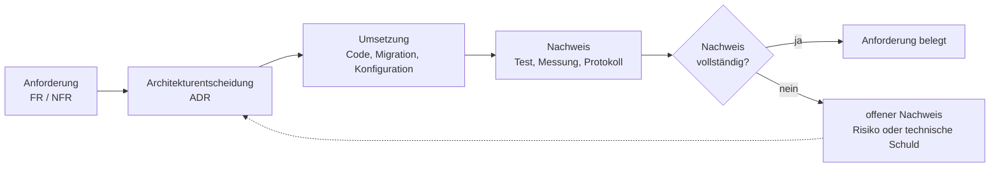

*Abbildung: Nachverfolgbarkeitskette von der Anforderung bis zum Nachweis.*

| Anforderung | Architekturantwort | Nachweis im Prototyp | Offener Nachweis |
|-------------|---------------------|----------------------|------------------|
| FR-1 | Spring Security, BCrypt, RBAC | zwei Filterketten und Security-Tests | reproduzierbaren DB-gestützten Testlauf archivieren |
| FR-5 | Service-Transaktion und Datenmodell | Service- und Fachtests vorhanden | Parallelitätstest |
| FR-9 | serverseitige Vorlagenverarbeitung | Apache-POI-Services und Tests | fachliche Formularabnahme |
| FR-12 | Constraints, Transaktionen, RLS | Migrationen und RLS-Komponenten | vollständige Negativtests |
| NFR-1 | zentrale Security, RLS, Audit | Implementierungsartefakte vorhanden | Bedrohungs- und Datenschutzabnahme |
| NFR-4 | pgBackRest-Zielbild; verschlüsselter `pg_dump`-Übergangsjob implementiert | Konfigurationsdatei und `ops/backup-interim.ps1` vorhanden | pgBackRest als Dienst und protokollierter Restore |
| NFR-5 | Vaadin-Verwaltungsoberfläche | Views vorhanden | Usability-Test mit Zielgruppe |

# 3. Architekturentscheidungen

Die vierzehn Architecture Decision Records bilden kein unverbundenes Register, sondern eine
Entscheidungskette: Der Stilentscheidung folgen Technologie-, Betriebs- und Backupentscheidungen,
die einander bedingen und teilweise ersetzt oder ergänzt wurden.

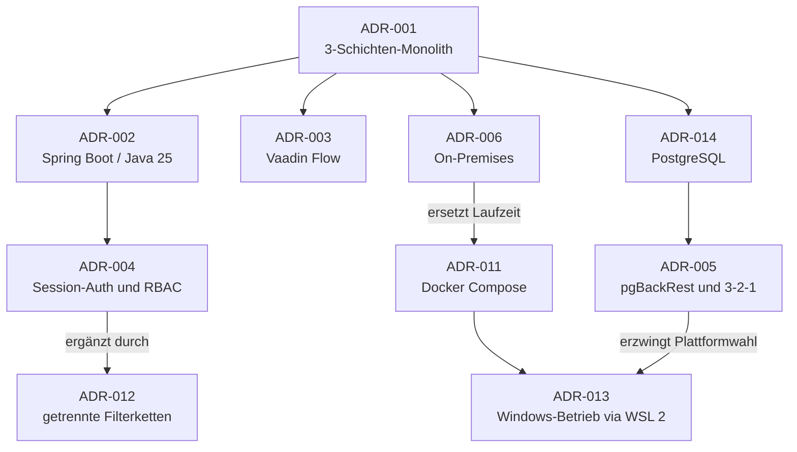

*Abbildung: Entscheidungslandkarte der Architecture Decision Records und ihrer Abhängigkeiten.*

## 3.1 Architekturstil: zentraler 3-Schichten-Monolith

ADR-001 ersetzt das Fat-Client-Modell durch eine zentrale Webanwendung:

```text
Browser → zentrale Anwendung → PostgreSQL
```

Ein modularer Monolith ist für wenige gleichzeitige Benutzer und ein kleines Betriebsteam
angemessener als Microservices. Er vermeidet Service Discovery, verteilte Transaktionen,
Nachrichteninfrastruktur und mehrere unabhängig zu betreibende Deployments. Diese Einordnung
folgt der Empfehlung, mit einem gut strukturierten Monolithen zu beginnen und eine Zerlegung erst
bei nachgewiesenem Bedarf vorzunehmen [24, 25]. Gegenüber einem
modernisierten Desktop-Client besitzt er den wesentlichen Vorteil, dass Browser keine
Datenbankzugangsdaten benötigen.

„3-Schichten“ bezeichnet logische Verantwortlichkeiten und nicht zwingend drei getrennte Server.
Im Prototyp befinden sich Vaadin-Präsentation und Spring-Boot-Anwendung im selben Prozess,
während PostgreSQL in einem separaten Container läuft.

## 3.2 Backend: Spring Boot und Java 25

ADR-002 wählt Spring Boot. Der abgegebene Build verwendet Spring Boot **4.1.0** [12] und Java **25** [11].
Die Entscheidung ist insbesondere durch folgende Aspekte plausibel:

- vorhandener Java-Bestandscode als fachliche Referenz,
- Spring Security, Spring Data JPA und Transaktionsunterstützung,
- Apache POI für Office-Dokumente,
- etablierte Testwerkzeuge,
- Betrieb als einzelnes Anwendungsartefakt.

Java 25 wurde am 16. September 2025 als LTS-Release veröffentlicht. Supportzeiträume sind
distributions- und lizenzabhängig. Oracle plant kostenlose NFTC-Updates bis September 2028 und
kommerziellen Extended Support bis mindestens September 2033 [10]. Die Arbeit verwendet
daher nicht die pauschale Aussage, jede Java-25-Distribution sei automatisch bis 2033 kostenlos
unterstützt.

## 3.3 Frontend: Vaadin Flow

ADR-003 entscheidet sich für Vaadin. `Code.zip` bestätigt Vaadin **25.2.3** [13] und ein
Produktions-Bundle im Spring-Boot-Artefakt. Ein zwischenzeitlich untersuchter Angular-Ansatz ist
nicht Bestandteil der finalen Implementierung.

Vaadin passt zu einer formular- und tabellenlastigen Verwaltungsanwendung:

- UI und Services verwenden dieselbe Java-Typwelt.
- Eine separate SPA-Deploymentkette entfällt.
- Formulare, Grids, Navigation und Validierungsintegration sind verfügbar.
- Die Oberfläche wird zentral aktualisiert.

Die Entscheidung besitzt zugleich Nachteile: serverseitiger Sitzungszustand, Bindung an das
Vaadin-Programmiermodell und potenzielle Lizenzkosten für nicht freie Zusatzkomponenten. Der
Prototyp verwendet laut Architekturartefakten ausschließlich freie `vaadin-core`-Komponenten.

Die frühere Matrix bewertete Vaadin in allen Kriterien maximal. Das ist als objektiver Nachweis
zu stark. Eine angemessenere Darstellung ist:

| Kriterium | Vaadin | Angular | Einordnung |
|-----------|:------:|:-------:|------------|
| Java-Integration | hoch | mittel | Vorteil Vaadin |
| unabhängige Frontend-Entwicklung | niedrig | hoch | Vorteil Angular |
| Betriebsartefakte | ein Anwendungsartefakt | getrennte Builds | kontextabhängig |
| serverseitiger Zustand | erforderlich | nicht zwingend | Nachteil Vaadin |
| Komponenten für Verwaltungs-UI | hoch | hoch | kein eindeutiger Sieger |

## 3.4 Datenbank: PostgreSQL

PostgreSQL 18 [14] ersetzt SQL Server Express. Gründe sind offene Lizenzierung, fehlende
Express-Größenlimits, Transaktions- und Constraint-Unterstützung sowie die Integration mit
Spring Data JPA. Die Wahl eines DBMS garantiert jedoch weder Konsistenz noch Datenschutz.
Entscheidend sind Schema, Constraints, Rollen, Migrationen, Backup und Betrieb. Die Entscheidung
ist als **ADR-014** dokumentiert. PostgreSQL adressiert die Rahmenbedingung eines
Windows-Betriebs nicht selbst; der Windows-konforme Betrieb des Datenbankdienstes wird deshalb
über ADR-013 (§3.5) sichergestellt.

## 3.5 Deployment: On-Premises und Container

ADR-006 entscheidet sich für einen lokalen Betrieb. Diese Entscheidung reduziert Abhängigkeiten
von Internetverbindung und externen Auftragsverarbeitern. Sie ist aber keine hinreichende
Bedingung für DSGVO-Konformität. Die DSGVO ist technologieneutral; maßgeblich sind unter anderem
Rechtsgrundlagen, technische und organisatorische Maßnahmen, Berechtigungskonzepte,
Löschprozesse und gegebenenfalls eine Datenschutz-Folgenabschätzung [5, 7].

Der ursprüngliche Entwurf sah native Windows-Dienste vor. Der Prototyp verwendet dagegen
Docker Compose [22] mit Backend- und Datenbankcontainer. ADR-011 dokumentiert diese Änderung. TLS soll
durch einen vorgelagerten Reverse Proxy terminiert werden, der nicht Teil des Compose-Stacks ist.
Damit bleibt eine konkrete Betriebsentscheidung offen.

### Windows-Konformität des Betriebs (ADR-013)

Die Aufgabenstellung fordert als verbindliche Rahmenbedingung, dass die gesamte Software
einschließlich Datenbank unter Microsoft Windows läuft. Diese Vorgabe wird hier bewusst als
eigene Architekturentscheidung (**ADR-013**) behandelt, weil der gewählte Container-Stack sonst
als Verstoß gegen die Windows-Vorgabe missverstanden werden könnte. Bewertet wurden vier
Betriebsvarianten:

| Betriebsvariante | Windows-Konformität | Wartung/Support beim Verein | Backup-Konsequenz | Bewertung |
|------------------|---------------------|-----------------------------|-------------------|-----------|
| Docker Desktop bzw. Docker Engine mit WSL 2 (gewählt) | läuft als verwalteter Dienst auf einem Windows-Host | eine reproduzierbare, versionierte Laufzeit; geringe Wartung | pgBackRest im Linux-Container nutzbar; als Übergang `pg_dump` vom Windows-Host | **gewählt** |
| Windows-Container | nativ Windows | offizielle PostgreSQL-Windows-Container werden kaum gepflegt | eingeschränkte Werkzeugunterstützung | verworfen |
| Nativer Windows-Dienst (PostgreSQL-Dienst + Java-Dienst) | vollständig nativ | vertrauter, aber manueller Betrieb je Komponente | pgBackRest nicht nativ [16]; Umstieg auf `pg_basebackup`/`pg_dump` nötig | dokumentierte Rückfalloption |
| Hyper-V-Linux-VM auf Windows-Host | Windows-Host, Linux-Gast | zusätzliche VM-Administration | pgBackRest nutzbar, höherer Betriebsaufwand | verworfen |

Gewählt wird die Ausführung der beiden Container unter **Docker Desktop bzw. Docker Engine auf
Windows**; die dafür genutzte Linux-Laufzeit stellt das in Windows integrierte **WSL 2** bereit.
Aus Sicht des Betreibers sind damit sowohl der Anwendungsserver als auch die Datenbank ein unter
Windows verwalteter, über den Windows-Diensthost gestarteter Prozess. Host, Speicher, Netzwerk und
Betriebsführung unterstehen vollständig Windows; die Container isolieren lediglich die
Laufzeitumgebung. Die Rahmenbedingung ist damit erfüllt.

Die containerisierte Variante wurde der rein nativen Installation vorgezogen, weil sie
reproduzierbare, versionierte Umgebungen, einheitliche Konfiguration und eine einfachere Wartung
ermöglicht (vgl. ADR-011) und weil das vorgesehene Backupwerkzeug pgBackRest keine native
Windows-Installation besitzt [16]. Verlangt eine spätere Ausschreibung eine Container-freie
Installation, bleibt der native Windows-Betrieb als dokumentierte Rückfalloption bestehen:
PostgreSQL wird offiziell als Windows-Dienst bereitgestellt und die Spring-Boot-Anwendung läuft als
eigenständiger Java-Dienst; die Backupstrategie müsste dann auf ein Windows-fähiges Verfahren
(etwa `pg_basebackup` oder `pg_dump` mit WAL-Archivierung, siehe §3.6) umgestellt werden. Für den
vorliegenden Prototyp wird die Docker-Variante als Zielbild geführt, da sie die geforderte
einfache Wartung am besten unterstützt und vollständig auf einem Windows-Server betrieben werden
kann.

## 3.6 Backupentscheidung

ADR-005 beschreibt pgBackRest, WAL-Archivierung und eine 3-2-1-Strategie [15]. `Code.zip` enthält
`ops/pgbackrest.conf`, die Compose-Datei bindet jedoch ausdrücklich keinen Backupdienst ein.
Die Entscheidung ist daher **konfiguriert, aber nicht als laufender Betriebsprozess
implementiert**.

Die ursprüngliche Kombination aus nativen Windows-Diensten und pgBackRest war nicht konsistent:
pgBackRest unterstützt keine native Windows-Installation [16]. Im nun
containerisierten Linux-Kontext ist der Einsatz technisch plausibel, muss aber noch integriert
und durch Restore-Tests belegt werden.

## 3.7 Bewertungsmethode und Grenzen der Entscheidungsmatrizen

Technologieentscheidungen wurden teilweise über gewichtete Matrizen vorbereitet. Das Vorgehen
erhöht die Transparenz, besitzt aber drei Grenzen. Erstens sind Kriterien nie vollständig
neutral: Das Kriterium „direkte Wiederverwendung von Java-Services“ bevorzugt ein Java-UI,
während „unabhängige Frontendentwicklung“ ein separates SPA-Framework bevorzugt. Zweitens sind
Sternebewertungen ordinal und nicht automatisch messbar. Der Unterschied zwischen vier und fünf
Sternen ist keine objektive Einheit. Drittens kann eine hohe Gesamtsumme ein Ausschlusskriterium
verdecken, beispielsweise fehlende Plattformunterstützung eines Betriebswerkzeugs.

Die Matrizen werden daher in dieser Arbeit nach folgenden Regeln interpretiert:

1. Kriterien werden aus Anforderungen und Randbedingungen abgeleitet.
2. Ausschlusskriterien werden vor der gewichteten Bewertung geprüft.
3. Bewertungen erhalten eine textuelle Begründung und möglichst einen Prototypnachweis.
4. Sensitivitätsanalysen prüfen, ob kleine Gewichtsänderungen die Entscheidung umkehren.
5. Negative Konsequenzen der gewählten Option werden nicht in den Ausblick verschoben, sondern
   als technische Schulden dokumentiert.

Für die Frontendentscheidung bedeutet dies: Vaadin ist nicht generell besser als Angular,
sondern im gewählten Kontext wegen Java-Integration und eines gemeinsamen Deploymentartefakts
vertretbar. Für andere Teams, öffentliche Webangebote oder stark getrennte
Frontend-/Backendorganisationen könnte dieselbe Analyse zu einem anderen Ergebnis führen.

### Sensitivitätsanalyse der Frontend-Entscheidung

Um die vierte Regel nicht nur zu benennen, sondern anzuwenden, wird die Frontendentscheidung
zwischen Vaadin und Angular exemplarisch quantitativ auf Robustheit geprüft. Die ordinalen
Sternebewertungen werden dazu in eine numerische Skala von 1 (sehr schwach) bis 5 (sehr stark)
überführt. Die Kriteriengewichte leiten sich aus den Anforderungen und Randbedingungen des
konkreten Projektkontexts ab (kleines Team, formularlastige Verwaltungs-UI, ein Betriebsteam,
gemeinsames Deploymentartefakt).

| Kriterium | Gewicht | Vaadin | Angular | Differenz (V−A) |
|-----------|:------:|:------:|:-------:|:---------------:|
| Java-Integration und Wiederverwendung | 25 % | 5 | 2 | +3 |
| Eignung für formular-/tabellenlastige Verwaltungs-UI | 20 % | 4 | 4 | 0 |
| Betriebs- und Deploymenteinfachheit (ein Artefakt) | 20 % | 5 | 3 | +2 |
| Unabhängige Frontend-Entwicklung | 15 % | 2 | 5 | −3 |
| Vermeidung serverseitigen Sitzungszustands | 10 % | 2 | 5 | −3 |
| Lizenzkosten bei ausschließlich freien Komponenten | 10 % | 4 | 4 | 0 |
| **Gewichtete Gesamtbewertung** | **100 %** | **3,95** | **3,55** | **+0,40** |

Im Basisszenario führt Vaadin mit 3,95 gegenüber 3,55, also mit einem Abstand von 0,40 Punkten.
Der Vorsprung entsteht ausschließlich über die Java-Integration und die Betriebseinfachheit,
während die Kriterien zur Frontend-Autonomie klar für Angular sprechen. Zwei neutrale Kriterien
(Verwaltungs-UI, Lizenzkosten) beeinflussen die Reihenfolge nicht.

Für die Sensitivitätsanalyse wird geprüft, wie stark die Gewichte verändert werden müssen, damit
die Entscheidung kippt. Verschiebt man Gewicht vom stärksten Vaadin-Kriterium (Java-Integration)
auf das stärkste Angular-Kriterium (unabhängige Frontend-Entwicklung), so verändert sich der
Abstand um sechs Punkte je verschobenem Gewichtsanteil. Der Gleichstand wird bei einer
Verschiebung von rund **6,7 Prozentpunkten** erreicht (Java-Integration 25 % → 18,3 %,
unabhängige Frontend-Entwicklung 15 % → 21,7 %). Kleinere Gewichtsänderungen von bis zu etwa
fünf Prozentpunkten oder eine Score-Unsicherheit von ±1 auf einem der neutralen Kriterien kehren
die Entscheidung dagegen nicht um.

| Szenario | Änderung gegenüber Basis | Vaadin | Angular | Ergebnis |
|----------|--------------------------|:------:|:-------:|----------|
| Basis (Projektkontext) | — | 3,95 | 3,55 | Vaadin |
| Kipppunkt | Java-Integration −6,7 pp, Frontend-Autonomie +6,7 pp | 3,55 | 3,55 | Gleichstand |
| Getrennte Frontend-Organisation | Java-Integration 15 %, Betrieb 15 %, Frontend-Autonomie 25 %, Serverzustand 15 % | 3,50 | 3,95 | Angular |

Die Analyse bestätigt die qualitative Aussage: Die Vaadin-Entscheidung ist im vorliegenden
Kontext stabil gegenüber kleinen Gewichtsänderungen, kehrt sich aber bei einer bewussten
Höhergewichtung der Frontend-Autonomie oder in einer Organisation mit eigenständigem
Frontend-Team um. Damit ist die Entscheidung nicht universell optimal, sondern nachvollziehbar
kontextspezifisch und gegen die zentralen Annahmen abgesichert.

## 3.8 Architekturkonformität zwischen Entwurf und Implementierung

Der Vergleich der ADRs mit `Code.zip` zeigt vier Kategorien:

| Kategorie | Beispiele | Bewertung |
|-----------|-----------|-----------|
| konform umgesetzt | Spring Boot, Java 25, Vaadin, PostgreSQL, JPA, Envers | Entscheidung und Code stimmen überein |
| erweitert | zusätzliche REST-API und zweite Security-Filterkette | ADR-012 ergänzt den ursprünglichen Entwurf |
| technisch verändert | Docker Compose statt nativer Windows-Dienste | ADR-011 ersetzt die Laufzeitausprägung |
| nur vorbereitet | pgBackRest, Monitoringwerkzeuge | Konfiguration vorhanden, Betriebsnachweis fehlt |

Diese Unterscheidung verhindert zwei typische Dokumentationsfehler: Einerseits darf eine
Implementierungsabweichung nicht durch rückwirkendes Umschreiben des ursprünglichen ADRs
unsichtbar werden. Andererseits ist nicht jede Erweiterung ein Architekturbruch. Die REST-API
verändert den Sicherheits- und Testumfang, lässt den zentralen Monolithen und die
Schichtenstruktur aber bestehen.

## 3.9 Verworfene Alternativen

### Modernisierter Desktop-Client

Ein JavaFX- oder überarbeiteter Swing-Client hätte Teile der vorhandenen UI-Struktur erhalten.
Er hätte jedoch weiterhin Installationen und Updates pro Arbeitsplatz erfordert. Vor allem hätte
die Versuchung bestanden, den direkten Datenbankzugriff beizubehalten. Damit wäre das zentrale
Sicherheits- und Wartungsproblem nur teilweise gelöst worden.

### Microservices

Eine Aufteilung nach Mitglieder-, Spenden-, Dokument- und Benutzerverwaltung hätte technische
Grenzen geschaffen, aber zugleich verteilte Transaktionen, mehrere Deployments, API-Versionierung
und deutlich mehr Monitoring benötigt. Newman weist ausdrücklich darauf hin, dass Microservices
ihre Vorteile erst bei entsprechender organisatorischer Größe und Betriebsreife entfalten und
andernfalls vor allem Betriebskomplexität hinzufügen [25]. Bei wenigen Benutzern entsteht daraus
kein angemessener Skalierungsnutzen. Fachliche Modularität wird stattdessen innerhalb eines
Monolithen umgesetzt.

### Public Cloud

Cloudbetrieb ist nicht grundsätzlich datenschutzwidrig. Er hätte jedoch Vertrags-, Transfer-,
Netzwerk- und Kostenentscheidungen erfordert, die für den lokalen Verein im Projektzeitraum nicht
ausreichend geklärt werden konnten. On-Premises wurde deshalb als kontextspezifische
Risikoreduktion gewählt, nicht als allgemeine Compliance-Aussage.

### `pg_dump` als implementierte Übergangslösung

Tägliche logische Dumps bieten ohne zusätzliche WAL-Strategie kein Point-in-Time-Recovery, sind
für das aktuelle Datenvolumen aber vertretbar und vor allem sofort unter Windows lauffähig. Da
pgBackRest erst nach produktiver Integration schützt, wurde als Übergangslösung ein
automatisierter, verschlüsselter `pg_dump`-Job umgesetzt, der über die Windows-Aufgabenplanung
(Task Scheduler) zeitgesteuert ausgeführt wird (siehe §7.4). Damit existiert bereits vor der
pgBackRest-Integration ein laufendes, Windows-konformes Backup. pgBackRest im Linux-Container
bleibt das Zielwerkzeug für Voll-, Differenz- und WAL-basiertes Point-in-Time-Recovery.

# 4. Implementierte Systemarchitektur

Die in Kapitel 3 getroffenen Entscheidungen schlagen sich in einer konkreten Struktur nieder. Dieses Kapitel beschreibt den umgesetzten Prototyp in mehreren aufeinander aufbauenden Sichten – von der Verteilung auf Container über die Schichtung und das Domänenmodell bis zu ausgewählten Laufzeitabläufen – und erläutert, welche Grenzen diese Sichten jeweils schützen.

## 4.1 Kontext- und Deployment-Sicht

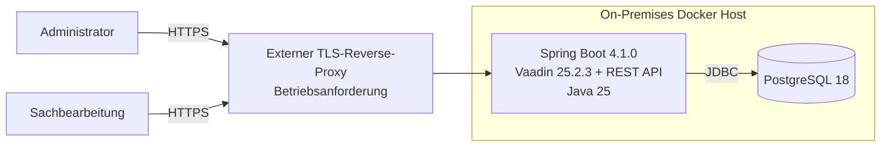

*Abbildung: Deployment- und Containersicht der implementierten Systemarchitektur.*

Das Compose-Produktionsmodell enthält keinen separaten nginx- oder Angular-Container. Die
Anwendung liefert Vaadin-UI und REST-API gemeinsam aus. Ein Entwicklungs-Override darf nicht
mit dem Produktionsprofil verwechselt werden.

## 4.2 Logische Schichten

| Schicht | Verantwortung | Beispiele aus `Code.zip` |
|---------|---------------|---------------------------|
| Präsentation | Vaadin Views und UI-Navigation | `@Route`-Views, Login-UI |
| Web/API | HTTP-Endpunkte und Statuscodes | `*Controller.java` |
| Anwendung | Geschäftslogik und Transaktionen | `*Service.java` |
| Persistenz | JPA-Repositories | `*Repository.java` |
| Domäne | Entitäten und Beziehungen | Mitglied, Spende, Bußgeld, Eingang, Dokument |
| Querschnitt | Security, RLS, Audit, Konfiguration | `SecurityConfig`, RLS-Klassen, Envers |

Die zusätzliche REST-API erweitert das ursprüngliche Vaadin-Zielbild. Direkte Aufrufe von Views
auf Services und externe API-Aufrufe sind zwei getrennte Eintrittswege. Autorisierung,
Validierung und Fehlerbehandlung dürfen deshalb nicht ausschließlich in der UI liegen.

## 4.3 Domänenmodell

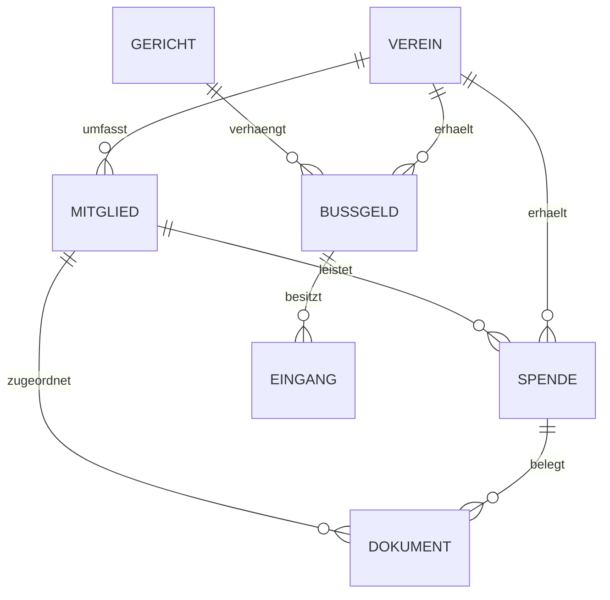

*Abbildung: Vereinfachtes fachliches Domänenmodell der modernisierten Anwendung.*

Für FR-5 gilt:

```text
Restbetrag = Bußgeldbetrag − Summe aller zugeordneten Zahlungseingänge
```

Die Regel gehört in die Service- und Domänenlogik und wird durch Datenbankconstraints ergänzt.
Eine UI-Berechnung allein wäre nicht ausreichend, da auch REST-Aufrufe die Invariante verletzen
könnten.

## 4.4 Beispielhafter Ablauf

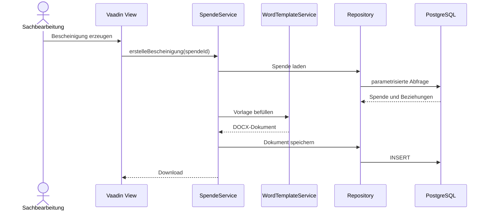

*Abbildung: Laufzeitsicht der Erzeugung einer Spendenbescheinigung.*

## 4.5 Komponenten- und Paketstruktur

Die Schichtenarchitektur wird im Code durch fachliche und technische Pakete konkretisiert. Eine
Schicht ist nur dann wirksam, wenn ihre Abhängigkeitsrichtung eingehalten wird. Ein
`Repository` darf beispielsweise keine Vaadin-Komponente kennen, und eine View darf keine
JDBC-Verbindung öffnen.

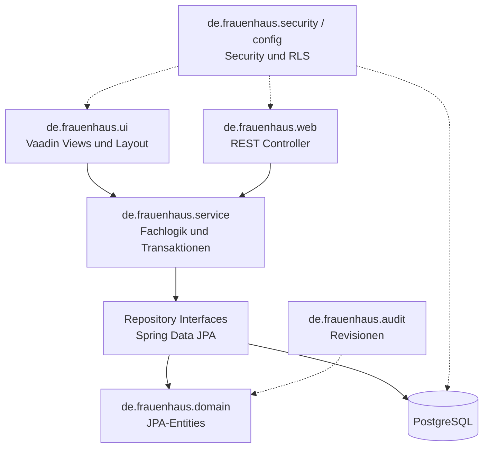

*Abbildung: Bausteinsicht der Anwendungs- und Querschnittskomponenten.*

Vaadin-UI und REST-Controller bilden zwei Adapter derselben Anwendung. Diese Sicht entspricht
einer vereinfachten Ports-and-Adapters-Idee, obwohl der Gesamtaufbau weiterhin als
Schichtenarchitektur beschrieben wird. Die Services sind der gemeinsame fachliche Kern.

### Präsentationskomponenten

`MainLayout` stellt Navigation und den gemeinsamen Rahmen bereit. Fachliche Views wie
`MitgliederView`, `SpendenView`, `BussgelderView` und `ReportsView` organisieren
Benutzerinteraktionen. `BenutzerView` ist durch `@RolesAllowed("ADMIN")` zusätzlich geschützt.
Routenannotation und sichtbare Navigation verbessern die Benutzerführung, ersetzen aber keine
Service- oder URL-Autorisierung.

### Servicekomponenten

Services bündeln Anwendungsfälle. Dazu gehören CRUD-orientierte Services, Such- und
Reportlogik, Dokumenterzeugung, Verteiler-Versand, Benutzerverwaltung und Auditabfragen. Die
Service-Schicht ist der geeignete Ort für Transaktionsgrenzen, weil ein fachlicher Anwendungsfall
mehrere Repositoryoperationen umfassen kann.

### Querschnittskomponenten

Security, RLS, Audit und Konfiguration schneiden mehrere fachliche Module. Diese Komponenten
sollten möglichst deklarativ eingebunden werden. Andernfalls würde jede Fachoperation eigene
Sicherheits- und Protokollierungslogik enthalten, was zu Inkonsistenzen führt.

## 4.6 Laufzeitsicht der Anmeldung

Die zwei Security-Filterketten werden durch ihre Reihenfolge getrennt. Die spezifische API-Kette
besitzt `@Order(1)` und wird vor der allgemeinen Vaadin-Kette ausgewertet.

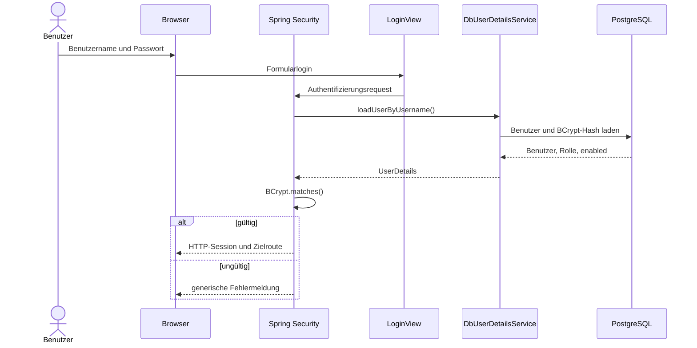

*Abbildung: Sequenz der sessionbasierten Anmeldung an der Vaadin-Oberfläche.*

Nach erfolgreicher Anmeldung liegt der `SecurityContext` serverseitig in der HTTP-Session. Der
Browser erhält lediglich das Session-Cookie. Für einen sicheren Produktivbetrieb sind
`HttpOnly`, `Secure`, ein angemessenes `SameSite`-Attribut, Session-Fixation-Schutz und ein
begrenztes Timeout relevant.

## 4.7 Laufzeitsicht eines API-Aufrufs

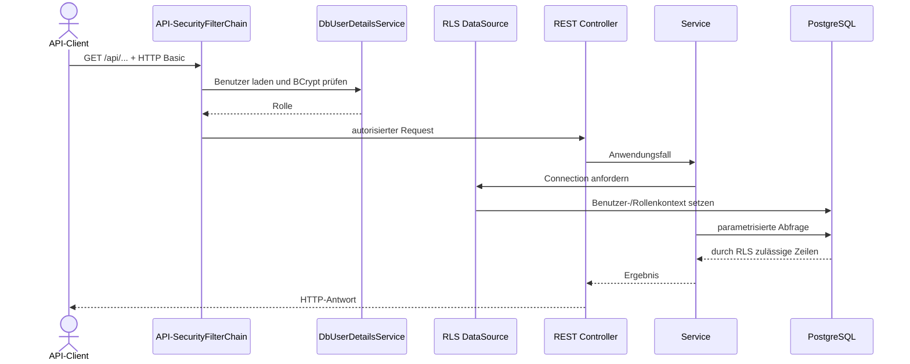

*Abbildung: Sequenz eines zustandslosen API-Aufrufs mit RLS-Kontext.*

Die Zustandslosigkeit bedeutet, dass der Client bei jedem Request erneut Credentials sendet.
Dies vermeidet serverseitige API-Sessions, erhöht aber die Bedeutung von TLS, Rate Limiting und
einer kontrollierten Clientimplementierung. API und UI teilen zwar Benutzerbasis und Rollen,
haben aber unterschiedliche Angriffspunkte.

## 4.8 Transaktionen und Nebenläufigkeit

Ein einzelner Benutzer verhindert keine Nebenläufigkeit: Browser-Tabs, wiederholte Requests,
Hintergrundprozesse oder zwei Sachbearbeiter können denselben Datensatz bearbeiten. Deshalb sind
Transaktionsgrenzen auch bei kleiner Last erforderlich.

Für schreibende Anwendungsfälle gelten folgende Regeln:

- Eine fachliche Operation wird vollständig committed oder zurückgerollt.
- Berechnete Werte werden innerhalb derselben Transaktion bestimmt.
- Datenbankconstraints sichern Invarianten unabhängig vom Aufrufweg.
- Fehler werden nicht in erfolgreiche leere Ergebnisse umgewandelt.
- Bei konkurrierenden Änderungen ist eine erkennbare Konfliktreaktion einem stillen
  Überschreiben vorzuziehen.

Optimistisches Sperren über eine Versionsspalte ist für seltene Konflikte geeignet. Fehlt eine
solche Versionierung bei kritischen Entitäten, muss mindestens durch Tests geklärt werden, ob
Lost Updates möglich sind. Pessimistische Sperren wären nur für eng begrenzte Abläufe sinnvoll,
da sie Wartezeiten und Deadlocks verursachen können.

## 4.9 REST-API als zusätzliche Architekturgrenze

Die REST-API war im ursprünglichen Vaadin-Entwurf nicht zwingend erforderlich. Ihre Aufnahme ist
trotzdem sinnvoll, wenn Reports, Automatisierung oder weitere Clients angebunden werden sollen.
Sie erzeugt jedoch neue Anforderungen:

- stabile und dokumentierte Request-/Response-Modelle,
- konsistente Validierungsfehler,
- eindeutige HTTP-Statuscodes,
- Schutz vor Entity-Leakage und unerwünschter Serialisierung,
- Pagination und Größenlimits,
- Versionierungsstrategie für inkompatible Änderungen.

Eine OpenAPI-Beschreibung ist im ausgewerteten Nachweis nicht als verbindlicher Vertrag belegt.
Sie wäre eine geeignete Ergänzung, um API-Implementierung, Tests und externe Nutzung zu
synchronisieren.

# 5. Sicherheit und Datenschutz

Datensicherheit ist einer der drei ausdrücklich geforderten Schwerpunkte der Aufgabenstellung. Das Kapitel entwickelt daher ein mehrstufiges Schutzkonzept, das Authentifizierung und Autorisierung in der Anwendung mit einer zweiten, datenbankseitigen Durchsetzung verbindet, und ordnet es einem expliziten Bedrohungsmodell sowie den datenschutzrechtlichen Anforderungen zu.

## 5.1 Authentifizierung und Autorisierung

Der Code verwendet BCrypt-gehashte Passwörter, Datenbankbenutzer und die Rollen `ADMIN` und
`SACHBEARBEITUNG`. `SecurityConfig.java` definiert zwei geordnete Filterketten:

1. `/api/**` und `/actuator/**` verwenden HTTP Basic, `STATELESS` und deaktivierten
   CSRF-Schutz.
2. Die Vaadin-Oberfläche verwendet `VaadinSecurityConfigurer`, `LoginView` und eine
   serverseitige Session.

ADR-012 dokumentiert diese Erweiterung des ursprünglichen ADR-004. UI- und
API-Authentifizierung müssen in Dokumentation und Tests getrennt ausgewiesen werden:

| Eintrittspunkt | Erwartetes Modell | Wesentliche Prüfung |
|---------------|-------------------|----------------------|
| Vaadin-UI | Formularlogin und serverseitige Session | CSRF, Session-Fixation, Logout, Rollen |
| REST-API | HTTP Basic je Request, zustandslos | TLS, Rollen, Rate Limiting, Fehlerantworten |

**Listing: Getrennte Security-Filterketten für REST-API und Vaadin-UI.**

```java
@Bean
@Order(1)
SecurityFilterChain apiFilterChain(HttpSecurity http) {
    http.securityMatcher("/api/**", "/actuator/**")
        .csrf(csrf -> csrf.disable())
        .sessionManagement(sm -> sm
            .sessionCreationPolicy(SessionCreationPolicy.STATELESS))
        .authorizeHttpRequests(auth -> auth
            .requestMatchers("/actuator/health/**").permitAll()
            .requestMatchers("/api/admin/**").hasRole("ADMIN")
            .anyRequest().authenticated())
        .httpBasic(basic -> basic.authenticationEntryPoint(apiEntryPoint()));
    return http.build();
}

@Bean
@Order(2)
SecurityFilterChain uiFilterChain(HttpSecurity http) {
    http.authorizeHttpRequests(auth ->
            auth.requestMatchers("/error").permitAll())
        .with(VaadinSecurityConfigurer.vaadin(),
            configurer -> configurer.loginView(LoginView.class));
    return http.build();
}
```

Der gekürzte Quellcodeauszug belegt die im Text beschriebene Trennung unmittelbar im
Implementierungsartefakt [30].

HTTP Basic überträgt bei jedem Request wiederverwendbare Zugangsdaten. Base64 ist keine
Verschlüsselung; TLS ist zwingend. Eine Speicherung der Credentials im Browser-`sessionStorage`
ist im abgegebenen Code nicht nachgewiesen und wird nicht behauptet. Falls ein zukünftiger Client
dies tut, wäre dies wegen des XSS-Risikos zu vermeiden [9].

## 5.2 Defense in Depth

Das System verwendet mehrere Schutzschichten:

1. zentrale Authentifizierung in Spring Security,
2. rollenbasierte Autorisierung,
3. Service- und Transaktionsgrenzen,
4. parametrisierte JPA-Abfragen,
5. PostgreSQL Row-Level Security,
6. Auditierung ausgewählter Änderungen,
7. Trennung von Anwendung und Datenbank.

Keine einzelne Schicht darf als vollständige Sicherheitsgarantie bezeichnet werden. Insbesondere
verhindert JPA SQL-Injection nur bei korrekter Parameterbindung. Native SQL-Abfragen,
dynamisch zusammengesetztes JPQL und nicht parametrisierbare Bezeichner bleiben zu prüfen
[8].

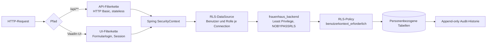

*Abbildung: Sicherheitsarchitektur mit zwei Filterketten und datenbankseitiger Zugriffskontrolle.*

## 5.3 Row-Level Security

`RowLevelSecurityDataSource` setzt Benutzer- und Rollenkontext auf Datenbankverbindungen.
Migrationen richten Rollen und Policies ein [21]. RLS kann Schäden durch fehlerhafte
Anwendungsabfragen begrenzen, erzeugt aber zusätzliche Komplexität:

- Context-Leakage bei Connection Pooling muss ausgeschlossen werden.
- Die Anwendungsrolle darf `BYPASSRLS` nicht besitzen.
- Policies müssen durch Positiv- und Negativtests geprüft werden.
- Migrationen und Applikationskonfiguration müssen dieselben Rollennamen verwenden.

Die vorhandenen RLS-Unit- und Integrationstests sind deshalb architektonisch besonders relevant.

**Listing: Parametrisierte Übergabe des Benutzer- und Rollenkontexts an PostgreSQL.**

```java
try (PreparedStatement statement = connection.prepareStatement(
        "SELECT set_config('app.benutzer', ?, false), " +
        "set_config('app.benutzer_rolle', ?, false)")) {
    statement.setString(1, benutzer);
    statement.setString(2, rolle);
    statement.execute();
} catch (SQLException e) {
    connection.close();
    throw e;
}
```

Das Listing zeigt zwei wesentliche Eigenschaften: Fremdeingaben werden gebunden und eine
Verbindung mit fehlgeschlagener Kontextinitialisierung wird nicht an die Anwendung
zurückgegeben [30].

## 5.4 Datenschutzbewertung

On-Premises reduziert bestimmte Risiken, ersetzt aber keine Datenschutzorganisation. Vor
Produktivbetrieb sind mindestens zu klären:

- Rechtsgrundlagen nach Art. 6 und gegebenenfalls Art. 9 Abs. 2 DSGVO,
- Erforderlichkeit einer Datenschutz-Folgenabschätzung nach Art. 35,
- Datenminimierung und Zweckbindung,
- Aufbewahrungs- und Löschfristen,
- Umgang mit Löschungen in Auditdaten und Backups,
- Berechtigungskontrollen und regelmäßige Überprüfung,
- Verfahren für Auskunft, Berichtigung und Löschung.

Die Formulierung „vollständige DSGVO-Konformität ohne juristische Grauzone“ wird vermieden, weil
eine Architektur allein keine rechtliche Konformität beweisen kann.

## 5.5 Bedrohungsmodell

Das Bedrohungsmodell orientiert sich an STRIDE, ohne daraus eine vollständige formale
Sicherheitsanalyse abzuleiten.

| Kategorie | Beispiel im System | Architekturmaßnahme | Verbleibendes Risiko |
|-----------|--------------------|---------------------|----------------------|
| Spoofing | gestohlene Zugangsdaten | BCrypt, TLS, zentrale Anmeldung | kein MFA, Rate Limiting offen |
| Tampering | manipulierte API-Requests | Backendvalidierung, Rollen, Constraints | fehlerhafte Autorisierungsregel |
| Repudiation | Änderung wird bestritten | Envers und Benutzerrevision | unvollständige Auditabdeckung |
| Information Disclosure | Offenlegung von Adressen | Rollen, RLS, TLS, internes Netz | Fehlkonfiguration oder kompromittierter Account |
| Denial of Service | viele Login-/Reportanfragen | begrenzte Exposition | keine belegten Limits und Alarmierung |
| Elevation of Privilege | Sachbearbeitung ruft Admin-API auf | `ROLE_ADMIN`, `@RolesAllowed` | Divergenz zwischen UI und API |

Die höchste Auswirkung besitzt eine unbefugte Offenlegung von Adress- und Kontaktdaten. Das
rechtfertigt die mehrschichtige Absicherung und strengere Abnahmekriterien als bei einer
gewöhnlichen internen Adressverwaltung.

## 5.6 Autorisierungsmodell

Das Zwei-Rollen-Modell ist bewusst einfach:

| Fähigkeit | ADMIN | SACHBEARBEITUNG |
|-----------|:-----:|:----------------:|
| operative Mitglieder-, Spenden- und Bußgeldpflege | ja | ja |
| Reports und Dokumente | ja | ja |
| Benutzerverwaltung | ja | nein |
| sicherheitskritische Administration | ja | nein |

Einfachheit reduziert Fehlkonfigurationen, kann aber zu weitreichenden Rechten führen. Für eine
spätere Produktivversion sollte geprüft werden, ob getrennte Rechte für Export, Löschung,
Benutzerverwaltung oder besonders sensible Daten notwendig sind. Zusätzliche Rollen sind nur
sinnvoll, wenn sie organisatorisch gepflegt und regelmäßig rezertifiziert werden können.

## 5.7 Secrets und Konfiguration

Geheimnisse umfassen Datenbankpasswörter, initiale Administrationsdaten, TLS-Schlüssel,
SMTP-Zugangsdaten und die spätere Backup-Passphrase. Sie dürfen nicht in Images, Git-Historie
oder Beispielkonfigurationen mit realen Werten gelangen.

Die Konfigurationsstrategie muss mindestens sicherstellen:

- Trennung von Code und umgebungsspezifischen Geheimnissen,
- minimale Dateirechte beziehungsweise Docker-Secret-Zugriffe,
- Rotation ohne Codeänderung,
- keine Ausgabe von Passwörtern in Logs,
- kontrollierter Bootstrap des ersten Administrators,
- dokumentierte Verantwortlichkeit für Schlüssel und Notfallzugriff.

Umgebungsvariablen sind besser als hart codierte Werte, aber nicht automatisch geheim: Sie können
über Prozessinformationen, Compose-Ausgaben oder Diagnosewerkzeuge sichtbar werden. Für einen
kleinen On-Premises-Betrieb kann eine restriktiv geschützte Secret-Datei verhältnismäßig sein.

## 5.8 TLS und Netzwerkgrenzen

Der Compose-Stack terminiert TLS nicht selbst. Ein externer Reverse Proxy muss daher Teil des
Produktionsdesigns werden. Er übernimmt:

- HTTPS und Zertifikatsverwaltung,
- Weiterleitung ausschließlich zum Backend,
- Größen- und Timeoutlimits,
- Security Header,
- optional Rate Limiting,
- Protokollierung ohne sensible Requestinhalte.

PostgreSQL darf im Produktionsprofil nicht allgemein im LAN veröffentlicht werden. Nur das
Backend benötigt Datenbankzugriff. Entwicklungsports sind an Loopback zu binden und dürfen nicht
versehentlich durch das Produktions-Compose aktiviert werden.

## 5.9 Sicherheitsverifikation

Sicherheitsmechanismen gelten erst als belegt, wenn Negativfälle getestet werden. Ein
Mindestkatalog umfasst:

1. anonyme Benutzer erreichen weder UI-Fachrouten noch geschützte APIs,
2. Sachbearbeitung kann keine Benutzeradministration aufrufen,
3. ein deaktivierter Benutzer kann sich nicht anmelden,
4. falsche Passwörter liefern keine Information über die Existenz eines Benutzers,
5. API-Requests ohne oder mit ungültigem Basic-Header erhalten 401,
6. authentifizierte Benutzer ohne Rolle erhalten 403,
7. RLS verhindert Zugriffe ohne korrekt gesetzten Kontext,
8. Logout invalidiert die UI-Session,
9. technische Fehler geben keine Stacktraces oder Geheimnisse an den Client,
10. Dependency- und Container-Scans werden mit Version und Datum archiviert.

Die vorhandenen Testquellen adressieren Teile dieses Katalogs; die Einordnung des zunächst
DB-losen Testlaufs erfolgt zentral in Abschnitt 8.3. Der Katalog orientiert sich an den prüfbaren
Kontrollzielen des OWASP Application Security Verification Standard [19].

# 6. Persistenz, Audit und Dokumente

Die Datenhaltung entscheidet darüber, ob fachliche Konsistenz, Nachvollziehbarkeit und Wartbarkeit dauerhaft gewährleistet bleiben. Dieses Kapitel behandelt deshalb die Transaktionsgrenzen des Persistenzmodells, die versionierte Schemaentwicklung, den Umfang der Auditierung und die revisionssichere Ablage erzeugter Dokumente.

## 6.1 Persistenzmodell und Transaktionsgrenzen

PostgreSQL bildet die gemeinsame persistente Datenbasis für Stamm-, Bewegungs-, Audit- und Dokumentdaten. Der Zugriff erfolgt über Spring Data JPA und Hibernate. Repositories kapseln Standardoperationen; fachliche Transaktionsgrenzen liegen in der Service-Schicht. Dadurch werden zusammengehörige Änderungen – beispielsweise das Erfassen einer Spende und das Ablegen der erzeugten Bescheinigung – atomar ausgeführt: Entweder werden alle Änderungen dauerhaft übernommen oder die gesamte Transaktion wird zurückgerollt.

Das relationale Schema soll fachliche Invarianten nicht ausschließlich der Anwendung überlassen. Neben Bean Validation und Service-Prüfungen sichert deshalb die Datenbank selbst die zentralen Zusagen ab: Primär- und Fremdschlüssel für alle fachlichen Entitäten und ihre Beziehungen, `NOT NULL` und eindeutige Constraints für zwingende beziehungsweise fachlich eindeutige Attribute, `CHECK`-Constraints für nicht negative Beträge und gültige Statuswerte sowie Indizes auf häufig verwendeten Such-, Sortier- und Fremdschlüsselfeldern. Löschregeln werden bewusst definiert, statt unbeabsichtigte Kaskaden entstehen zu lassen. Der Grund für diese Doppelung ist architektonisch: Anwendungsprüfungen gelten nur für den jeweiligen Eintrittsweg, Datenbankconstraints dagegen für jeden Zugriff.

Insbesondere finanzrelevante Regeln müssen in allen Eintrittswegen identisch gelten. Der Restbetrag eines Bußgelds ergibt sich aus dem ursprünglichen Betrag abzüglich der Summe aller zugeordneten Zahlungseingänge. Diese Berechnung gehört in die Domänen- beziehungsweise Service-Schicht und ist durch Transaktions- und Integrationstests zu sichern. Eine zusätzliche Plausibilitätsprüfung verhindert, dass konkurrierende oder fehlerhafte Requests zu einer unzulässigen Überzahlung führen.

JPA reduziert den Anteil handgeschriebenen SQL-Codes und bindet bei regulären Repository- und JPQL-Abfragen Parameter. Absolute SQL-Injection-Freiheit folgt daraus nicht: Native Queries sowie dynamisch zusammengesetzte Sortier- oder Spaltennamen bleiben prüfpflichtig (vgl. §5.2).

## 6.2 Schema- und Migrationsstrategie

Flyway verwaltet das Datenbankschema als versionierte Folge unveränderlicher Migrationen
[29]. Eine neue Umgebung muss allein aus dem definierten Ausgangszustand und
den Migrationen reproduzierbar aufgebaut werden können. Manuelle Änderungen an einer produktiven
Datenbank sind unzulässig, weil sie zu nicht dokumentiertem Schema-Drift führen und spätere
Wiederherstellungen erschweren.

Für Migrationen gelten dabei feste Regeln: Jede strukturelle oder sicherheitsrelevante Änderung erhält eine eigene, eindeutig nummerierte Migration, die neben Tabellen und Indizes auch Constraints, Auditstrukturen, Datenbankrollen und RLS-Policies umfasst. Bereits ausgeführte Migrationen werden nicht nachträglich verändert, sondern durch eine neue Migration korrigiert. Umfangreiche Datenänderungen bleiben von reinen Strukturänderungen getrennt, damit Fehler eindeutig zuzuordnen sind. Getestet wird jede Migration sowohl auf einer leeren Datenbank als auch auf einer Kopie des zuletzt freigegebenen Schemas; vor der produktiven Ausführung entsteht ein wiederherstellbares Backup, und Anwendung und Schema werden als zusammengehörige Version freigegeben.

Für Änderungen ohne kompatiblen Sofortwechsel eignet sich das Expand-and-Contract-Verfahren: Das Schema wird zunächst abwärtskompatibel erweitert, anschließend eine Anwendungsversion ausgerollt, die alte und neue Struktur verarbeitet, und erst nach dem Auslaufen der alten Version werden überholte Strukturen entfernt. Dadurch scheitert ein Rollback der Anwendung nicht an einer bereits inkompatibel veränderten Datenbank.

Ein Datenbank-Rollback durch automatisch erzeugte Down-Migrationen ist nicht das primäre Wiederherstellungsverfahren. Bei destruktiven oder umfangreichen Migrationen wird auf das vor dem Deployment erzeugte Backup zurückgegriffen, bei kleinen additiven Änderungen genügt meist der Weiterbetrieb der vorherigen Anwendungsversion. Der Deploymentplan muss deshalb für jede Migration ausweisen, ob sie abwärtskompatibel, nur vorwärts korrigierbar oder restorepflichtig ist.

Die Migration der Altdaten ist als eigener, wiederholbarer Prozess zu behandeln: Export aus dem Altsystem mit dokumentiertem Stichtag, Transformation von Datentypen, Zeichensätzen und Statuswerten, Normalisierung historisch uneinheitlicher Schreibweisen, Zuordnung alter zu neuen Primärschlüsseln, Erkennung verwaister Fremdschlüssel und Dubletten, Import in eine isolierte Zielumgebung sowie technischer und fachlicher Abgleich mit protokollierter Freigabe oder vollständigem Abbruch.

Der technische Abgleich vergleicht Datensatzzahlen pro Tabelle, Pflichtfeldverletzungen und referentielle Integrität; der fachliche Abgleich betrachtet Mitgliederzahlen sowie Spenden-, Bußgeld- und Zahlungssummen je Geschäftsjahr. Abweichungen werden nicht stillschweigend korrigiert, sondern mit Ursache und Entscheidung in einem Migrationsprotokoll erfasst. Ein Probelauf mit anonymisierten oder angemessen geschützten Daten ist vor dem finalen Cutover verpflichtend.

## 6.3 Auditmodell und Abdeckung

Hibernate Envers [17] bildet die Änderungshistorie deklarativ in derselben Persistenzinfrastruktur ab. Auditpflichtige Entities erhalten eine zugehörige `*_aud`-Tabelle. Eine Revision repräsentiert die in einer Transaktion erfassten Änderungen und soll mindestens Revisionsnummer, Zeitpunkt und den authentifizierten Anwendungsbenutzer enthalten. Dadurch lässt sich nachvollziehen, wer einen Datensatz angelegt, geändert oder gelöscht hat und welcher Zustand vor beziehungsweise nach der Änderung bestand.

Auditierung ist von technischem Logging zu unterscheiden: Anwendungslogs beschreiben Ereignisse und Fehler des laufenden Systems, Auditdaten machen fachliche Zustandsänderungen dauerhaft nachvollziehbar. Ein Logeintrag „Spende aktualisiert“ ersetzt daher keine versionierte Speicherung der geänderten Werte, und umgekehrt ist Envers kein Ersatz für Security- und Betriebslogs, weil etwa abgewiesene Anmeldeversuche keine Entity-Änderung erzeugen.

Vor der Produktivfreigabe ist die tatsächliche Abdeckung gegen eine verbindliche Matrix zu prüfen:

| Datengruppe | Auditbedarf | Erwartete Abdeckung | Abnahmenachweis |
|-------------|-------------|---------------------|-----------------|
| Mitglieder und Adressen | hoch | Anlegen, Ändern und Löschen einschließlich relevanter Altwerte | Revision mit Benutzer, Zeitpunkt sowie Alt-/Neuwert |
| Spenden | hoch | Betrag, Datum, Art, Zuordnung und Status | Änderungs- und Löschtest |
| Bußgelder | hoch | Betrag, Gericht, Status und Zuordnung | Statushistorie und Altwertprüfung |
| Zahlungseingänge | hoch | Anlegen, Betrag, Datum, Zuordnung und Storno | Berechnungs- und Revisionstest |
| Dokumentmetadaten | hoch | Erzeugung, Zuordnung, Typ, Vorlagenversion und Löschung | Auditdatensatz ohne unnötige Binärduplikation |
| Binärinhalt von Dokumenten | abzuwägen | Integrität und Version nachvollziehbar, aber keine unkontrollierte Vervielfachung | Hash-/Versionsprüfung |
| Benutzer und Rollen | sehr hoch | Benutzeranlage, Aktivierung, Sperrung und Rollenänderung | Admin- und Negativtest |
| rein technische Hilfstabellen | gering | begründete Ausnahme möglich | dokumentierte Entscheidung |

Die Matrix verhindert die pauschale, derzeit nicht belegte Aussage, jede Änderung werde vollständig auditiert. Für jede auditpflichtige Datengruppe sind Positiv- und Negativtests erforderlich: Ein Positivtest prüft, dass eine erlaubte Änderung eine korrekte Revision erzeugt, ein Negativtest, dass ein abgewiesener Request weder eine fachliche Änderung noch eine irreführende Erfolgsrevision hinterlässt. Auch Hintergrundprozesse wie Migrationen, Importläufe oder Dokumentenbatches erhalten dabei einen definierten technischen Akteur, statt Revisionen ohne Herkunft oder unter einem beliebigen Standardbenutzer zu erzeugen.

Auditdaten unterliegen selbst dem Datenschutz und dürfen nicht unbegrenzt allein mit dem Argument der Nachvollziehbarkeit gespeichert werden. Löschungen personenbezogener Stammdaten, Auditstände und Backups sind gemeinsam zu betrachten; wo gesetzliche Pflichten eine weitere Speicherung erfordern, kommen Sperrung, Zugriffsbeschränkung oder Pseudonymisierung in Betracht. Frist und Rechtsgrundlage legt die Organisation fest, die Architektur stellt lediglich die kontrollierte technische Umsetzung bereit.

## 6.4 Dokumentgenerierung

Spendenbescheinigungen, Serienbriefe und Auswertungen werden serverseitig ohne Office- oder Outlook-Automation erzeugt. Der implementierte Prototyp verwendet Apache POI [18] für Office-Dokumente. Die Dokumentlogik ist in dedizierten Services gekapselt, damit fachliche Datenbeschaffung, Vorlagenbefüllung und Speicherung nicht in Vaadin-Views oder REST-Controllern verteilt werden.

Der Erzeugungsprozess folgt einer definierten Pipeline:

1. Der Service lädt die benötigten fachlichen Daten innerhalb einer kontrollierten Transaktion.
2. Eingaben und Berechtigungen werden geprüft.
3. Eine eindeutig identifizierte und versionierte Vorlage wird ausgewählt.
4. Platzhalter werden durch formatierte Fachwerte ersetzt.
5. Das resultierende Dokument wird technisch validiert.
6. Metadaten und Binärinhalt werden gemeinsam persistiert.
7. Erst nach erfolgreicher Speicherung wird das Dokument zum Download bereitgestellt.

Zu den Metadaten gehören mindestens Dokumenttyp, Erzeugungszeitpunkt, fachliche Zuordnung, Dateiname, Medienformat, verwendete Vorlagenversion und erzeugender Benutzer. Ein kryptografischer Hash kann zusätzlich belegen, ob sich der gespeicherte Binärinhalt nach der Erzeugung verändert hat; er ist ein Integritätsmerkmal, aber keine elektronische Signatur.

Die Speicherung als PostgreSQL-`bytea` hält Dokument und Metadaten transaktional konsistent und schützt beide durch denselben Backup-Prozess, vermeidet also verwaiste Dateipfade und einen zweiten Sicherungsmechanismus. Der Preis sind größere Datenbank- und Backupvolumina: Binärdaten dürfen deshalb nicht gemeinsam mit Listenansichten geladen werden, sondern nur über Repository-Projektionen oder getrennte Ladeoperationen. Für größere Exporte und Serienbriefe ist chargenweise Verarbeitung vorzusehen; Fehler eines Einzeldokuments werden protokolliert und führen je nach fachlicher Vorgabe zum atomaren Abbruch oder zu einer Ergebnisliste erfolgreicher und fehlgeschlagener Dokumente.

Die technische Korrektheit einer DOCX-Datei beweist noch nicht die fachliche Richtigkeit. Die Abnahme muss alle Dokumentarten und Vorlagenvarianten abdecken und dabei die typischen Grenzfälle einschließen: Umlaute, Sonderzeichen und mehrzeilige Anschriften, ungewöhnlich lange Personen-, Vereins- und Straßennamen, fehlende optionale Daten, Betragsformatierung und Rundung, Datumsformate über den Geschäftsjahreswechsel hinweg, unterschiedliche Spendenarten, Seitenumbrüche und Tabellenüberläufe, leere wie sehr große Serienbriefmengen sowie die Aktualisierung auf neue amtliche Vorlagen.

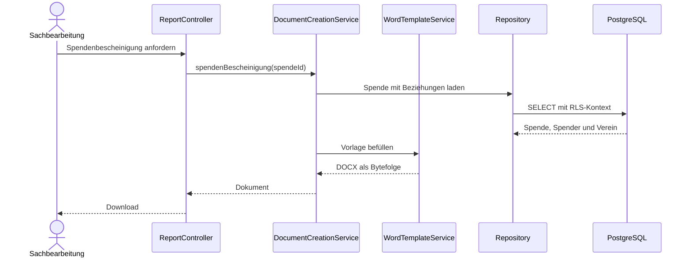

*Abbildung: Laufzeitsicht der serverseitigen Dokumenterzeugung.*

Jede freigegebene Vorlage erhält eine Versionskennung und ein fachliches Abnahmedatum. Bereits erzeugte Dokumente bleiben mit der damals verwendeten Vorlage nachvollziehbar. Der Austausch einer Vorlage ist damit eine kontrollierte Konfigurations- beziehungsweise Releaseänderung und kein unprotokollierter Dateiaustausch.

# 7. Deployment, Backup und Betrieb

Backup und Recovery sowie eine einfache Wartung sind zwei der drei geforderten Schwerpunkte und lassen sich nur gemeinsam mit dem Betriebsmodell beantworten. Das Kapitel beschreibt daher die containerbasierte Ausbringung auf dem Windows-Host, das Vorgehen bei Neustart und Notfall, das Sicherungskonzept nach der 3-2-1-Regel und die zugehörige Überwachung. Dabei wird durchgängig zwischen bereits umgesetzter Zwischenlösung und geplantem Zielbild unterschieden.

## 7.1 Betriebsmodell

Die Anwendung wird On-Premises auf einem einzelnen Docker-Host betrieben. Der Docker-Host ist ein
Windows-Server; die Linux-Laufzeit der Container wird über WSL 2 bereitgestellt (ADR-013), sodass
Anwendung und Datenbank die Rahmenbedingung eines vollständigen Windows-Betriebs erfüllen. Docker Compose startet das Spring-Boot-Backend mit Vaadin-UI und REST-API sowie PostgreSQL mit persistentem Datenvolume. Ein vorgeschalteter Reverse Proxy terminiert TLS, ist im abgegebenen Compose-Stack jedoch noch nicht enthalten. Der Docker-Host bleibt ein Single Point of Failure; Containerisierung verbessert Reproduzierbarkeit und Isolation, erzeugt aber kein automatisches Failover.

Für Produktion sind unveränderliche, eindeutig versionierte Images zu verwenden. Ein Deployment nur anhand des Tags `latest` wäre nicht reproduzierbar, weil derselbe Tag später auf einen anderen Inhalt zeigen kann. Freigaben müssen Anwendungs-, Image-, Schema- und Vorlagenversion gemeinsam dokumentieren. Secrets gehören weder in Images noch in das Repository. Sie werden über restriktiv geschützte Umgebungsdateien oder einen geeigneten lokalen Secret-Mechanismus bereitgestellt.

**Listing: Gekürzte Compose-Definition der beiden Laufzeitcontainer.**

```yaml
services:
  db:
    image: postgres:18
    healthcheck:
      test: ["CMD-SHELL", "pg_isready -U frauenhaus_app -d frauenhaus"]
    volumes:
      - pgdata:/var/lib/postgresql

  backend:
    build: .
    depends_on:
      db:
        condition: service_healthy
    environment:
      DB_HOST: db
      DB_USER: frauenhaus_backend
      FLYWAY_DB_USER: frauenhaus_app
    ports:
      - "${WEB_PORT:-8080}:8080"
```

Der Ausschnitt macht die zentrale Betriebsentscheidung nachvollziehbar: UI und API laufen in
einem Backendprozess, die Datenbank ist ein separater Container, und der Backendstart wartet auf
den erfolgreichen Datenbank-Healthcheck [30].

## 7.2 Deployment-Runbook

Jede Installation oder Aktualisierung folgt einem dokumentierten Runbook. Die ausführende Person protokolliert Zeitpunkt, Zielhost, freizugebende Version und Ergebnis.

### Vorbereitung

Vor der Ausbringung werden Release-Artefakt, Image-Digests und Prüfsummen verifiziert, Release Notes, Migrationen und bekannte Risiken gelesen sowie freier Speicher für Datenbank, Images, Logs und Backups geprüft. Anschließend werden der Zustand von Backend, Datenbank und Reverse Proxy kontrolliert und das aktuelle Backup einschließlich WAL-Archivierung verifiziert. Die betroffenen Benutzer werden über das Wartungsfenster informiert; Rollbackentscheidung und maximal zulässige Ausfallzeit werden vorab festgehalten.

### Technische Prüfung

Die Compose-Konfiguration wird mit `docker compose config` validiert, Images werden anhand fester Versions-Tags oder Digests geladen beziehungsweise gebaut, und Konfiguration wie Secrets werden auf Vollständigkeit geprüft, ohne sensible Werte zu protokollieren. Vor produktiven Migrationen läuft dieselbe Version in einer isolierten Umgebung gegen eine Kopie des letzten freigegebenen Schemas.

### Ausbringung

Während einer nicht abwärtskompatiblen Änderung wird der Benutzerzugriff kontrolliert unterbrochen; anschließend startet `docker compose up -d` die neuen Container, und Flyway führt ausstehende Migrationen aus. Der Prozess wird erst fortgesetzt, wenn Datenbank und Backend einen stabilen Zustand melden.

### Smoke-Test

Nach dem Start werden mindestens folgende Prüfungen durchgeführt:

- Container laufen ohne Neustartschleife,
- Datenbankverbindung ist erfolgreich,
- Health-Endpunkt meldet den erwarteten Zustand,
- Login über die Vaadin-Oberfläche funktioniert,
- ein Benutzer ohne Administratorrolle erhält keinen Admin-Zugriff,
- ein autorisierter Lesezugriff liefert plausible Daten,
- eine kontrollierte Testoperation kann transaktional gespeichert und entfernt werden,
- Dokumenterzeugung funktioniert mit einer freigegebenen Testvorlage,
- Reverse Proxy liefert HTTPS mit gültigem Zertifikat,
- Logs enthalten keine wiederholten Start-, Migrations- oder Verbindungsfehler.

### Abschluss und Rollback

Nach erfolgreichem Smoke-Test werden Versionsnummern, Startzeit, Prüfer und Ergebnis dokumentiert. Bei einem Fehler wird nicht mehrfach unkontrolliert weiter migriert. Ist das Schema abwärtskompatibel, kann auf das vorherige Image zurückgeschaltet werden. Ist die Migration destruktiv oder inkompatibel, erfolgt die Wiederherstellung aus dem vor dem Deployment erzeugten Backup. Das Rollback gilt erst als abgeschlossen, wenn die fachlichen Smoke-Tests erneut erfolgreich sind.

## 7.3 Neustart und Notfallbetrieb

Docker und die Compose-Dienste müssen nach einem Host-Reboot automatisch in definierter Reihenfolge starten; PostgreSQL muss bereit sein, bevor das Backend reguläre Zugriffe verarbeitet. Restart-Policies dürfen echte Konfigurationsfehler nicht durch endlose Neustartschleifen verdecken. Ein Wiederanlauftest simuliert mindestens den Neustart des Backends, des Datenbankcontainers und des gesamten Hosts sowie eine kurzzeitige Unterbrechung der Datenbankverbindung und ein nahezu vollständig belegtes Datenvolume. Für QS-1 wird die Zeit vom Ausfall bis zur erfolgreichen externen Health-Prüfung gemessen; das Ziel „unter 60 Sekunden“ gilt erst nach einem protokollierten Test als erreicht.

## 7.4 Backupdesign

Das Backupziel basiert auf pgBackRest, verschlüsselten Repositories und kontinuierlicher WAL-Archivierung; die vorhandene Konfigurationsdatei belegt jedoch nur die geplante Konfiguration. Als lauffähige Zwischenstufe ist der unten dokumentierte, verschlüsselte `pg_dump`-Übergangsjob umgesetzt. NFR-4 gilt erst dann als vollständig erfüllt, wenn pgBackRest als laufender Dienst eingebunden, zeitgesteuert ausgeführt und durch einen protokollierten Restore-Test geprüft wurde.

Das Zielbild folgt der 3-2-1-Regel:

- Produktivdaten im PostgreSQL-Volume,
- verschlüsseltes lokales Backup auf einem physisch getrennten Volume,
- zusätzliche verschlüsselte Kopie auf einem rotierenden Offsite-Datenträger.

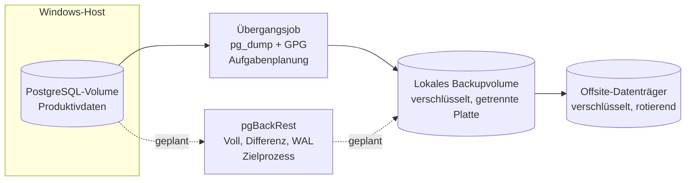

*Abbildung: Backup-Topologie nach der 3-2-1-Regel mit umgesetzter Übergangslösung und geplantem Zielprozess.*

Ein Backup auf demselben physischen Datenträger wie `pgdata` schützt nicht vor einem Plattendefekt, ein rein lokales Repository nicht vor Feuer, Wasser oder Diebstahl. Die externe Kopie muss daher regelmäßig an einen zweiten, zugriffsgeschützten Standort gebracht und jede Medienrotation mit Datum, Medium, verantwortlicher Person und erfolgreicher Prüfung protokolliert werden. Die Verschlüsselungspassphrase wird nicht gemeinsam mit dem Backup, sondern an mindestens zwei kontrollierten Orten verwahrt, sodass weder der Verlust eines einzelnen Geheimnisses noch der Ausfall einer einzelnen Person sämtliche Sicherungen unbrauchbar macht.

Ein geeigneter Zeitplan besteht aus regelmäßigen Voll- und differenziellen Backups sowie fortlaufender WAL-Archivierung. Retentionwerte sind anhand der realen Änderungsrate, des verfügbaren Speichers und der festgelegten Aufbewahrungsfristen zu validieren. Backupjobs melden nicht nur ihren Prozessstatus, sondern werden zusätzlich durch Repository-Prüfungen und Alterskontrollen überwacht.

### Übergangslösung: geplanter `pg_dump` unter Windows

Bis zur produktiven pgBackRest-Integration sichert ein Windows-konformer Übergangsjob die
Datenbank. Ein PowerShell-Skript erzeugt einen komprimierten Dump, verschlüsselt ihn und legt ihn
auf einem physisch getrennten Ziel ab; die zeitgesteuerte Ausführung übernimmt die
Windows-Aufgabenplanung. Zwei Aspekte sind dabei bewusst gelöst: Erstens schreibt `pg_dump` mit
`-f` direkt eine Datei im Container, die anschließend per `docker cp` binärgetreu übernommen wird;
die naheliegende PowerShell-Umleitung `> $dump` scheidet aus, weil sie den Stream unter Windows
PowerShell 5.1 als UTF-16LE-Text kodiert und den Custom-Format-Dump damit unbrauchbar macht.
Zweitens wird jeder Teilschritt über `$LASTEXITCODE` geprüft und über eine Logdatei protokolliert,
die das Monitoring aus §7.6 auswertet – ein Backupjob ohne Fehlerbehandlung stünde im Widerspruch
zur Überprüfbarkeitsforderung dieses Kapitels.

**Listing: Übergangs-Backupskript (`ops/backup-interim.ps1`, gekürzt).**

```powershell
$ErrorActionPreference = 'Stop'
$stamp   = Get-Date -Format 'yyyyMMdd-HHmmss'
$target  = 'D:\backups\frauenhaus'          # physisch getrenntes Volume
$log     = "$target\backup.log"
$inDump  = "/tmp/frauenhaus-$stamp.dump"     # Pfad im Container
$outDump = "$env:TEMP\frauenhaus-$stamp.dump"

function Write-Log($msg) { "$(Get-Date -Format o) $msg" | Add-Content -Encoding utf8 $log }

try {
    # Binaersicherer Dump direkt in eine Datei; KEINE PowerShell-Umleitung (>)
    docker exec frauenhaus-db pg_dump -U frauenhaus_app -F c -f $inDump -d frauenhaus
    if ($LASTEXITCODE -ne 0) { throw "pg_dump fehlgeschlagen ($LASTEXITCODE)" }
    docker cp "frauenhaus-db:$inDump" $outDump
    if ($LASTEXITCODE -ne 0) { throw "docker cp fehlgeschlagen ($LASTEXITCODE)" }
    docker exec frauenhaus-db rm -f $inDump

    # Verschluesselung; Passphrase-Datei ist per ACL nur fuer SYSTEM lesbar
    gpg --batch --yes --symmetric --cipher-algo AES256 `
        --passphrase-file 'C:\secure\backup.pass' `
        --output "$target\frauenhaus-$stamp.dump.gpg" $outDump
    if ($LASTEXITCODE -ne 0) { throw "gpg-Verschluesselung fehlgeschlagen ($LASTEXITCODE)" }
    Remove-Item $outDump

    # Aufbewahrung 14 Tage
    Get-ChildItem $target -Filter '*.gpg' |
      Where-Object { $_.LastWriteTime -lt (Get-Date).AddDays(-14) } |
      Remove-Item
    Write-Log "OK $stamp"
}
catch {
    Write-Log "FEHLER $stamp: $_"
    throw
}
```

Die Passphrasendatei `C:\secure\backup.pass` liegt nicht im Backup und wird per ACL auf das
Dienstkonto `SYSTEM` beschränkt (`icacls C:\secure\backup.pass /inheritance:r /grant:r SYSTEM:R`),
sodass weder Sicherungsmedium noch normale Benutzerkonten das Schlüsselmaterial lesen können.
Registriert wird der Job über die Windows-Aufgabenplanung:

```text
schtasks /Create /TN "Frauenhaus-DB-Backup" /SC DAILY /ST 02:00 ^
  /TR "powershell -ExecutionPolicy Bypass -File C:\ops\backup-interim.ps1" /RU SYSTEM
```

Der Übergangsjob ersetzt pgBackRest nicht: Er bietet kein Point-in-Time-Recovery und muss durch
einen protokollierten Restore-Test des Dumps abgesichert werden (vgl. R-2). Er stellt jedoch
sicher, dass bereits vor der Zielintegration ein laufendes, verschlüsseltes, fehlerprotokolliertes
und Windows-konformes Backup existiert.

## 7.5 Restore- und Disaster-Recovery-Verfahren

Ein Restore erfolgt grundsätzlich in eine neue, leere Umgebung. Das Originalvolume wird nicht überschrieben, bevor die Wiederherstellung erfolgreich geprüft ist. Das Runbook umfasst:

1. Schadenszeitpunkt und gewünschten Wiederherstellungszeitpunkt bestimmen.
2. betroffene Dienste stoppen und Originaldaten schreibgeschützt sichern.
3. passende Basis- und Differenzbackups sowie WAL-Segmente auswählen.
4. neuen PostgreSQL-Container mit leerem Datenvolume bereitstellen.
5. Backup entschlüsseln und gegebenenfalls Point-in-Time-Recovery konfigurieren.
6. Datenbank starten und technische Konsistenz prüfen.
7. Anwendung in passender Version gegen die wiederhergestellte Datenbank starten.
8. Datensatzzahlen, Jahressummen, Benutzer, Auditstände und Dokumentstichproben kontrollieren.
9. RPO und RTO aus tatsächlichen Zeitstempeln berechnen.
10. Freigabe oder erneuten Restoreversuch protokollieren.

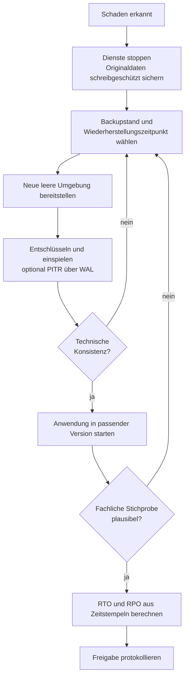

*Abbildung: Entscheidungsablauf des Restore- und Disaster-Recovery-Verfahrens.*

Das RPO bezeichnet das tatsächliche Datenverlustfenster zwischen dem letzten wiederherstellbaren Stand und dem Schadenszeitpunkt. WAL-Archivierung kann dieses Fenster deutlich unter 24 Stunden senken, sofern alle erforderlichen Segmente vorhanden sind. Das RTO umfasst den gesamten Zeitraum vom Beginn des Ausfalls bis zur fachlich freigegebenen Anwendung, nicht nur die Laufzeit des Restore-Befehls.

Quartalsweise Restore-Tests müssen mindestens einen vollständigen Restore und regelmäßig auch einen Point-in-Time-Restore umfassen. Ein Test gilt nur dann als erfolgreich, wenn die Anwendung startet, fachliche Stichproben plausibel sind, Dokumente geöffnet werden können und die gemessenen Zeiten dokumentiert wurden. „Backupjob erfolgreich“ ist kein Ersatz für diesen Nachweis.

Die Trennung von Vorsorge, Wiederherstellung, fachlicher Prüfung und dokumentierter Freigabe folgt
dem Grundprinzip etablierter Contingency-Planning-Leitfäden [20].

## 7.6 Logging, Monitoring und Alarmierung

Actuator-Endpunkte für `health`, `info` und `metrics` liefern Messdaten, bilden aber ohne externe Abfrage und Alarmierung noch kein Monitoring. Die Produktionsüberwachung muss außerhalb des überwachten Backendprozesses liegen. Andernfalls kann ein vollständiger Prozessausfall keine Warnung mehr erzeugen.

Mindestens zu überwachen sind:

- Erreichbarkeit von Reverse Proxy und Backend,
- Zustand der Datenbankverbindung,
- Containerstatus und Neustartzähler,
- CPU-, Arbeitsspeicher- und Plattenauslastung,
- freier Speicher von Daten- und Backupvolumes,
- Fehlerquote und Antwortzeiten,
- fehlgeschlagene Anmeldungen und auffällige Autorisierungsfehler,
- Alter und Ergebnis des letzten Backups,
- Funktion der WAL-Archivierung,
- Ablaufdatum des TLS-Zertifikats,
- wiederholte Fehler bei Dokumenterzeugung und E-Mail-Versand.

Warn- und Kritisch-Schwellenwerte werden so gewählt, dass vor dem tatsächlichen Ausfall reagiert werden kann; ein fast volles WAL- oder Datenvolume ist früher zu alarmieren als ein bereits vollständig belegtes Dateisystem. Jede Alarmmeldung benötigt einen benannten Empfänger, eine Eskalationsregel und eine Handlungsanweisung. Logs dürfen keine Passwörter, Basic-Auth-Header, vollständigen Dokumentinhalte oder unnötige personenbezogene Daten enthalten; Zugriff, Aufbewahrung und Löschung sind zu regeln, und alle Komponenten benötigen eine gemeinsame Zeitbasis, damit Anwendungs-, Audit- und Infrastrukturereignisse korreliert werden können. Die angestrebte Verfügbarkeit von 99 Prozent in den Kernzeiten wird erst mit extern gemessenem Messzeitraum, definierten Wartungsfenstern und festgelegter Berechnungsformel belastbar.

# 8. Qualitätssicherung und Nachweise

Eine Architektur gilt erst dann als tragfähig, wenn ihre Eigenschaften überprüfbar sind. Dieses Kapitel überführt die Qualitätsziele in prüfbare Szenarien, ordnet ihnen eine abgestufte Teststrategie zu und legt offen, welchen Aussagewert der archivierte Teststand tatsächlich besitzt.

## 8.1 Qualitätsszenarien

Qualitätsziele werden als überprüfbare Szenarien mit Auslöser, Umgebung, erwarteter Reaktion und Messgröße formuliert.

| ID | Szenario | Erwartete Reaktion und Nachweis |
|----|----------|-------------------------------|
| QS-1 Wiederanlauf | Der Backendprozess fällt während der Kernzeit aus. | Automatischer Neustart; externe Health-Prüfung spätestens nach 60 Sekunden erfolgreich. |
| QS-2 Recovery | Das Datenvolume ist nicht mehr verwendbar. | Restore auf neuer Umgebung; fachliche Freigabe innerhalb von vier Stunden, Datenverlust höchstens entsprechend dem festgelegten RPO. |
| QS-3 Verfügbarkeit | Das System wird während definierter Kernzeiten über mindestens drei Monate überwacht. | Mindestens 99 Prozent erfolgreiche externe Prüfungen nach dokumentierter Berechnung. |
| QS-4 Zugriffsschutz | Ein Browser oder Arbeitsplatz versucht direkten Datenbankzugriff. | Kein erreichbarer Datenbankport und keine DB-Credentials auf dem Client. |
| QS-5 Autorisierung | Sachbearbeitung ruft eine Admin-Funktion über UI oder API direkt auf. | Zugriff wird abgewiesen; keine Datenänderung; sicherheitsrelevantes Ereignis wird angemessen protokolliert. |
| QS-6 Fachkonsistenz | Mehrere Zahlungseingänge werden einem Bußgeld zugeordnet. | Restbetrag entspricht exakt der definierten Berechnung; unzulässige Überzahlung wird verhindert. |
| QS-7 Bedienbarkeit | Eine fachkundige, aber technisch unerfahrene Person bearbeitet typische Aufgaben. | Definierte Aufgaben werden ohne Entwicklerhilfe mit begrenzter Fehlerquote und Bearbeitungszeit abgeschlossen. |
| QS-8 Auditierbarkeit | Ein berechtigter Benutzer ändert einen finanz- oder personenbezogenen Datensatz. | Revision enthält Benutzer, Zeitpunkt, Operation sowie nachvollziehbare Alt-/Neuwerte. |
| QS-9 Dokumentqualität | Eine Bescheinigung wird mit Grenzwerten wie langem Namen und Umlauten erzeugt. | Datei ist technisch lesbar, vollständig formatiert und fachlich gegen die freigegebene Vorlage geprüft. |
| QS-10 Migration | Die Anwendung wird vom letzten freigegebenen Schema auf die neue Version aktualisiert. | Migration läuft einmalig erfolgreich; Datensatzzahlen, Constraints und Jahressummen bleiben plausibel. |
| QS-11 Isolation | Zwei Benutzer mit unterschiedlichen Rollen verwenden gepoolte DB-Verbindungen. | RLS-Kontext wird korrekt gesetzt und entfernt; keine Sichtbarkeit fremder oder unzulässiger Daten. |
| QS-12 Lastverhalten | Eine realistische Maximalzahl gleichzeitiger Benutzer führt Such- und Dokumentoperationen aus. | Keine Dateninkonsistenz; Antwortzeiten und Ressourcenverbrauch bleiben innerhalb festgelegter Grenzwerte. |

Jedes Szenario erhält ein Testprotokoll mit Version, Umgebung, Ausgangsdaten, erwarteter Reaktion, tatsächlichem Ergebnis und Abweichungen. Ohne dieses Protokoll bleibt ein Zahlenwert ein Ziel und kein nachgewiesenes Qualitätsmerkmal.

## 8.2 Testpyramide

Die Teststrategie folgt einer Testpyramide. Viele schnelle Tests prüfen isolierte Fachlogik; eine kleinere Zahl von Integrationstests bewertet Framework-, Datenbank- und Sicherheitsverhalten; wenige End-to-End-Tests verifizieren die wichtigsten Benutzerabläufe.

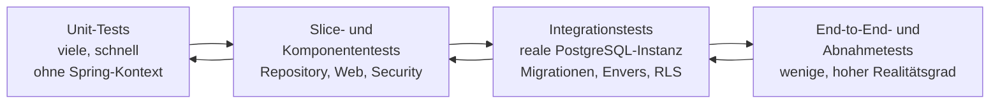

*Abbildung: Teststufen der Qualitätssicherung von der breiten Unit-Basis bis zur schmalen Abnahmespitze.*

### Unit-Tests

Unit-Tests decken deterministische Geschäftsregeln ohne Spring-Kontext ab. Dazu gehören Restbetragsberechnung, Validierung, Formatierung, Vorlagenauswahl und Statusübergänge. Abhängigkeiten werden nur dort gemockt, wo dies eine fachliche Einheit isoliert. Ein Test, der hauptsächlich Mock-Aufrufe bestätigt, liefert weniger Aussagekraft als ein Test des beobachtbaren Ergebnisses.

### Slice- und Komponententests

Repository-, Web- und Security-Slices laden nur den benötigten Frameworkausschnitt und prüfen JPA-Mappings, Validierungsfehler, HTTP-Statuscodes, Serialisierung und einzelne Filterketten. Fehler bleiben dadurch leichter lokalisierbar als bei Tests über den vollständigen `ApplicationContext`.

### Integrationstests

Integrationstests verwenden eine reale, vorzugsweise containerisierte PostgreSQL-Version und prüfen Flyway-Migrationen, Constraints, Transaktionen, Envers, RLS und datenbankspezifische Abfragen. Eine In-Memory-Datenbank wäre für Rollen, Policies, `bytea` und produktionsnahe SQL-Semantik nicht ausreichend. Besonders wichtig sind Negativtests: unberechtigte Rollen dürfen keine Admin-Operationen ausführen, RLS darf keine fremden Daten liefern, fehlerhafte Transaktionen dürfen keine Teiländerungen hinterlassen und eine ungültige Migration muss den Start kontrolliert verhindern.

### End-to-End- und Abnahmetests

Wenige stabile End-to-End-Tests decken die kritischen Pfade ab:

1. Anmeldung und rollenabhängige Navigation,
2. Mitglied anlegen und ändern,
3. Spende erfassen und Bescheinigung erzeugen,
4. Bußgeld mit mehreren Zahlungseingängen bearbeiten,
5. Administrator ändert eine Rolle,
6. Restore-Umgebung starten und fachliche Stichprobe durchführen.

Fachliche Dokument- und Usability-Abnahmen bleiben teilweise manuell, weil Layout, Verständlichkeit und amtliche Gültigkeit nicht vollständig durch technische Assertions abgedeckt werden können.

## 8.3 Interpretation des archivierten Teststands

Die zuerst archivierten Surefire-Berichte erfassen 142 Tests, davon 33 als `Error` und 4 als
übersprungen. Die Fehler entstanden nicht durch verletzte Assertions, sondern durch eine
Ausführungsumgebung ohne die für die Integrationstests benötigte PostgreSQL-Datenbank. Der
Spring-`ApplicationContext` konnte deshalb für datenbankabhängige Tests nicht vollständig
initialisiert werden; nach Überschreiten des Failure-Threshold wurden weitere Tests derselben
Kontextkonfiguration ebenfalls als `Error` markiert.

Dieser Lauf ist damit ein Nachweis einer ungeeigneten Testumgebung, nicht eines fehlerhaften
Testbestands. In einer Umgebung mit bereitgestellter Datenbank läuft die Testsuite erfolgreich.
Für die wissenschaftliche Nachvollziehbarkeit sollten neben dem grünen Ergebnis auch
PostgreSQL-Version, Startverfahren, verwendetes Profil, Commit-ID und Testbericht archiviert
werden. Die vier übersprungenen Tests sind weiterhin einzeln zu begründen, sofern sie auch im
aktuellen Lauf übersprungen werden.

Die Fehleranalyse erfolgt ursachenorientiert: Zunächst wird die erste ursprüngliche Exception eines betroffenen Testkontexts identifiziert und von den Folgefehlern des Context-Failure-Threshold getrennt; anschließend werden Profile, Umgebungsvariablen, Datenbank und Testressourcen geprüft, die betroffene Testklasse isoliert wiederholt und danach die gesamte Suite in einer sauberen Umgebung gestartet. Surefire-, Failsafe- und Coverage-Berichte werden unverändert archiviert.

Erst ein vollständiger Lauf mit null Errors und null Failures kann als erfolgreicher automatisierter Testnachweis gelten. Übersprungene Tests bleiben sichtbar und begründungspflichtig.

## 8.4 Coverage und statische Analyse

JaCoCo- und SonarQube-Konfigurationen zeigen, dass Messwerkzeuge vorgesehen sind. Ohne exportierten Bericht, Toolversion, Commitbezug und ausgeführten Befehl sind konkrete Prozent- oder Ratingangaben jedoch nicht reproduzierbar. Coverage misst ausgeführten Code, nicht die Qualität der Assertions. Hohe Abdeckung kann wichtige Grenzfälle auslassen; niedrige Abdeckung kann auf ungetestete Risiken hinweisen.

Bewertet werden deshalb neben der Gesamtabdeckung gezielt sicherheits- und fachkritische Bereiche: Rollen- und Filterketten, Restbetrags- und Summenberechnungen, Transaktionsrollback, Audit- und RLS-Kontext, Migrationen, Dokumenterzeugung sowie Fehler- und Ausnahmebehandlung. Statische Analyse ergänzt Tests, ersetzt sie aber nicht: Ein Sonar-Rating belegt weder DSGVO-Konformität noch Schwachstellenfreiheit. Relevante Findings werden priorisiert, begründet behoben oder als akzeptiertes Risiko dokumentiert.

## 8.5 Reproduzierbarkeitskriterien

Ein Qualitätsnachweis ist reproduzierbar, wenn eine unabhängige Person ohne nicht dokumentiertes Vorwissen zum gleichen Ergebnis gelangt. Bereitzustellen sind deshalb der eindeutige Git-Commit oder die Prüfsumme von `Code.zip`, die Versionen von Betriebssystem, Docker, Compose, JDK, Maven und PostgreSQL einschließlich Image-Digests, die vollständigen Build- und Testbefehle mit benötigten Profilen, eine anonymisierte Beispielkonfiguration ohne Secrets, der definierte Ausgangszustand der Datenbank samt Testdaten oder deterministischem Erzeugungsprozess sowie die Surefire-, Failsafe-, JaCoCo- und Analyseberichte mit Datum, Dauer und Ergebnis jedes Laufs.

Der Reproduktionslauf beginnt in einem sauberen Arbeitsverzeichnis und mit neuen Volumes, damit lokal vorhandene Abhängigkeiten fehlende Angaben nicht verdecken. Secrets werden nicht in das Reproduktionspaket aufgenommen; stattdessen dokumentiert eine Vorlage die erforderlichen Variablen und zulässigen Wertebereiche. Zeitabhängige Tests verwenden kontrollierbare Zeitquellen, Zufallswerte einen dokumentierten Seed, und externe Dienste wie SMTP werden durch Testdoubles ersetzt.

Die Architektur gilt hinsichtlich der Kapitel 6 bis 8 erst dann als belastbar nachgewiesen, wenn Schemaaufbau, Migration, Testlauf, Deployment, Backup und Restore anhand derselben freigegebenen Version wiederholt erfolgreich durchgeführt wurden.

# 9. Risiken und technische Schulden

Kein Modernisierungsstand ist frei von Restrisiken und bewusst aufgeschobenen Arbeiten. Das Kapitel bewertet diese Punkte nach einem einheitlichen quantitativen Schema, führt sie in einem Risikoregister zusammen und benennt die verbliebenen technischen Schulden mitsamt vorgesehener Behandlung.

## 9.1 Quantitative Bewertungsmethode

Risiken werden anhand von **Eintrittswahrscheinlichkeit** `W` und **Auswirkung** `A` auf einer
Skala von 1 bis 5 bewertet. Der Risikowert ergibt sich aus `R = W × A`.

| Wert | Eintrittswahrscheinlichkeit | Auswirkung |
|:---:|------------------------------|------------|
| 1 | unwahrscheinlich; nur unter außergewöhnlichen Bedingungen | kaum wahrnehmbare Betriebsbeeinträchtigung |
| 2 | selten; im betrachteten Betriebsjahr eher nicht zu erwarten | begrenzte Störung ohne Verlust schutzbedürftiger Daten |
| 3 | möglich; kann bei normalem Betrieb auftreten | merkliche fachliche oder betriebliche Beeinträchtigung |
| 4 | wahrscheinlich; ohne Gegenmaßnahme wiederholt zu erwarten | erheblicher Ausfall, Datenverlust oder Datenschutzvorfall |
| 5 | nahezu sicher oder bereits beobachtet | existenzielle, rechtliche oder langfristige Auswirkung |

: Bewertungsmaßstab für Eintrittswahrscheinlichkeit und Auswirkung

Für die Auswirkung wird nicht der Mittelwert mehrerer Dimensionen verwendet, sondern der jeweils höchste plausible Wert aus **Vertraulichkeit**, **Integrität**, **Verfügbarkeit**, **rechtlicher Wirkung** und **betrieblichem Aufwand**. Dadurch wird verhindert, dass ein gravierendes Datenschutzrisiko durch geringe Auswirkungen in anderen Dimensionen rechnerisch relativiert wird.

| Risikowert | Klasse | Behandlung |
|:----------:|--------|------------|
| 1–4 | niedrig | beobachten und bei Änderungen neu bewerten |
| 5–9 | mittel | Maßnahme planen und Verantwortlichkeit festlegen |
| 10–16 | hoch | vor Produktivfreigabe reduzieren oder ausdrücklich akzeptieren |
| 17–25 | kritisch | Produktivsetzung bis zur Reduktion ausschließen |

: Klassifikation und Behandlung der Risikowerte

Die Bewertung ist eine strukturierte Experteneinschätzung und keine statistisch gemessene Ausfallwahrscheinlichkeit. Sie schafft Vergleichbarkeit, darf jedoch keine Scheingenauigkeit erzeugen. Nach Umsetzung einer Maßnahme wird zusätzlich ein **Restrisiko** geschätzt. Eine Maßnahme gilt erst dann als abgeschlossen, wenn ein überprüfbarer Nachweis vorliegt. Eine vorhandene Konfigurationsdatei reduziert beispielsweise das Backup-Risiko noch nicht in gleichem Maß wie ein erfolgreich protokollierter Restore-Test.

## 9.2 Risikoregister

| ID | Risiko | W | A | R | Klasse | Behandlung und erforderlicher Nachweis | Ziel-Restwert |
|----|--------|:-:|:-:|:-:|--------|-----------------------------------------|:-------------:|
| R-1 | Das Zielbackup pgBackRest ist noch nicht als automatisierter Betriebsprozess in den Compose-Stack integriert; als Übergang läuft ein geplanter, verschlüsselter `pg_dump`-Job (§7.4). | 4 | 5 | 20 | kritisch | pgBackRest als Dienst mit Zeitplan, getrenntem Zielmedium und Alarmierung einrichten; erfolgreichen Job protokollieren. | 4 |
| R-2 | Wiederherstellung, RTO und RPO sind nicht praktisch belegt. Ein unentdecktes fehlerhaftes Backup könnte erst im Notfall auffallen. | 4 | 5 | 20 | kritisch | Restore in einer isolierten Umgebung durchführen, Dauer und Datenverlustfenster messen sowie fachliche Stichproben dokumentieren. | 5 |
| R-3 | Anwendung und Datenbank laufen auf einem einzelnen Host. Hardwarefehler oder Fehlkonfiguration können beide Komponenten gleichzeitig betreffen. | 3 | 5 | 15 | hoch | Wiederanlaufhandbuch, Ersatzhardware, gesicherte Images und regelmäßige Wiederherstellungsübung vorsehen. | 8 |
| R-4 | Der produktive TLS-Reverse-Proxy liegt außerhalb des dokumentierten Compose-Stacks. Zertifikate, sichere Protokolle und Weiterleitungsregeln sind offen. | 3 | 5 | 15 | hoch | Referenzkonfiguration, Zertifikatserneuerung und TLS-Test dokumentieren; unverschlüsselten Direktzugriff verhindern. | 4 |
| R-5 | Vaadin-UI und REST-API verwenden unterschiedliche Security-Filterketten. Änderungen können unbemerkt nur einen Eintrittspunkt schützen. | 3 | 5 | 15 | hoch | Positiv- und Negativtests für beide Ketten, Rollen und nicht authentifizierte Zugriffe ausführen. | 6 |
| R-6 | Die Wirksamkeit der Row-Level Security hängt von Datenbankrollen und korrekt gesetztem Verbindungskontext ab. Pooling-Fehler könnten Kontext übertragen. | 3 | 5 | 15 | hoch | Tests für Connection-Reuse, fehlenden Kontext, Rollenwechsel und `BYPASSRLS` durchführen. | 5 |
| R-7 | Auditierung ist nicht für alle relevanten Entitäten und Aktionen nachgewiesen. Fachlich bedeutsame Änderungen könnten ohne Historie bleiben. | 3 | 4 | 12 | hoch | Entitäts- und Ereignismatrix beschließen; Änderung, Löschung und Rollenwechsel automatisiert prüfen. | 4 |
| R-8 | Löschpflichten können mit Auditdaten, Dokumenten und langfristig aufbewahrten Sicherungen kollidieren. | 3 | 5 | 15 | hoch | abgestimmtes Lösch- und Retention-Konzept einschließlich Backup-Zyklen, Ausnahmen und Verantwortlichkeiten erstellen. | 6 |
| R-9 | Ein Testlauf ohne bereitgestellte PostgreSQL-Datenbank erzeugt irreführende `ApplicationContext`-Fehler und kann als Produktproblem fehlinterpretiert werden. | 2 | 2 | 4 | niedrig | DB-gestützten grünen Testlauf einschließlich Umgebung, Commit und Bericht archivieren. | 1 |
| R-10 | Dokumentvorlagen oder fachliche Regeln können sich ändern, ohne dass die erzeugten Bescheinigungen angepasst werden. | 3 | 4 | 12 | hoch | Vorlagen versionieren, fachliche Freigabe festlegen und Regressionstests für alle Dokumentarten einführen. | 6 |
| R-11 | Container-Basisimages und Java-Abhängigkeiten können ungepatchte Schwachstellen enthalten. | 3 | 4 | 12 | hoch | regelmäßigen Dependency- und Image-Scan sowie Patch- und Rollbackprozess etablieren. | 6 |
| R-12 | Fehlerhafte oder unvollständige Migration aus dem Altsystem könnte Summen, Beziehungen oder historische Daten verfälschen. | 3 | 5 | 15 | hoch | Datensatzzahlen, fachliche Jahressummen, Fremdschlüssel und Stichproben gegen das Altsystem abgleichen. | 5 |
| R-13 | Der serverseitige Vaadin-Sitzungszustand begrenzt horizontale Skalierung und führt bei Neustarts zum Verlust aktiver Sitzungen. | 2 | 3 | 6 | mittel | für den kleinen Nutzerkreis akzeptieren; bei Wachstum Lasttest und Sessionstrategie neu bewerten. | 4 |
| R-14 | Verfügbarkeits- und Qualitätswerte könnten ohne reproduzierbare Berichte als erreicht interpretiert werden. | 3 | 3 | 9 | mittel | Zielwerte, Messwerte und Konfigurationsnachweise konsequent getrennt ausweisen. | 3 |

Die höchsten Risiken betreffen nicht die grundsätzliche Wahl von Spring Boot, Vaadin oder PostgreSQL, sondern die Lücke zwischen implementierter Anwendung und nachgewiesenem Betrieb. Besonders R-1 und R-2 sind vor einer Produktivsetzung mit schutzbedürftigen Daten zwingend zu reduzieren.

## 9.3 Technische Schulden

Technische Schulden werden als bewusst oder faktisch aufgeschobene Arbeiten verstanden, die kurzfristig Entwicklungszeit sparen, langfristig jedoch Änderungsaufwand oder Betriebsrisiko erzeugen. Der Begriff geht auf Cunninghams Schulden-Metapher zurück [27] und wird hier im Sinne der differenzierten Betrachtung von Kruchten et al. verwendet, die zwischen bewusst eingegangener und unbeabsichtigter technischer Schuld unterscheidet [26]. Der „Kapitalbetrag“ entspricht dem Aufwand zur Beseitigung; die „Zinsen“ entstehen durch wiederholte manuelle Tätigkeiten, erschwerte Änderungen oder zunehmende Unsicherheit.

| ID | Technische Schuld | Entstehung und laufende Zinsen | Abbaukriterium | Priorität |
|----|-------------------|-------------------------------|----------------|:---------:|
| TS-1 | Backup: Übergangsjob läuft, Zielprozess und Restore-Nachweis offen | Der verschlüsselte `pg_dump`-Job schließt die Grundlücke; ohne pgBackRest fehlt jedoch PITR, ohne Restore-Test bleibt die Wiederherstellbarkeit unbewiesen. | pgBackRest als Dienst, Monitoring und protokollierter Restore | kritisch |
| TS-2 | Nicht selbsttragende Testumgebung | Datenbankabhängige Tests benötigen eine explizit bereitgestellte PostgreSQL-Instanz. | Testprofil oder Testcontainers-Setup sowie archivierter grüner Lauf | mittel |
| TS-3 | Externer Reverse-Proxy ohne Referenzkonfiguration | Installationen können unterschiedliche oder unsichere TLS-Einstellungen verwenden. | versionierte und getestete Produktivkonfiguration | hoch |
| TS-4 | Unvollständige Auditabdeckungsmatrix | Neue Entitäten können ohne bewusste Entscheidung aus der Historisierung herausfallen. | verbindliche Matrix und automatisierte Architekturtests | hoch |
| TS-5 | Parallelität von Vaadin-Servicezugriff und REST-API | Validierung und Autorisierung könnten an zwei Stellen unterschiedlich umgesetzt werden. | gemeinsame Servicegrenzen und Eintrittspunkt-Tests | hoch |
| TS-6 | Fehlende reproduzierbare Qualitätsberichte | Kennzahlen lassen sich nicht über Releases vergleichen. | versionierte Toolkonfiguration und archivierte Berichte | mittel |
| TS-7 | Betriebswissen außerhalb des Repositorys | Wiederanlauf und Updates hängen von einzelnen Personen ab. | getestetes Betriebs-, Update- und Notfallhandbuch | hoch |
| TS-8 | Ungeklärte Aufbewahrungs- und Löschregeln | Spätere Bereinigung wird mit wachsendem Datenbestand aufwendiger. | fachlich und datenschutzrechtlich freigegebenes Retention-Konzept | hoch |

Technische Schulden werden nicht pauschal als Implementierungsfehler bewertet. Die Vaadin-Sitzungsbindung ist beispielsweise ein bewusster Architekturtrade-off, solange Nutzerzahl, Last und Betriebsmodell den Annahmen entsprechen. Problematisch wird sie erst, wenn sich diese Randbedingungen ändern, ohne dass die Entscheidung erneut bewertet wird.

---

# 10. Evaluation der Architektur

Der Nachweis einer Architektur steht und fällt mit der Frage, worauf sich eine Aussage jeweils stützt. Dieses Kapitel führt dazu Evidenzstufen ein, prüft anhand einer Konformitätsmatrix die Übereinstimmung von Entwurf und Implementierung, bewertet die Qualitätsziele auf dieser Grundlage und benennt die Grenzen der Bewertung.

## 10.1 Bewertungsansatz und Evidenzstufen

Die Evaluation prüft, ob die dokumentierten Entscheidungen im Prototyp erkennbar sind und ob die daraus erwarteten Qualitätseigenschaften nachgewiesen wurden. Dabei werden vier Evidenzstufen unterschieden:

1. **Entschieden:** Ein ADR beschreibt Kontext, Entscheidung und Konsequenzen.
2. **Implementiert:** Quellcode oder Konfiguration setzt die Entscheidung erkennbar um.
3. **Getestet:** Ein reproduzierbarer Test belegt das erwartete Verhalten.
4. **Betrieblich nachgewiesen:** Mess- oder Betriebsprotokolle bestätigen die Eigenschaft unter realistischen Bedingungen.

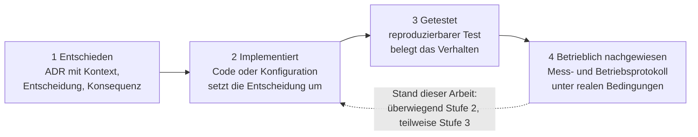

*Abbildung: Evidenzstufen der Architekturevaluation und erreichter Stand der Arbeit.*

Diese Stufen sind nicht austauschbar. Ein ADR beweist keine Implementierung, Quellcode beweist keinen erfolgreichen Test und ein erfolgreicher Unit-Test beweist noch keinen belastbaren Produktivbetrieb. Der szenariobasierte Bewertungsansatz orientiert sich an etablierten Architekturevaluationsmethoden, insbesondere an der szenariogetriebenen Qualitätsanalyse von ATAM [28] und der Qualitätsmodellierung nach Bass et al. [23]. Die Evaluation stützt sich auf das Architekturdokument, das ADR-Verzeichnis, die Anforderungen, die Architekturdiagramme und die dokumentierte Untersuchung von `Code.zip`.

## 10.2 Architekturkonformitätsmatrix

Die Matrix formuliert zentrale Architekturregeln als prüfbare Aussagen. Sie ersetzt keine ADRs, sondern verknüpft deren Entscheidungen mit der vorhandenen Evidenz.

| ID | Architekturregel | Quelle | Evidenz | Status | Abweichung oder nächste Prüfung |
|----|------------------|--------|---------|--------|---------------------------------|
| AC-1 | Browser und Arbeitsplatzrechner greifen nicht direkt auf PostgreSQL zu. | ADR-001 | Kontext- und Deployment-Sicht; zentraler Backend-Zugriff | konform | Produktivnetzwerk muss DB-Port zusätzlich technisch abschotten. |
| AC-2 | Geschäftslogik und Transaktionen liegen in der Service-Schicht und nicht ausschließlich in Vaadin-Views oder Controllern. | ADR-001/002 | Services, Repositories und Schichtenmodell | teilweise belegt | Paketabhängigkeiten und ausgewählte fachliche Regeln automatisiert prüfen. |
| AC-3 | Das Backend verwendet Spring Boot und Java 25. | ADR-002 | `pom.xml`, Container-Build | konform | Support- und Patchstrategie der gewählten Distribution dokumentieren. |
| AC-4 | Die Benutzeroberfläche wird mit Vaadin Flow als Teil des Spring-Boot-Artefakts ausgeliefert. | ADR-003 | Vaadin-Abhängigkeiten und Produktions-Bundle | konform | Lizenzprüfung bei Einführung zusätzlicher kommerzieller Komponenten wiederholen. |
| AC-5 | Passwörter werden nicht im Klartext gespeichert; Autorisierung erfolgt rollenbasiert. | ADR-004 | BCrypt-Konfiguration, Rollen `ADMIN` und `SACHBEARBEITUNG` | implementiert | Negativtests und Passwort-Policy fehlen als vollständiger Abnahmenachweis. |
| AC-6 | UI und REST-API besitzen getrennte, explizit geordnete Security-Filterketten. | ADR-012 | `SecurityConfig.java` | konform implementiert | vollständiger erfolgreicher Sicherheitstestlauf erforderlich. |
| AC-7 | Konfiguration und Geheimnisse werden außerhalb des Anwendungsartefakts bereitgestellt. | ADR-007 | externe Properties und Compose-Variablen | teilweise belegt | Dateirechte, Rotation und Schlüsselverwahrung im Zielbetrieb prüfen. |
| AC-8 | Persistenz erfolgt über Spring Data JPA und versionierte Flyway-Migrationen. | ADR-008 | Repositories, Entities und Migrationen | konform | native und dynamische Abfragen separat auf sichere Parametrisierung prüfen. |
| AC-9 | Fachlich relevante Änderungen werden nachvollziehbar historisiert. | ADR-009 | Envers, Audit-Service und Auditmigrationen | teilweise konform | Entitätsabdeckung und Benutzerzuordnung vollständig ausweisen. |
| AC-10 | Dokumente werden serverseitig ohne interaktive Office-Installation erzeugt. | ADR-010 | Apache-POI-basierte Services | konform implementiert | fachliche Freigabe der erzeugten Dokumente bleibt offen. |
| AC-11 | Die Anwendung wird On-Premises mit Docker Compose betrieben. | ADR-006/011 | `docker-compose.yml` und Container-Build | konform | Host-Härtung, Neustart und Rollback betrieblich testen. |
| AC-12 | Produktionszugriffe erfolgen ausschließlich verschlüsselt über einen Reverse-Proxy. | ADR-011 | als Deploymentanforderung dokumentiert | offen | Proxy ist nicht Bestandteil des nachgewiesenen Stacks. |
| AC-13 | Daten und Dokumente werden automatisiert, verschlüsselt und wiederherstellbar gesichert. | ADR-005/008 | `pgbackrest.conf` sowie geplanter `pg_dump`-Übergangsjob (§7.4) | teilweise konform | laufendes verschlüsseltes Übergangsbackup vorhanden; pgBackRest-Integration, Offsite-Kopie und Restore-Protokoll fehlen. |
| AC-14 | Datenbankzugriffe werden zusätzlich durch Row-Level Security begrenzt. | Sicherheitsarchitektur | RLS-Migrationen und DataSource-Komponenten | implementiert | Wirksamkeit mit echter PostgreSQL-Instanz und Connection Pooling nachweisen. |
| AC-15 | Qualitätskennzahlen sind einem Commit, einer Toolversion und einer Konfiguration zuordenbar. | Qualitätssicherung | gemeinsame CK- und SonarQube-Messung mit der Metriken-Gruppe (Kapitel 12) | teilweise nachgewiesen | Commit, Toolversionen und Quality Profile des Messlaufs revisionssicher archivieren. |

Der überwiegende Teil der Regeln ist im Prototyp umgesetzt oder konform dokumentiert. Einige Regeln sind nur teilweise belegt; für ein vollständiges, wiederherstellungsgeprüftes Backup ist eine verschlüsselte Übergangslösung umgesetzt (§7.4), der pgBackRest-Zielprozess und der Restore-Nachweis stehen jedoch noch aus, und die reproduzierbaren Qualitätskennzahlen liegen als gemeinsame CK- und SonarQube-Messung vor (Kapitel 12), müssen aber noch revisionssicher archiviert werden. Die Matrix zeigt damit eine hohe Konformität des strukturellen Zielbilds, aber eine deutlich geringere Reife der betrieblichen Qualitätssicherung.

## 10.3 Bewertung der Qualitätsziele

| Qualitätsziel | Bewertung | Begründung |
|---------------|-----------|------------|
| Sicherheit und Datenschutz | teilweise erreicht | Zentraler Zugriff, BCrypt, RBAC, getrennte Filterketten und RLS verbessern das Ausgangsniveau deutlich. TLS-Betrieb, Retention, Löschung und vollständige Negativtests bleiben offen. |
| Zuverlässigkeit | noch nicht nachgewiesen | Containerisierung und Datenbanktransaktionen schaffen Voraussetzungen. Verfügbarkeit, Neustartzeit und Restorefähigkeit wurden jedoch nicht durch Messprotokolle belegt. |
| Wartbarkeit | strukturell verbessert | Schichten, ADRs, Migrationen und zentrale Auslieferung reduzieren verteilte Änderungen. Fehlerhafte Tests und fehlende Betriebsdokumentation schränken den Nutzen ein. |
| Backup und Recovery | Zielbild vorhanden | Werkzeugwahl und Konfiguration sind dokumentiert, ein laufender und getesteter Prozess fehlt. |
| Bedienbarkeit | plausibel, aber offen | Vaadin bietet geeignete Komponenten für Formulare und Tabellen. Ein Usability-Test mit der tatsächlichen Sachbearbeitung ist nicht dokumentiert. |
| Funktionale Eignung | teilweise belegt | Domänenmodell und Services decken wesentliche Anforderungen ab. Fachliche Vollständigkeit, Dokumentkorrektheit und Migration müssen abgenommen werden. |

Die Architektur adressiert die wesentlichen Schwächen des Altsystems. Der stärkste nachweisbare Fortschritt ist die Beseitigung des direkten Datenbankzugriffs vom Client. Der schwächste Bereich ist die betriebliche Verifikation. Dadurch ist die Architektur als tragfähiger Prototyp, nicht aber als vollständig abgenommene Produktivlösung einzustufen.

## 10.4 Grenzen der Evaluation

Die Ergebnisse unterliegen mehreren Einschränkungen:

- Die Bewertung bezieht sich auf den dokumentierten Abgabestand und nicht auf einen langfristig betriebenen Produktivserver.
- Ein realer Lasttest mit repräsentativer Nutzerzahl und Datenmenge liegt nicht vor.
- Verfügbarkeit, RTO und RPO sind Zielwerte ohne ausreichend langen Messzeitraum.
- Der zunächst archivierte, DB-lose Testlauf ist kein Produktdefekt; seine Einordnung und der noch
  zu archivierende erfolgreiche DB-gestützte Lauf sind in Abschnitt 8.3 beschrieben.
- Eine vollständige manuelle Codeprüfung sämtlicher Abfragen, Berechtigungen und Fehlerpfade ist nicht Teil dieser Arbeit.
- Datenschutzkonformität kann nicht allein aus Softwarearchitektur abgeleitet werden. Rechtsgrundlagen, Verzeichnisse von Verarbeitungstätigkeiten, organisatorische Prozesse und gegebenenfalls eine Datenschutz-Folgenabschätzung liegen außerhalb der technischen Evaluation.
- Die fachliche Richtigkeit gesetzlicher Dokumente muss durch fachkundige Personen bestätigt werden.
- Hardwareausfälle, kompromittierte Administratorenkonten, Schadsoftware und physischer Zugriff auf den Server wurden nur auf Architekturebene betrachtet.
- Die in Kapitel 12 gemeinsam mit der Metriken-Gruppe ermittelten CK- und SonarQube-Werte belegen die Richtung der Verbesserung; als vollständig reproduzierbare Evidenz müssen sie jedoch mit Commit, Werkzeugversionen und Quality Profile archiviert werden.
- Die verwendeten Framework- und Datenbankversionen verändern sich über die Lebensdauer des Systems. Die Bewertung ist daher zeitgebunden.

Diese Einschränkungen reduzieren nicht den Wert der vorhandenen Architekturarbeit. Sie begrenzen vielmehr, welche Schlussfolgerungen aus den verfügbaren Artefakten zulässig sind.

---

# 11. Teamübergreifende Umsetzung

Dieses Kapitel bearbeitet Teilaufgabe b): Die entworfene Architektur wurde nicht isoliert von der
Architekturgruppe, sondern im Gesamtteam aus den Gruppen Architektur, Datenbank, GUI, Vorlagen,
Testen und Metriken umgesetzt. Beschrieben werden die Rollenverteilung, die vereinbarten
Schnittstellenverträge, die Übergabepunkte, die Entscheidungswege sowie aufgetretene Konflikte und
ihre Auflösung. Die Architekturgruppe verantwortet das Zielbild und die Schnittstellendefinition;
die Fachgruppen liefern die jeweiligen Bausteine in den gemeinsamen Prototyp `Code.zip` [30].

## 11.1 Rollen und Verantwortlichkeiten der Gruppen

| Gruppe | Beitrag zur Umsetzung | Schnittstelle zur Architektur |
|--------|-----------------------|-------------------------------|
| Architektur | Zielarchitektur, ADRs, Schichtenschnitt, Sicherheitskonzept | gibt Schnittstellenverträge und Randbedingungen vor |
| Datenbank | Schema, Constraints, Migrationen, RLS-Policies | Flyway-Migrationen und JPA-Entitäten |
| GUI | Vaadin-Views, Navigation, Formularvalidierung | nutzt die Service-Schicht, keine direkten DB-Zugriffe |
| Vorlagen | Word-/Dokumentvorlagen und Generierungslogik | Apache-POI-Services hinter Service-Schnittstelle |
| Testen | Unit-, Integrations- und Sicherheitstests | prüft Schnittstellenverträge und Negativfälle |
| Metriken | CK- und SonarQube-Messung | misst den gemeinsamen Stand (Kapitel 12) |

## 11.2 Schnittstellenverträge und Übergabepunkte

Damit die Gruppen parallel arbeiten konnten, wurden die Kopplungspunkte als explizite Verträge
festgelegt statt implizit über gemeinsam bearbeiteten Code:

- **Datenbank ↔ Backend:** Das Schema ist die verbindliche Grenze. Änderungen erfolgen
  ausschließlich über versionierte Flyway-Migrationen [29]; die Backend-Entitäten spiegeln das
  Schema, verändern es aber nicht ad hoc. Übergabepunkt ist eine lauffähige Migration mit
  zugehöriger JPA-Entität.
- **Backend ↔ GUI:** Die GUI greift ausschließlich über die Service-Schicht zu, nie direkt auf
  Repositories oder die Datenbank. Der Vertrag besteht aus Service-Signaturen und DTOs. So bleibt
  die zentrale Autorisierung wirksam, weil keine Zugriffe an der Security vorbeigeführt werden.
- **Backend ↔ REST:** Die REST-API besitzt eine eigene, dokumentierte Filterkette (ADR-012) und
  stabile Endpunktverträge, sodass externe Aufrufer unabhängig von der UI bedient werden.
- **Vorlagen ↔ Backend:** Dokumentvorlagen werden versioniert und über einen Generierungsservice
  angesprochen. Übergabepunkt ist eine freigegebene Vorlage mit fachlichem Abnahmedatum (§6).
- **Testen ↔ alle:** Die Testgruppe konsumiert dieselben Service- und REST-Verträge und prüft
  insbesondere Negativfälle wie unautorisierte Zugriffe und ungültige Eingaben.

## 11.3 Integrationsablauf und Entscheidungswege

Architekturänderungen mit gruppenübergreifender Wirkung wurden über ADRs entschieden und erst nach
Konsens in den gemeinsamen Stand übernommen. Der typische Ablauf lautet: Vorschlag → Abstimmung der
betroffenen Gruppen → ADR (akzeptiert oder ersetzt) → Umsetzung im jeweiligen Baustein →
Integration in `Code.zip` → gemeinsame Prüfung durch die Testgruppe. Zwei Entscheidungen sind
unmittelbar aus dieser Zusammenarbeit entstanden: ADR-011 (Container statt nativer Dienste,
gemeinsam mit dem Betrieb) und ADR-012 (getrennte Filterketten, ausgelöst durch die
REST-Anforderung). Auch ADR-013 (Windows-Betrieb) wurde mit Blick auf die Support- und
Backupfähigkeit beim Verein gemeinsam abgewogen.

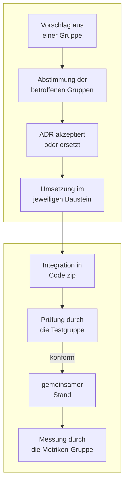

*Abbildung: Entscheidungs- und Integrationsablauf zwischen den Arbeitsgruppen; obere Reihe zuerst lesen. Stellt die Testgruppe eine Vertragsverletzung fest, kehrt der Ablauf zur Abstimmung der betroffenen Gruppen zurück.*

## 11.4 Konflikte und ihre Auflösung

| Konflikt | Beteiligte | Auflösung |
|----------|-----------|-----------|
| Direktzugriff der GUI auf Repositories gewünscht | GUI ↔ Architektur | abgelehnt; Zugriff nur über die Service-Schicht, um die zentrale Autorisierung zu erhalten |
| Schemaänderung ohne Migration | GUI/Backend ↔ Datenbank | verbindliche Regel „keine Schemaänderung ohne Flyway-Migration“ |
| Authentifizierung für REST und UI vermischt | Architektur ↔ Testen | zwei getrennte Filterketten (ADR-012) statt einer gemischten Kette |
| Windows-Vorgabe vs. Linux-Container | Architektur ↔ Betrieb | ADR-013: Container auf Windows-Host über WSL 2, native Installation als Rückfalloption |

## 11.5 Ergebnis und offene Integrationsnachweise

Die Zusammenarbeit führte zu einem gemeinsamen, integrierten Prototyp, in dem die Bausteine der
Gruppen über die vereinbarten Verträge zusammenspielen. Nachweisbar sind Schema, Service-Schicht,
Vaadin-UI, REST-API, Vorlagenservices und die gemeinsame Metrikmessung. Offen bleiben die
durchgängig protokollierten Integrationstests über alle Gruppen hinweg – ein DB-gestützter grüner
Gesamtlauf ist zu archivieren (vgl. §8.3) – sowie die fachliche Abnahme der Dokumentvorlagen. Die
teamübergreifende Umsetzung ist damit strukturell erfüllt, während der vollständige,
reproduzierbare Integrationsnachweis noch aussteht.

Dieses Kapitel beschreibt bewusst überwiegend den vereinbarten **Soll-Prozess** der
Zusammenarbeit. Ein belastbarer Evidenznachweis im Sinne der Evidenzstufen aus §10.1 – etwa
protokollierte gruppenübergreifende Sitzungen, Reviews, Pull Requests oder benannte
Ansprechpartner – liegt für die Teamintegration nicht vor; das Evidenzinventar (Anhang C) enthält
daher folgerichtig keinen eigenen Eintrag hierzu. Im abgegebenen Repository-Stand sind zudem die
Beiträge der übrigen Gruppen nicht auffindbar: Die Ordner `02-datenbank`, `04-gui`, `05-vorlagen`,
`06-metriken` und `07-testen` enthalten nur `.gitkeep`-Platzhalter, sodass sich die
teamübergreifende Umsetzung im Wesentlichen aus dem gemeinsamen `Code.zip` und den daraus
ableitbaren Verträgen erschließt. Auch hier gilt eine Machbarkeitsgrenze: Sechs Gruppen
entwickelten parallel innerhalb eines Semesters an einem gemeinsamen Prototyp; ein durchgängig
protokollierter, gruppenübergreifender Integrationslauf und die fachliche Vorlagenabnahme waren in
diesem Rahmen nicht mehr vollständig zu leisten und sind als nächste Ausbaustufe ausgewiesen.

# 12. Metrische Evaluation im Vergleich zum Altsystem

Dieses Kapitel bearbeitet Teilaufgabe c) der Aufgabenstellung. Die Metriken, die zuvor auf den
IST-Zustand des Altsystems angewendet wurden, werden in Zusammenarbeit mit der Metriken-Gruppe auf
den neuen Prototyp übertragen. Ziel ist nicht die bloße Angabe von Zahlen, sondern die Beurteilung,
ob die Architekturentscheidungen der Kapitel 3 bis 5 eine messbare Verbesserung bewirken und an
welchen Stellen weiterhin technische Schulden bestehen.

## 12.1 Vorgehen und Werkzeuge

Eine tiefergehende metrische Analyse war im Rahmen der Prüfungsleistung zeitlich nicht möglich:
Sie setzt eine vollständige Vermessung des IST-Standes, die anschließende Neuentwicklung auf Basis
der entworfenen Architektur und erst danach eine Re-Vermessung eines **funktional äquivalenten**
Standes voraus. Innerhalb eines Semesters konnte diese Kette nur einmalig und auf
Prototyp-Reifegrad durchlaufen werden. Erschwerend kommt hinzu, dass Alt- und Neusystem nicht
denselben Funktionsumfang abbilden: Der Prototyp implementiert die Kernfälle der neuen
Architektur, ist aber kein nachweislich funktionsgleiches Abbild des Altsystems. Solange diese
funktionale Äquivalenz nicht hergestellt ist, sind insbesondere die struktursensiblen Vergleiche
(CBO, LCOM) nur begrenzt aussagekräftig. Die im Folgenden berichteten Werte sind daher als
**richtungsweisender Trend** zu lesen; ein funktional gleichwertiger Vergleichsstand, eine
normierte Betrachtung und wiederholte Messläufe stehen aus. Diese zeitliche Machbarkeitsgrenze ist
die gemeinsame Ursache hinter den weiter unten einzeln benannten Symptomen (Bereichsangaben in der
Baseline, fehlende Normierung, nicht archivierter Messlauf).

Es wurde derselbe Werkzeug- und Metriksatz wie bei der Vermessung des Altsystems verwendet, um
Vergleichbarkeit herzustellen. Die objektorientierte Struktur wird über die CK-Metriksuite nach
Chidamber und Kemerer erfasst [31]: LCOM (Lack of Cohesion of Methods), CBO (Coupling Between
Objects), RFC (Response For a Class) und die zyklomatische Komplexität. Ergänzend liefert
SonarQube [32] eine Wartbarkeits- und Sicherheitsbewertung sowie die Anzahl von Vulnerabilities
und Security Hotspots. Die Metriken-Gruppe verantwortet Werkzeugkonfiguration und Schwellenwerte;
die Architekturgruppe interpretiert die Ergebnisse im Licht der getroffenen Entscheidungen.

Die kritischen Schwellenwerte entsprechen den auch beim Altsystem verwendeten Grenzen
(LCOM ≥ 30, CBO ≥ 5, RFC > 30, zyklomatische Komplexität > 20 je Methode). Gezählt wird jeweils
die Anzahl der Klassen, die den Schwellenwert überschreiten. Da der Prototyp mehr Klassen umfasst
als das Altsystem, sind absolute Klassenzahlen mit Vorsicht zu vergleichen; die Richtung der
Veränderung ist aussagekräftiger als der Einzelwert.

Für den IST-Zustand lagen einzelne CK-Kennzahlen aus der ursprünglichen Vermessung nur als
Bereichsangaben vor (etwa „mehr als 10“ bzw. „mehr als 50“ kritische Klassen). Diese werden
unverändert übernommen; wo lediglich eine Bereichsangabe existiert, wird bewusst **keine**
quantitative Verbesserung behauptet, sondern nur die belegbare Richtung interpretiert. Da der
Prototyp zudem mehr Klassen umfasst als das Altsystem, werden die absoluten Zählwerte durch eine
relative Betrachtung ergänzt: Aussagekräftig ist der Anteil kritischer Klassen an der Gesamtzahl,
nicht die absolute Zahl allein. Da die Metriken-Gruppe die Gesamtzahl analysierter Klassen für den
gemeinsamen Messlauf noch nicht endgültig ausgewiesen hat, wird der Anteil kritischer Klassen an
der Gesamtmenge hier noch nicht als exakte Quote angegeben; stattdessen wird für die Metriken mit
exakten Endwerten (RFC, zyklomatische Komplexität) die **relative Veränderung** berichtet (§12.2).
Eine vollständig auf Klassenzahl und LOC normierte Gegenüberstellung ist gemeinsam mit der
Metriken-Gruppe für den nächsten Messlauf vorgesehen.

Diese Kennzahlen sind das Ergebnis des gemeinsamen Messlaufs und werden – konsistent mit
Abschnitt 8.4 – als richtungsweisende Evidenz und nicht als abschließend reproduzierbarer Nachweis
verwendet. Die vollständige Reproduzierbarkeit (Commit-ID, Werkzeugversionen, Quality Profile und
ausgeführter Befehl) ist noch zu archivieren (AC-15); erst damit erfüllen die Werte die in
Abschnitt 8.4 geforderten Kriterien.

## 12.2 Ergebnisse der Metrikmessung

Die folgende Gegenüberstellung fasst die gemeinsam mit der Metriken-Gruppe ermittelten Werte
zusammen.

| Metrik (Werkzeug) | Altsystem (IST) | Neuer Prototyp | Zielsetzung |
|-------------------|-----------------|----------------|-------------|
| LCOM (CK) | > 10 Klassen kritisch (≥ 30) | 10 Klassen kritisch (≥ 30) | Verbesserung der Kohäsion |
| CBO (CK) | > 50 Klassen kritisch (≥ 5) | 59 Klassen kritisch (≥ 5) | Reduktion der Kopplung |
| RFC (CK) | 25 Klassen kritisch (> 30) | 15 Klassen kritisch (> 30) | Klarere Verantwortlichkeiten |
| Zyklomatische Komplexität (CK) | Gesamt 1.268 (viele > 20) | Gesamt 997 (16 > 20) | Reduktion der Komplexität |
| Maintainability (SonarQube) | A (Gut) | A (Gut) | Rating beibehalten |
| Security Rating (SonarQube) | E (Kritisch) | A (Gut) | Rating deutlich verbessern |
| Vulnerabilities (SonarQube) | 1 (Kritisch) | 0 | keine bekannten Schwachstellen |
| Security Hotspots (SonarQube) | 151 | 0 | systematische Prüfung |

Für die beiden Metriken mit exakten Endwerten lässt sich die relative Veränderung direkt
angeben: Die Zahl der Klassen mit hohem RFC (> 30) sinkt von 25 auf 15 (−40 %), die zyklomatische
Gesamtkomplexität von 1.268 auf 997 (−21 %). Für LCOM und CBO liegt der IST-Wert nur als
Bereichsangabe vor, sodass hier bewusst keine Prozentangabe gebildet wird. Diese relative
Betrachtung ergänzt die Absolutwerte, ersetzt jedoch nicht die noch ausstehende Normierung auf die
Gesamtzahl der Klassen und die LOC (§12.1).

```mermaid
xychart-beta
    title "Kritische Klassen und Gesamtkomplexität: Altsystem gegenüber Prototyp"
    x-axis ["RFC > 30 (Klassen)", "CBO >= 5 (Klassen)", "Zykl. Komplexität / 10", "Security Hotspots / 10"]
    y-axis "Messwert" 0 --> 130
    bar [25, 50, 127, 15.1]
    bar [15, 59, 99.7, 0]
```

*Abbildung: Gegenüberstellung ausgewählter Messwerte von Altsystem (heller Balken) und Prototyp (blauer Balken, überlagert dargestellt); Komplexität und Security Hotspots sind zur gemeinsamen Skalierung durch zehn geteilt, der CBO-Wert des Altsystems ist eine untere Schranke.*

## 12.3 Interpretation der CK-Metriken

Die zyklomatische Komplexität zeigt die deutlichste strukturelle Verbesserung. Die
Gesamtkomplexität sinkt von 1.268 auf 997 (rund 21 Prozent), und die Anzahl besonders komplexer
Einheiten (> 20) fällt von „vielen“ auf 16. Dies ist unmittelbar auf die Auflösung der
ereignisgetriebenen Swing-Handler und die Verlagerung der Geschäftslogik in klar geschnittene
Service-Methoden zurückzuführen (ADR-001, ADR-002).

RFC verbessert sich von 25 auf 15 kritische Klassen. Die Schichtentrennung reduziert die Menge der
von einer Klasse potenziell ausgelösten Methoden und schärft die Verantwortlichkeiten.

LCOM zeigt keine belastbare Verbesserung. Der IST-Wert lag nur als Bereichsangabe („mehr als 10“
kritische Klassen) vor, der Prototyp weist 10 kritische Klassen auf. Da Ausgangs- und Zielwert
innerhalb derselben Größenordnung und der Bereichsunschärfe der Baseline liegen, wird hier
ausdrücklich keine Verbesserung behauptet. Einige Service- und Hilfsklassen bündeln weiterhin
fachlich unterschiedliche Methoden und bleiben unter der Kohäsionsschwelle. Dies deckt sich mit der
in Abschnitt 9.3 dokumentierten technischen Schuld und ist ein Kandidat für gezieltes Refactoring.

CBO ist die einzige Metrik, deren Zielrichtung nicht erreicht wird: Die Zahl kritisch gekoppelter
Klassen liegt mit 59 sogar leicht über dem Ausgangswert. Dieses Ergebnis ist differenziert zu
bewerten. Ein erheblicher Teil der gemessenen Kopplung entsteht durch die bewusst eingeführten
Frameworks: Dependency Injection, Repository-Schnittstellen, Vaadin-Komponenten und die zusätzliche
REST-Schicht erhöhen die Zahl referenzierter Typen, ohne zwangsläufig die fachliche Verflechtung zu
verschlechtern. CBO unterscheidet nicht zwischen Frameworkkopplung und fachlicher Kopplung.
Gleichwohl ist der Wert ein ernstzunehmender Hinweis, die Abhängigkeiten zwischen fachlichen
Modulen künftig durch Schnittstellen und automatisierte Architekturtests (vgl. AC-2) zu begrenzen.

## 12.4 Interpretation der SonarQube-Ergebnisse

Den größten und zugleich sicherheitsrelevantesten Fortschritt zeigen die SonarQube-Kennzahlen. Das
Security Rating steigt von E (kritisch) auf A, die einzige zuvor gemeldete Vulnerability entfällt
(1 → 0) und die Security Hotspots sinken von 151 auf 0. Diese Verbesserung ist konsistent mit den
Sicherheitsentscheidungen der Arbeit: Der Wegfall der Klartext-Zugangsdaten und der direkten
JDBC-Zugriffe (ADR-001), die durchgängig parametrisierten Zugriffe über Spring Data JPA (ADR-008),
zentrale Authentifizierung mit BCrypt und RBAC (ADR-004) sowie Row-Level Security beseitigen genau
die Muster – dynamisch zusammengesetztes SQL und unsichere Credentialbehandlung –, die im Altsystem
die zahlreichen Hotspots verursachten.

Die Wartbarkeit bleibt trotz gewachsenem Funktionsumfang auf dem Rating A. Die Architektur konnte
also zusätzliche Sicherheits-, Audit- und Dokumentfunktionen aufnehmen, ohne die
Wartbarkeitsbewertung zu verschlechtern.

Der Wert von null Hotspots ist einzuordnen: Er belegt, dass die im Altsystem markierten Muster nicht
mehr auftreten, hängt jedoch vom konfigurierten Quality Profile und vom analysierten Umfang ab. Ein
Security Rating A ist keine Aussage über die Wirksamkeit gegen aktive Angriffe und ersetzt
insbesondere keinen Penetrationstest (vgl. Abschnitt 5.9).

## 12.5 Einordnung und Grenzen der Messung

Die Messung stützt die zentrale These der Arbeit empirisch: Die Modernisierung verbessert Sicherheit
und Komplexität deutlich, während Kopplung und teilweise Kohäsion offene Punkte bleiben. Damit
liefern die Metriken erstmals objektivierte Belege für die zuvor überwiegend qualitativ begründeten
Qualitätsziele.

Bei der Interpretation sind mehrere Grenzen zu beachten:

- Die Werte beziehen sich auf einen bestimmten Stand von `Code.zip`. Für volle Reproduzierbarkeit
  müssen Commit, Werkzeugversionen und Quality Profile archiviert werden (vgl. AC-15).
- Absolute Klassenzahlen sind wegen des größeren Umfangs des Prototyps nur eingeschränkt mit dem
  Altsystem vergleichbar; eine auf die Klassenzahl normierte Betrachtung wäre aussagekräftiger.
- CK-Schwellenwerte sind Heuristiken. Eine überschrittene Schwelle ist ein Prüfhinweis, kein
  Fehlerbeweis.
- SonarQube-Ergebnisse sind nur so belastbar wie das gewählte Quality Profile und der Scan-Umfang.

Die Metriken bestätigen somit die Richtung der Architekturentscheidungen und benennen zugleich die
nächsten konkreten Verbesserungsschritte: Reduktion der fachlichen Kopplung, gezieltes Refactoring
gering kohäsiver Klassen und die revisionssichere Archivierung der Messläufe.

# 13. Fazit und zukünftige Entwicklung

Abschließend werden die Ergebnisse der Kapitel 4 bis 12 gegen die Aufgabenstellung gespiegelt. Das Kapitel fasst zusammen, was belegt erreicht wurde und was offen bleibt, und leitet daraus eine priorisierte Roadmap für die Weiterentwicklung ab.

## 13.1 Schlussfolgerung

Der Wechsel vom verteilten Swing-Fat-Client zu einem zentralen 3-Schichten-Monolithen ist für den betrachteten Verein nachvollziehbar und angemessen. Er beseitigt die sicherheitskritische Verteilung von Datenbankzugangsdaten auf Arbeitsplatzrechner, zentralisiert Geschäftsregeln und ermöglicht ein einheitliches Deployment. Für einen kleinen Nutzerkreis und ein begrenztes Betriebsteam wäre eine Microservice-Architektur mit zusätzlichen Netzwerk-, Deployment- und Observability-Anforderungen unverhältnismäßig.

Spring Boot, Vaadin und PostgreSQL bilden einen konsistenten Stack für eine formular- und tabellenorientierte interne Verwaltungsanwendung. Die direkte Java-Integration von Vaadin reduziert technologische Übergänge, erzeugt jedoch eine stärkere Frameworkbindung und serverseitigen Sitzungszustand. Diese Nachteile sind im aktuellen Kontext vertretbar, solange die Anwendung intern betrieben wird und keine starke horizontale Skalierung benötigt.

Die Sicherheitsarchitektur stellt gegenüber dem Altsystem einen deutlichen Fortschritt dar. Zentrale Authentifizierung, BCrypt, RBAC, getrennte Filterketten, parametrisierte Persistenzzugriffe, RLS und Auditierung folgen dem Prinzip der gestaffelten Schutzmaßnahmen. Dennoch darf die Summe dieser Mechanismen nicht mit nachgewiesener DSGVO-Konformität gleichgesetzt werden. Insbesondere TLS-Betrieb, Löschregeln, Auditaufbewahrung, Backupzugriffe und organisatorische Berechtigungsprüfungen müssen außerhalb des reinen Anwendungscodes verbindlich geregelt werden.

Die größte Differenz besteht zwischen **implementierter Struktur** und **betrieblicher Reife**.
Eine pgBackRest-Konfiguration ist noch kein Backupdienst, ein Backup ohne Restore-Test kein
belastbarer Wiederherstellungsprozess und ein Actuator-Endpunkt noch kein Monitoring. Der
zwischenzeitlich grüne Testlauf in einer DB-fähigen Umgebung stärkt dagegen die
Implementierungsevidenz; der frühere Lauf ohne Datenbank ist nicht als Qualitätsmangel der Tests
zu bewerten. Die offenen Betriebsnachweise verhindern weiterhin eine uneingeschränkte Einstufung
als produktionsreif.

Insgesamt ist der Prototyp deshalb als tragfähige, weitgehend architekturkonforme Grundlage zu bewerten. Die zentralen Entscheidungen sind plausibel und in wesentlichen Teilen implementiert. Eine Produktivsetzung mit den besonders schutzbedürftigen Daten des Vereins sollte jedoch erst erfolgen, wenn die kritischen Betriebs-, Sicherheits- und Wiederherstellungsnachweise erbracht wurden.

## 13.2 Roadmap

### Phase 0: Freigabesperre beseitigen

Vor der Verarbeitung realer personenbezogener Daten sind folgende Punkte zwingend:

1. erfolgreichen DB-gestützten Maven-Testlauf mit Umgebung und Bericht archivieren,
2. produktiven TLS-Reverse-Proxy konfigurieren und testen,
3. pgBackRest in den Betrieb integrieren,
4. vollständigen Restore auf einem neu aufgebauten System durchführen,
5. RTO und RPO messen,
6. Rollen- und Security-Negativtests für UI und API abschließen,
7. Migration durch Datensatz-, Summen- und Stichprobenvergleich abnehmen,
8. Dokumentvorlagen fachlich freigeben,
9. Lösch-, Retention- und Auditregeln beschließen.

### Phase 1: Betriebsstabilisierung

In den ersten drei Betriebsmonaten sollten ein externes Health-Monitoring, Alarmierungswege, Logaufbewahrung, Patchfenster und ein Rollbackverfahren etabliert werden. Backupjobs und fehlgeschlagene Anmeldungen müssen überwacht werden. Mindestens eine weitere Wiederherstellungsübung sollte zeigen, dass der Prozess nicht nur einmalig funktioniert.

Für Änderungen an Benutzerrollen, Sicherheitskonfiguration, RLS-Policies und Datenbankmigrationen sind Reviews durch eine zweite Person vorzusehen. Qualitätsberichte sollen mit Commit, Java-Version, Toolversion und Konfiguration archiviert werden.

### Phase 2: Qualitätsausbau

Nach Stabilisierung folgen Usability-Tests mit der Sachbearbeitung, Performance-Messungen mit realistischer Datenmenge sowie eine vollständige Auditabdeckungsmatrix. Wiederkehrende manuelle Prüfungen sollten, soweit sinnvoll, automatisiert werden. Architekturtests können beispielsweise verbieten, dass Vaadin-Views direkt auf Repositories zugreifen oder fachliche Services Webklassen importieren.

### Phase 3: Bedarfsabhängige Weiterentwicklung

Eine stärkere Verteilung oder horizontale Skalierung ist erst dann zu prüfen, wenn messbare Auslöser vorliegen, etwa deutlich höhere Nutzerzahlen, externe Clients, lange Antwortzeiten oder Anforderungen an unabhängige Deployments. Eine REST-API darf nicht allein deshalb zu Microservices führen. Solange ein modularer Monolith die Qualitätsziele erfüllt, ist seine geringere Betriebskomplexität ein Vorteil.

Weitere mögliche Entwicklungsschritte sind:

- stärkere Authentifizierung für Administratoren,
- automatisierte Dependency- und Container-Scans,
- versionierte Datenschutz- und Löschläufe,
- regelmäßige Disaster-Recovery-Übungen,
- standardisierte Betriebsmetriken und Service-Level-Indikatoren,
- Prüfung einer hochverfügbaren Datenbank erst bei entsprechendem Bedarf,
- kontrollierte Bereitstellung zusätzlicher Schnittstellen für externe Systeme.

---

# 14. Glossar

Das Glossar erläutert die in dieser Arbeit wiederkehrend verwendeten Fach- und Technologiebegriffe. Es dient dem einheitlichen Verständnis über alle Arbeitsgruppen hinweg.

| Begriff | Bedeutung |
|---------|-----------|
| ADR | Architecture Decision Record; kompaktes Dokument einer bedeutsamen Architekturentscheidung |
| Architecture Conformance | Übereinstimmung der Implementierung mit expliziten Architekturregeln |
| Audit | Nachvollziehbare Aufzeichnung sicherheits- oder fachlich relevanter Änderungen |
| BCrypt | Adaptives Verfahren zum Hashen von Passwörtern |
| C4 | Modell für Kontext-, Container-, Komponenten- und Codesichten |
| CSRF | Cross-Site Request Forgery; missbräuchliches Auslösen authentifizierter Browseranfragen |
| Defense in Depth | Kombination mehrerer unabhängiger Schutzschichten |
| DSGVO | Datenschutz-Grundverordnung der Europäischen Union |
| Envers | Hibernate-Modul zur Versionierung von Änderungen an JPA-Entities |
| Evidenz | Nachprüfbares Artefakt zur Begründung einer Aussage |
| Flyway | Werkzeug zur versionierten Ausführung von Datenbankmigrationen |
| JPA | Java Persistence API; Standardabstraktion für objekt-relationalen Datenzugriff |
| PITR | Point-in-Time-Recovery; Wiederherstellung auf einen bestimmten Zeitpunkt |
| RBAC | Role-Based Access Control; rollenbasierte Zugriffskontrolle |
| Restrisiko | Nach Umsetzung einer Maßnahme verbleibendes Risiko |
| RLS | Row-Level Security; datenbankseitige Einschränkung sichtbarer oder änderbarer Zeilen |
| RPO | Recovery Point Objective; maximal akzeptiertes Datenverlustfenster |
| RTO | Recovery Time Objective; maximal akzeptierte Wiederherstellungsdauer |
| Technische Schuld | Aufgeschobene technische Arbeit, die später zusätzlichen Aufwand oder Risiken verursacht |
| TLS | Transport Layer Security; Schutz der Datenübertragung durch Verschlüsselung und Authentisierung |
| Vaadin Flow | Serverseitiges Java-Framework für Weboberflächen |
| WAL | Write-Ahead Log von PostgreSQL; Grundlage für Recovery und PITR |

# Anhang A: ADR-Register

Die ADRs 001 bis 014 liegen als vollständige Dokumente im Verzeichnis `adrs/`; ADR-013 (Windows-Betrieb) und ADR-014 (DBMS-Wahl) wurden im Zuge dieser Arbeit ergänzt. Das Register gibt nur Status, Beziehung und Evaluationsrelevanz wieder und dupliziert nicht den vollständigen ADR-Inhalt.

| ADR | Kurzthema | Status | Aktuelle Einordnung |
|-----|-----------|--------|---------------------|
| ADR-001 | zentraler 3-Schichten-Monolith | akzeptiert | strukturelles Zielbild umgesetzt |
| ADR-002 | Spring Boot und Java 25 | akzeptiert | im Build und Container umgesetzt |
| ADR-003 | Vaadin Flow | akzeptiert und implementiert | finale Präsentationstechnologie |
| ADR-004 | Session-Authentifizierung und RBAC | akzeptiert | für die UI gültig; durch ADR-012 ergänzt |
| ADR-005 | pgBackRest und 3-2-1-Strategie | vorgeschlagen, nicht implementiert | Konfiguration vorhanden, Betriebsnachweis offen |
| ADR-006 | On-Premises-Deployment | teilweise ersetzt | Standortentscheidung bleibt, technische Ausprägung durch ADR-011 ersetzt |
| ADR-007 | Konfiguration und Secrets | akzeptiert | betriebliche Berechtigungen und Rotation prüfen |
| ADR-008 | JPA und Dokumentablage | akzeptiert | grundsätzlich implementiert |
| ADR-009 | Audit mit Envers | akzeptiert | Abdeckung nicht vollständig nachgewiesen |
| ADR-010 | Dokumentgenerierung | akzeptiert | Apache POI implementiert; fachliche Abnahme offen |
| ADR-011 | containerisiertes On-Premises-Deployment | akzeptiert und implementiert | aktuelles Deploymentmodell |
| ADR-012 | getrennte Security-Filterketten | akzeptiert und implementiert | aktuelles Sicherheitsmodell für UI und API |
| ADR-013 | Betrieb der Container auf einem Windows-Host (Docker Desktop/WSL 2) | akzeptiert und implementiert | erfüllt die Windows-Rahmenbedingung; nativer Windows-Betrieb als Rückfalloption |
| ADR-014 | PostgreSQL statt SQL Server Express | akzeptiert und implementiert | DBMS-Wechsel; Windows-konformer Betrieb über ADR-013 sichergestellt |

# Anhang B: Anforderungs-Traceability-Matrix

| Anforderung | Architekturzuordnung | Evidenz | Status | Offener Nachweis |
|-------------|----------------------|---------|--------|------------------|
| FR-1 Anmeldung und Rollen | Spring Security, BCrypt, RBAC | Security-Konfiguration und Benutzerverwaltung | implementiert | vollständige Positiv- und Negativtests |
| FR-2 Mitglieder und Adressen | Domänenmodell, Services, Repositories, Vaadin-Views | Entities und Anwendungsartefakte | teilweise belegt | fachlicher End-to-End-Test |
| FR-3 Spendenverwaltung | Spenden-Domäne und Persistenz | Services, Repositories und Tests | teilweise belegt | erfolgreicher Testlauf |
| FR-4 Bußgeldverwaltung | Bußgeld-Domäne und Statusmodell | Entities und Services | teilweise belegt | Statusübergänge fachlich abnehmen |
| FR-5 Zahlungseingänge und Restbetrag | Service- und Domänenlogik | Berechnungslogik und Tests | implementiert | grüner Regressionstest |
| FR-6 Gerichtsverwaltung | Stammdatenmodule | Repository-, Service- und UI-Komponenten | teilweise belegt | CRUD-End-to-End-Test |
| FR-7 administrative Stammdaten | RBAC und Verwaltungs-Views | Adminfunktionen | teilweise belegt | Zugriff mit Sachbearbeitungsrolle verweigern |
| FR-8 Auswertungen | Reporting-Services | Reportlogik und Tests | teilweise belegt | Summen mit Referenzdaten vergleichen |
| FR-9 Spendenbescheinigungen | Dokumentservices und Apache POI | Vorlagen- und Generierungsdienste | technisch implementiert | fachliche und rechtliche Freigabe |
| FR-10 Serienbriefe | WordTemplateService und Verteilerlogik | Dokument- und Versandtests | technisch implementiert | Sonderzeichen und lange Anschriften prüfen |
| FR-11 Validierung | Bean Validation, UI- und Serviceprüfung | Validierungslogik | teilweise belegt | Eintrittspunkte systematisch vergleichen |
| FR-12 Datenkonsistenz | Transaktionen, Constraints, JPA und RLS | Migrationen und Domänenmodell | teilweise belegt | Negativ-, Parallelitäts- und Migrationstests |
| NFR-1 Sicherheit/DSGVO | Defense in Depth, On-Premises, RBAC, RLS, Audit | ADR-004/006/007/009/012 | teilweise erreicht | TLS, Löschung, Retention und organisatorische Maßnahmen |
| NFR-2 Zuverlässigkeit | Containerbetrieb, Health-Endpunkte, Recovery-Ziel | Compose und Actuator | nicht ausreichend nachgewiesen | Verfügbarkeits- und Neustartmessung |
| NFR-3 Wartbarkeit | Schichten, ADRs, Migrationen, zentraler Build | Architektur- und Buildartefakte | strukturell erreicht | Architekturtests und grüner Build |
| NFR-4 Backup und Recovery | pgBackRest, WAL und 3-2-1-Zielbild; verschlüsselter `pg_dump`-Übergangsjob | ADR-005, `ops/pgbackrest.conf` und `ops/backup-interim.ps1` | Übergangslösung implementiert, Zielprozess und Restore offen | pgBackRest als Dienst, Offsite-Kopie und protokollierter Restore |
| NFR-5 Bedienbarkeit | Vaadin-basierte Verwaltungsoberfläche | Views und Komponenten | plausibel | Usability-Test mit Zielgruppe |

# Anhang C: Evidenzinventar

| ID | Evidenz | Belegt | Einschränkung |
|----|---------|--------|---------------|
| E-1 | `01-requirements.md` | funktionale und nichtfunktionale Anforderungen | enthält überwiegend noch keine vollständigen Abnahmekriterien |
| E-2 | `02-finale-architektur.md` | konsolidierter Implementierungs- und Nachweisstatus | beruht teilweise auf der Auswertung des Codearchivs |
| E-3 | `03-architekturdiagramme.md` | Kontext-, Deployment-, Security- und Laufzeitsichten | Diagramme sind Modelle und keine Laufzeitmessung |
| E-4 | `adrs/001` bis `adrs/014` (ADR-013 und ADR-014 in dieser Arbeit ergänzt) | Entscheidungshistorie, Alternativen und Konsequenzen | ADR-006 ist technisch teilweise durch ADR-011 ersetzt |
| E-5 | `Code.zip` und `pom.xml` | Technologieversionen, Abhängigkeiten und Buildstruktur | Reproduzierbarkeit muss durch neuen Build bestätigt werden |
| E-6 | Java-Quellcode | Schichten, Services, Security, Audit, RLS und Dokumentgenerierung | Quellcode allein belegt keine fehlerfreie Ausführung |
| E-7 | Flyway-Migrationen | versioniertes Schema, Rollen, Policies und Auditstrukturen | erfolgreiche Migration in Zielumgebung separat prüfen |
| E-8 | `docker-compose.yml` und Overrides | containerisiertes Backend und PostgreSQL | produktiver Reverse-Proxy und Backupdienst fehlen |
| E-9 | `ops/pgbackrest.conf` | geplante Backupkonfiguration | kein Nachweis automatischer Backups oder Restores |
| E-10 | Testquellen | Unit-, Security- und Integrationstests | datenbankabhängige Tests benötigen PostgreSQL |
| E-11 | `ops/backup-interim.ps1` | implementierter, verschlüsselter `pg_dump`-Übergangsjob mit Fehlerprotokoll | ersetzt pgBackRest nicht; Restore-Test noch nicht protokolliert |
| E-11 | Surefire-Berichte | erster Lauf ohne DB sowie erfolgreicher Lauf mit DB | grünen Lauf mit Umgebung und Commit dauerhaft archivieren |
| E-12 | JaCoCo- und Sonar-Konfiguration | vorgesehene Analysewerkzeuge | reproduzierbare exportierte Berichte fehlen |
| E-13 | Dokumentvorlagen und Generierungsservices | technische Dokumenterzeugung | fachliche Aktualität und Rechtskonformität offen |
| E-14 | zukünftige Restore-, Monitoring- und Abnahmeprotokolle | betriebliche Qualität | zum Abgabezeitpunkt noch nicht vorhanden |

Das Inventar ermöglicht, jede zentrale Aussage einer konkreten Quelle zuzuordnen. Fehlende Evidenz wird dabei nicht als Gegenbeweis interpretiert, sondern als offene Nachweisanforderung.

# Literaturverzeichnis

1. ISO/IEC 25010:2023: *Systems and software Quality Requirements and Evaluation (SQuaRE) —
   Product quality model*.
2. Brown, S.: *The C4 model for visualising software architecture*.
   <https://c4model.com/>
3. Hruschka, P.; Starke, G.: *arc42 — Template for Software Architecture Documentation*.
   <https://arc42.org/>
4. Nygard, M.: *Documenting Architecture Decisions*, 2011.
   <https://cognitect.com/blog/2011/11/15/documenting-architecture-decisions>
5. Verordnung (EU) 2016/679 (Datenschutz-Grundverordnung), insbesondere Art. 5, 9, 25, 32 und
   35 sowie Erwägungsgrund 15.
6. Gerichtshof der Europäischen Union: Urteil vom 1. August 2022, Rs. C-184/20.
   <https://eur-lex.europa.eu/legal-content/DE/TXT/?uri=CELEX:62020CJ0184>
7. European Data Protection Board: *Coordinated Enforcement Action — Use of cloud-based
   services by the public sector*, 2023.
   <https://www.edpb.europa.eu/documents/coordinated-enforcement-framework/coordinated-enforcement-action-use-of-cloud-based_en>
8. OWASP: *SQL Injection Prevention Cheat Sheet*.
   <https://cheatsheetseries.owasp.org/cheatsheets/SQL_Injection_Prevention_Cheat_Sheet.html>
9. OWASP: *HTML5 Security Cheat Sheet*.
   <https://cheatsheetseries.owasp.org/cheatsheets/HTML5_Security_Cheat_Sheet.html>
10. Oracle: *Oracle Releases Java 25*, 16. September 2025.
    <https://www.oracle.com/news/announcement/oracle-releases-java-25-2025-09-16/>
11. OpenJDK: *JDK 25*.
    <https://openjdk.org/projects/jdk/25/>
12. Spring: *Spring Boot Reference Documentation*.
    <https://docs.spring.io/spring-boot/>
13. Vaadin: *Vaadin Flow Documentation*.
    <https://vaadin.com/docs/latest/flow>
14. PostgreSQL Global Development Group: *PostgreSQL 18 Documentation*.
    <https://www.postgresql.org/docs/18/>
15. pgBackRest Project: *User Guide*.
    <https://pgbackrest.org/user-guide.html>
16. pgBackRest Project: *Windows support?*, Issue #2431.
    <https://github.com/pgbackrest/pgbackrest/issues/2431>
17. Hibernate: *Envers*.
    <https://hibernate.org/orm/envers/>
18. Apache Software Foundation: *Apache POI*.
    <https://poi.apache.org/>
19. OWASP: *Application Security Verification Standard (ASVS)*.
    <https://owasp.org/www-project-application-security-verification-standard/>
20. National Institute of Standards and Technology: *Contingency Planning Guide for Federal
    Information Systems (SP 800-34 Rev. 1)*.
    <https://csrc.nist.gov/publications/detail/sp/800-34/rev-1/final>
21. PostgreSQL Global Development Group: *Row Security Policies*.
    <https://www.postgresql.org/docs/18/ddl-rowsecurity.html>
22. Docker: *Docker Compose Documentation*.
    <https://docs.docker.com/compose/>
23. Bass, L.; Clements, P.; Kazman, R.: *Software Architecture in Practice*, 4. Auflage,
    Addison-Wesley, 2021.
24. Richards, M.; Ford, N.: *Fundamentals of Software Architecture — An Engineering Approach*,
    O'Reilly, 2020.
25. Newman, S.: *Building Microservices — Designing Fine-Grained Systems*, 2. Auflage,
    O'Reilly, 2021.
26. Kruchten, P.; Nord, R. L.; Ozkaya, I.: *Technical Debt: From Metaphor to Theory and Practice*.
    IEEE Software, 29(6), S. 18–21, 2012.
27. Cunningham, W.: *The WyCash Portfolio Management System*. OOPSLA '92 Experience Report,
    ACM SIGPLAN OOPS Messenger, 1992.
28. Kazman, R.; Klein, M.; Clements, P.: *ATAM: Method for Architecture Evaluation*.
    Technical Report CMU/SEI-2000-TR-004, Software Engineering Institute, 2000.
    <https://resources.sei.cmu.edu/library/asset-view.cfm?assetid=5177>
29. Redgate: *Flyway Documentation*.
    <https://documentation.red-gate.com/flyway>
30. Arbeitsgruppe 3 Architektur: *Code.zip — Implementierungsartefakt der modernisierten
    Vereinsverwaltung FH_MA*, Quellcode, Konfiguration und Datenbankmigrationen, Stand
    15. August 2026.
31. Chidamber, S. R.; Kemerer, C. F.: *A Metrics Suite for Object Oriented Design*.
    IEEE Transactions on Software Engineering, 20(6), S. 476–493, 1994.
    <https://doi.org/10.1109/32.295895>
32. SonarSource: *SonarQube Documentation*.
    <https://docs.sonarsource.com/sonarqube-server/>

# Hilfsmittelverzeichnis

Im Sinne der wissenschaftlichen Redlichkeit dokumentiert das folgende Verzeichnis den Einsatz
KI-basierter Hilfsmittel bei der Erstellung dieser Arbeit. Die durch das Werkzeug erzeugten
Vorschläge wurden ausnahmslos kritisch geprüft, eigenständig überarbeitet und verantwortet; die
inhaltliche Gesamtverantwortung für die vorliegende Arbeit verbleibt vollständig bei den
Verfassern.

| Arbeitsschritt | Eingesetzte KI-Systeme | Beschreibung der Verwendungsweise | Betroffene Teile der Abgabe |
|----------------|------------------------|-----------------------------------|-----------------------------|
| Literaturrecherche | GitHub Copilot CLI (Claude Opus 4.8) | Unterstützung beim Sichten, Auffinden und Einordnen einschlägiger Quellen zu Softwarearchitektur, Sicherheits- und Datenschutzanforderungen, Backup- und Recovery-Verfahren sowie objektorientierten Softwaremetriken. | Kapitel 3, 5, 7 und 12 |
| Literaturanalyse | GitHub Copilot CLI (Claude Opus 4.8) | Extraktion und strukturierte Zusammenfassung der Quellen entlang der Kriterien Problem, Zielsetzung, Grundlagen und Ergebnisse sowie Abgleich der In-Text-Belege mit den Originalfundstellen (Prüfung von Seitenangaben und Quellentypen). | Kapitel 2 bis 12 sowie Literaturverzeichnis |
| Generierung von Texten | GitHub Copilot CLI (Claude Opus 4.8) | Erstellung und Korrekturlesen deutschsprachiger Fließtextpassagen auf Basis der eigenen Entwurfsentscheidungen, Code- und Messergebnisse; Erzeugung der Diagrammquelltexte für die Architektursichten. | Gesamte Arbeit einschließlich Abbildungen |
| Überarbeitung von Texten | GitHub Copilot CLI (Claude Opus 4.8 / Claude Sonnet 5) | Sprachliche und strukturelle Überarbeitung der gesamten Arbeit: Straffung und Vereinheitlichung der Formulierungen, Angleichung von Zitierweise und Formatierung, Korrektur von Tippfehlern sowie Angleichung der Überschriftenhierarchie. Die inhaltliche Analyse und die Schlussfolgerungen stammen von den Verfassern. | Gesamte Arbeit |

# Eigenständigkeitserklärung

Wir versichern, dass wir die vorliegende Seminararbeit als Gruppenarbeit selbstständig und ohne
unerlaubte fremde Hilfe angefertigt haben. Alle Stellen, die wörtlich oder sinngemäß aus
veröffentlichten oder unveröffentlichten Schriften und anderen Quellen entnommen wurden, sind als
solche kenntlich gemacht. Die Arbeit hat in gleicher oder ähnlicher Form noch keiner anderen
Prüfungsbehörde vorgelegen und wurde nicht anderweitig veröffentlicht.

Der jeweils verantwortliche Autor der einzelnen Kapitel ist in Abschnitt 1.5 sowie durch die
Kopfzeile der jeweiligen Seiten ausgewiesen. Jedes Gruppenmitglied trägt die Verantwortung für die
von ihm bearbeiteten Abschnitte und bestätigt die Eigenständigkeit des eigenen Beitrags.

Verwendete KI-gestützte Werkzeuge wurden ausschließlich unterstützend (z. B. für Formulierung und
Formatierung) eingesetzt; die inhaltliche Verantwortung und die fachlichen Entscheidungen liegen
vollständig bei den Autoren.

&nbsp;

| Ort, Datum | Nils Firschau | Paul Faller | Robin Steiner | Ole Schildt |
|------------|---------------|-------------|---------------|-------------|
| Mannheim, 15. August 2026 | | | | |
