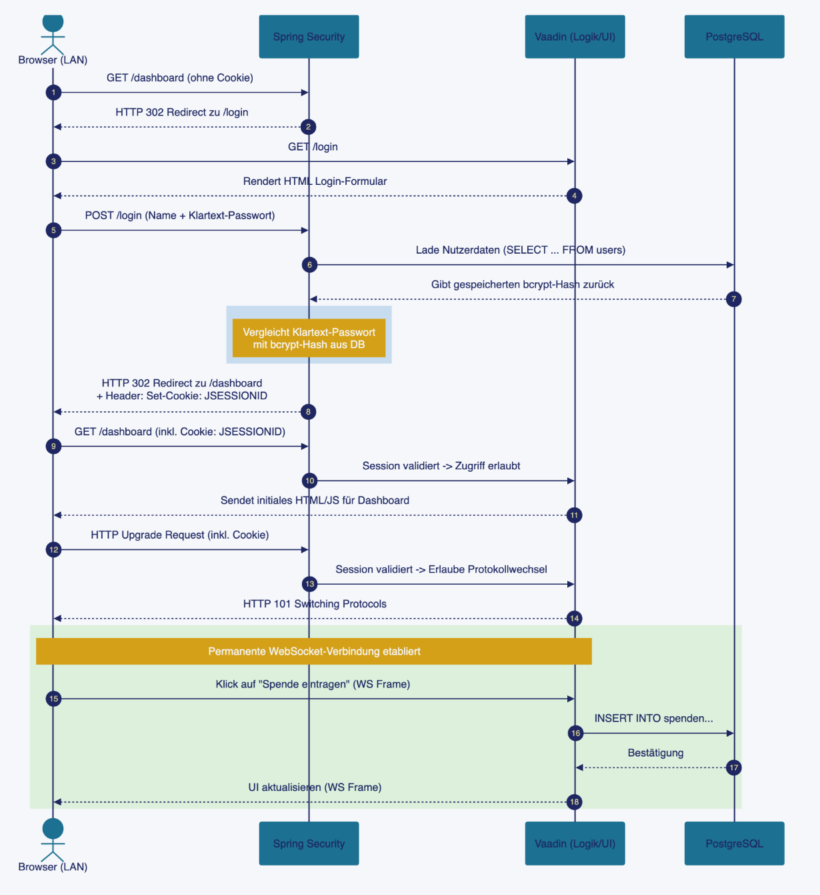

# ADR-004: Authentifizierung & Autorisierung – Zustandslose HTTP-Basic-Auth mit BCrypt und RBAC

## Status

**Akzeptiert** – Juni 2026

## Kontext

Gemäß ADR-001 übernimmt die neue Anwendungsschicht (Spring Boot) die zentrale Sicherheitsbarriere,
die im IST-System vollständig fehlt. Konkret fordert das Requirements-Dokument:

- **FR-1.1 Benutzeranmeldung**: Authentifizierung mittels Benutzername und Passwort.
- **FR-1.2 Rollenverwaltung**: Unterstützung rollenbasierter Zugriffsrechte (RBAC), konkret der Rollen *Administrator* und *Sachbearbeiter*.
- **NFR-1 Sicherheit/DSGVO**: Verarbeitung personenbezogener Daten nach DSGVO-Standards.

Das IST-System (`CLoginFrame` / `compucrash.user_def`) bietet keinerlei Rollenkonzept auf
Anwendungsebene und speichert keine sinnvoll gehashten Passwörter. Jeder Client, der eine
DB-Verbindung aufbauen kann, hat vollen Zugriff (siehe ADR-001). Diese Schwachstelle muss
durch einen zentralen, im Backend erzwungenen Authentifizierungs- und Autorisierungsmechanismus
vollständig behoben werden.

Gemäß ADR-005 wird das System ausschließlich **On-Premises im lokalen Netzwerk** betrieben,
ist **nicht über das Internet erreichbar** und hat nur wenige, bekannte Nutzer (Mitarbeitende
des Vereins). Dieser eingeschränkte Bedrohungskontext beeinflusst maßgeblich, welches
Authentifizierungsverfahren angemessen ist. Ein für öffentlich erreichbare Multi-Tenant-Systeme
optimiertes Verfahren (z.B. JWT mit Refresh-Tokens) wäre hier unverhältnismäßig komplex.

## Entscheidung

Wir entscheiden uns für **Form-based Session-Authentifizierung via Spring Security** in Kombination
mit **BCrypt-gehashten Passwörtern** und einem **einfachen rollenbasierten Zugriffsmodell (RBAC)**
mit genau zwei Rollen: `ADMIN` und `SACHBEARBEITUNG`.

<!-- ```
Vaadin Frontend ──(Authorization: Basic <user:pass base64>)──> Spring Security Filter Chain
                                                                   │
                                                    SessionCreationPolicy.STATELESS
                                                                   │
                                              DbUserDetailsService ── liest app.app_user
                                                                   │
                                        BCryptPasswordEncoder.matches(...)
                                                                   │
                                    hasRole("ADMIN") für /api/admin/**
                                    authenticated() für alle übrigen Endpunkte
``` -->



Zentrale Bausteine:

- **`SecurityConfig`**: Spring Security 6 Konfiguration nutzt Form-based Session-Authentifizierung mit serverseitigen HTTP-Sessions anstelle einer zustandslosen REST-API. CSRF-Schutz ist für Vaadin-Flow-Interaktionen und WebSockets aktiviert.
- **`AppUser`**: JPA-Entity (`app.app_user`) mit `username`, `passwordHash` (BCrypt),
  `role` (Enum `ADMIN` / `SACHBEARBEITUNG`), `enabled`-Flag, ersetzt `compucrash.user_def`.
- **`DbUserDetailsService`**: Implementiert UserDetailsService, lädt Benutzer dynamisch aus PostgreSQL und prüft Anmeldedaten. Benutzeränderungen und Rollenanpassungen sind ohne Anwendungsneustart sofort wirksam.
- **`AdminBootstrap`**: Legt beim allerersten Start automatisch einen Admin-Account an, sofern
  die Benutzertabelle leer ist. Passwort kommt aus `APP_ADMIN_PASSWORD` (Umgebungsvariable) oder
  wird als Einmal-Zufallswert generiert und **einmalig geloggt**. Es gibt kein eingebranntes
  Standardpasswort (vermeidet CWE-798 *Use of Hard-coded Credentials*).
- **`@EnableMethodSecurity`**: Ermöglicht deklarative Zugriffskontrollen sowohl auf UI-Ebene an Vaadin-Views (via @RolesAllowed) als auch feingranular auf Service-Ebene (@PreAuthorize).

## Betrachtete Alternativen

### Alternative A: Zustandsloses HTTP Basic Auth

Übermittlung der Zugangsdaten (Base64-codiert) bei jedem einzelnen HTTP-Request.

| Aspekt | Bewertung |
|--------|-----------|
| Implementierungsaufwand | ✅ Minimal in klassischen REST-APIs |
| Statefulness | ✅ Zustandslos |
| Eignung für Vaadin | ❌ Ungeeignet: Vaadin Flow basiert auf serverseitigen UI-Sessions und WebSockets |
| UX im Browser | ❌ Öffnet ohne Custom-Handling den nativen Browser-Login-Dialog |
| Session-Invalidierung | ❌ Kein echter serverseitiger Logout möglich |

**Ablehnung**: Ursprünglich für eine entkoppelte REST-API mit separatem SPA-Frontend (z. B. Angular) angedacht. Passt nicht zum gewählten Vaadin-Full-Stack-Ansatz (ADR-003), welcher nativ auf serverseitigen HTTP-Sessions für UI-Zustände aufbaut.


### Alternative B: JWT (Bearer Token, zustandslos mit Refresh-Token)

Backend stellt beim Login ein signiertes JWT aus, das die Rolle als Claim enthält;
Refresh-Tokens ermöglichen erneuerbare Sessions ohne erneute Passworteingabe.

| Aspekt | Bewertung |
|--------|-----------|
| Skalierbarkeit | ✅ Kein zentraler Session-Store nötig, optimal für verteilte / Multi-Server-Systeme |
| Implementierungsaufwand | ❌ Hoch (Signing-Key-Verwaltung, Token-Refresh-Flow, Blacklisting bei Logout) |
| Widerruf vor Ablauf | ❌ Erfordert zusätzliche Token-Blacklist oder kurze Lebensdauer + Refresh-Komplexität |
| Eignung für Kleinstsystem (1 Server, wenige Nutzer) | ❌ Löst ein Problem (horizontale Skalierung), das hier (On-Premises) nicht existiert |
| Integration in Vaadin | ❌ Unnötig komplex, da Vaadin ohnehin serverseitige Sessions verwaltet 
| Frontend-Komplexität | ❌ Token-Speicherung (localStorage vs. Cookie), Refresh-Interceptor nötig |
| Sicherheitsgewinn ggü. Basic Auth im LAN | ⚠️ Marginal, da kein Multi-Server-Szenario vorliegt |

**Ablehnung**: JWT löst primär Probleme verteilter/skalierender Systeme (mehrere Backend-Instanzen,
Third-Party-APIs, mobile Clients mit langlebigen Sessions). Für einen einzelnen Spring-Boot-Monolithen mit
wenigen bekannten Nutzern im LAN steht der Mehraufwand in keinem Verhältnis zum Sicherheitsgewinn.

<!-- ### Alternative B: Server-seitige Session mit Cookie (Spring Session)

Klassische Server-Session: Login erzeugt eine Session-ID, die als `HttpOnly`-Cookie an den
Browser übergeben wird; der Server hält den Auth-Status serverseitig vor.

| Aspekt | Bewertung |
|--------|-----------|
| Widerruf/Logout | ✅ Server kann Session jederzeit sofort invalidieren |
| CSRF-Schutz nötig | ❌ Cookie-basierte Auth erfordert aktiven CSRF-Schutz (bei reiner REST-API sonst deaktiviert) |
| Statefulness | ⚠️ Server muss Session-Zustand vorhalten (In-Memory reicht bei 1 Dienst, aber Kopplung an Prozesslaufzeit) |
| Implementierungsaufwand | ⚠️ Mittel – Cookie-Handling, CSRF-Token im Frontend, SameSite-Konfiguration |
| Angular-Integration | ⚠️ `withCredentials`, CSRF-Interceptor zusätzlich nötig |

**Nicht gewählt**: Technisch valide und im Grunde vergleichbar sicher, bringt aber zusätzliche
Komplexität (CSRF-Handling, Session-Zustand im Prozess) ohne relevanten Mehrwert gegenüber der
zustandslosen Basic-Auth-Variante für dieses Einzelserver-Szenario. -->

### Alternative C: Form-based Session Auth + BCrypt (gewählt) ✅

| Aspekt | Bewertung |
|--------|-----------|
| Integration in Vaadin | ✅ Nativ: Zusammenspiel von Spring Security und WebSockets via HTTP-Session |
| Passwort-Sicherheit | ✅ BCrypt: Adaptiver, gesalzener Password-Hasher (Standard in Spring Security) |
| Session-Security | ✅ Active CSRF-Protection für Vaadin-Requests, automatischer Session-Timeout und Schutz vor Session-Fixation |
| Transport-Sicherheit | ✅ Erzwungenes HTTPS/TLS im On-Premises-Netzwerk |
| Logout / Widerruf | ✅ Serverseitige Session-Invalidierung jederzeit sofort möglich |
| Rollenkonzept (RBAC) | ✅ Deklarative Absicherung auf View-Ebene (@RolesAllowed) und Service-Ebene (@PreAuthorize) |

## Begründung

### 1. Verhältnismäßigkeit zum Bedrohungskontext

Das System läuft ausschließlich On-Premises, ist nicht über das Internet erreichbar (ADR-005)
und wird von einer kleinen Anzahl bekannter Mitarbeitender im LAN genutzt. Die für
Internet-exponierte Multi-Server-Systeme entwickelten Verfahren (JWT mit Refresh-Tokens,
verteilte Session-Stores) lösen Probleme, die in diesem Kontext nicht existieren. Ein einfaches,
gut verstandenes Verfahren reduziert die Angriffsfläche durch geringere Komplexität
("Einfachheit als Sicherheitsmerkmal").

### 2. Vollständige Elimination der IST-Schwachstelle

Die zentrale, im ADR-001 identifizierte Schwachstelle (kein Rollenkonzept, keine zentrale
Zugriffskontrolle) wird durch die Kombination aus zentralem `SecurityFilterChain`,
DB-gestützter Benutzerverwaltung und rollenbasierter Autorisierung (`hasRole("ADMIN")`,
`@PreAuthorize`) vollständig geschlossen. Kein Client hat mehr direkten, ungeprüften Zugriff.

### 3. BCrypt statt Klartext

BCrypt ist ein adaptiver, gesalzener Hash-Algorithmus, der gezielt für Passwort-Hashing entwickelt
wurde (konfigurierbarer Kostenfaktor gegen Brute-Force, automatisches Salting gegen
Rainbow-Table-Angriffe). Dies ersetzt die im IST-System vollständig fehlende Passwort-Sicherung
(Klartext-Credentials in lokalen `.ini`-Dateien) durch Industriestandard.

### 4. Kein eingebranntes Standardpasswort

`AdminBootstrap` erzeugt den initialen Administrator-Account **nur beim allerersten Start**
mit einem konfigurierbaren oder zufällig generierten Einmal-Passwort. Dies vermeidet eine der
häufigsten Schwachstellenklassen in Kleinanwendungen (CWE-798, hart codierte
Standard-Zugangsdaten wie `admin/admin`).

### 5. Zwei Rollen genügen der fachlichen Anforderung

FR-1.2 fordert exakt zwei Rollen (Administrator, Sachbearbeiter). Ein komplexeres RBAC-Modell
mit feingranularen Permissions, Rollenhierarchien oder dynamischer Rechtevergabe würde eine
nicht existierende Anforderung vorwegnehmen ("Overengineering"). `@EnableMethodSecurity` erlaubt
bei Bedarf spätere Erweiterung auf feingranulare Berechtigungen, ohne das Grundmodell zu ändern.

### 6. Zusammenspiel mit Vaadin-Monolithen-Architektur

Da sich für Vaadin Flow entschieden wurde (ADR-003), verwaltet der Spring-Boot-Monolith den UI-Zustand ohnehin in einer serverseitigen HTTP-Session. Die form- und cookie-basierte Session-Authentifizierung von Spring Security dockt direkt an diese Architektur an, ohne dass zusätzliche Token-Infrastrukturen oder REST-APIs entwickelt werden müssen.

## Risiken und Mitigationen

| Risiko | Wahrscheinlichkeit | Auswirkung | Mitigation |
|--------|--------------------|-----------|-------------|
| Credential-Sniffing im LAN | Niedrig | Hoch | Erzwungene TLS/HTTPS-Verschlüsselung für alle Daten- und WebSocket-Verbindungen im LAN (Transportverschlüsselung) |
| Brute-Force auf Login-Endpunkt | Niedrig (kein Internet-Zugriff) | Mittel | Adaptiver BCrypt-Work-Factor drosselt Rechenzeit. Optionales Rate-Limiting auf Login-Ebene. |
| Session-Hijacking / CSRF-Angriffe | Niedrig | Hoch | Spring Security erzeugt bei erfolgreichem Login eine neue Session-ID (Schutz vor Session Fixation); automatischer CSRF-Schutz für Vaadin-Requests und HTTP-Cookies. |
| Kein automatischer Logout bei Inaktivität | Mittel | Niedrig | Konfiguration eines serverseitigen Session-Timeouts in Spring Boot (z. B. 30 Minuten). Ergänzend organisatorisch: Bildschirmsperre der Arbeitsplätze. |
| Verlust des Admin-Passworts | Niedrig | Mittel | `AdminBootstrap` kann bei leerer Benutzertabelle erneut ausgeführt werden (Notfall-Wiederherstellung via DB). |
| Unbefugter Aufruf geschützter Views | Niedrig | Hoch | Deny-by-Default auf Konfigurationsebene. Explizite Absicherung aller Vaadin-Views mittels @RolesAllowed und Feingranularität via @PreAuthorize. |

## Konsequenzen

### Positiv
- Sicherheitsniveau auf Industrie-Standard: Vollständige Elimination der Klartext-Credential-Problematik des IST-Systems durch sichere Passwort-Ablage mittels BCrypt.
- Natives UI-Sicherheitsmodell: Nahtlose Anbindung der Login-View und View-Protection an Vaadin Flow und Spring Security.
- Sofortiger Rechte-Widerruf & Logout: Bei Deaktivierung eines Benutzers oder Rollenänderungen kann die serverseitige HTTP-Session sofort invalidiert werden.
- Integrierter CSRF- & Session-Schutz: Vollständige Nutzung der erprobten Spring-Security-Mechanismen ohne manuelles Token-Handling im Frontend.
- Minimaler Implementierungs- und Betriebsaufwand
- Konsistent mit ADR-006: Das Sicherheitsmodell ist auf den On-Premises-Betrieb im LAN zugeschnitten.

### Negativ
- Server-Memory für Sessions: Jede aktive Benutzersession belegt Arbeitsspeicher auf dem Server. Jedoch ist aufgrund der geringen Nutzerzahl des Vereins dieser Punkt vernachlässigbar.

### Neutral
- Erfordert Pflege der Benutzerliste durch Administratoren über eine eigene
  Benutzerverwaltungs-Oberfläche.
- Passwort-Policy (Mindestlänge, Komplexität) ist eine organisatorische Ergänzung, kein
  architektonischer Bestandteil dieses ADRs.
